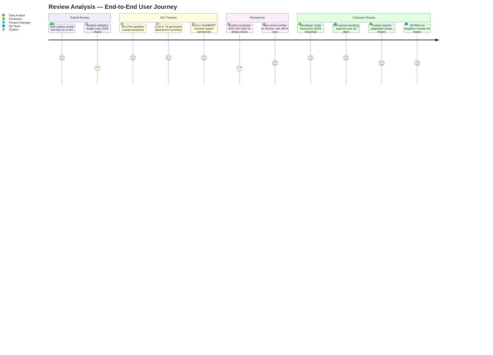

# Product Requirements Document
## Amazon Review Multi-Task NLP System

**Version:** 1.0  
**Status:** Production  
**Last Updated:** 2026-06-01

---

## 1. Problem Statement

Amazon product reviews are the primary signal e-commerce sellers and product teams use to understand customer perception. A moderately popular product can accumulate thousands of reviews in weeks. Manual reading does not scale: a product manager reviewing 500 reviews a day at 30 seconds each spends four hours daily on one product, extracts no structured data, misses aspect-level patterns (battery complaints buried in positive reviews), and cannot trend signal over time.

Existing platform-provided star-rating aggregates discard nuance. A product rated 3.5 stars may have a camera universally praised and a battery universally criticized — a distinction invisible at the aggregate level but critical for an engineering team deciding what to fix next.

This system converts raw review text into three structured outputs per review:

1. **Overall sentiment** (Positive / Neutral / Negative) with a confidence score
2. **Aspect-level sentiment** — which specific product features are mentioned, and whether the reviewer feels positive, negative, or neutral about each
3. **Abstractive summary** — a 2-3 sentence human-readable summary of the review's key points, capped at 60 words

---

## 2. Target Users

| User Type | Primary Need | Key Interaction |
|---|---|---|
| E-commerce Product Manager | Understand which product features drive negative sentiment | Trending aspects API, paginated review history |
| Amazon Seller / Brand Owner | Detect quality regressions in near-real-time | Batch API, sentiment distribution stats |
| Data Analyst | Export structured sentiment data for dashboards | REST API (all endpoints), DB direct access |
| QA / Customer Experience Team | Triage high-volume negative feedback | Filtered review history (`/api/reviews?sentiment=Negative`) |
| ML Engineer / Developer | Integrate sentiment analysis into internal tooling | `/api/sentiment` (stateless, no DB write), `/api/batch/analyze` |

---

## 3. Product Goals

### 3.1 Functional Goals

- **Automated sentiment classification:** Classify any review up to 2,000 characters into Positive, Neutral, or Negative with a calibrated confidence score.
- **Aspect-level feedback extraction:** Identify which product features (display, battery, camera, performance, design, audio, storage, software, connectivity, price, packaging, shipping, durability, comfort) are discussed and what the reviewer thinks of each.
- **Abstractive summarization:** Generate a human-readable 2-3 sentence summary covering overall impression, key points, and caveats — without inventing details not in the original.
- **Persistent structured history:** Every analyzed review is stored in MySQL with full ABSA output, enabling retrospective queries and trend analysis.
- **Deduplication:** The same review text submitted twice stores one record; no duplicate ABSA rows are written.

### 3.2 NLP Accuracy Goals

| Objective | Target | Mechanism |
|---|---|---|
| Sentiment classification accuracy | > 85% on Amazon review test set | BiLSTM trained on review corpus (`best_model.keras`) |
| Aspect coverage | 14 product categories | Keyword taxonomy in `absa.py` (`aspect_categories`) |
| Summary length constraint | Max 60 words | LLM system prompt hard limit; T5 `max_length=80` tokens |
| ABSA precision | Reject vague nouns | Generic filter (`generic_aspects`, `excluded_words`), LLM exclusion rules |

### 3.3 Scalability Goals

- Accept up to 10 reviews per batch call (`MAX_BATCH_SIZE = 10` in `app.py`)
- Paginate review history in configurable page sizes (1–100 records per page)
- Trend analysis window configurable from 1 to 365 days
- Thread-safe DB connections via `threading.local()` — safe under gunicorn multi-threaded workers

---

## 4. Product Features

| Feature | Priority | Route | Notes |
|---|---|---|---|
| Single review analysis (UI) | P0 | `POST /analyze` | Validates length, runs full pipeline, saves to DB, returns JSON |
| Single review analysis (API, stateless) | P0 | `POST /api/sentiment` | Same pipeline, no DB write — for integrators who manage their own storage |
| Batch analysis | P1 | `POST /api/batch/analyze` | Up to 10 reviews, per-item error isolation, each item saved to DB on success |
| Overall system stats | P1 | `GET /api/stats` | Total reviews, sentiment distribution, total aspect rows, most recent timestamp |
| Trending aspects | P1 | `GET /api/aspects/trending` | Top N aspects by mention count, with positive/negative/neutral breakdown, configurable time window |
| Paginated review history | P2 | `GET /api/reviews` | Optional sentiment filter, reverse-chronological, pagination metadata |
| Web UI | P2 | `GET /` | HTML form for manual review submission; served from `templates/index.html` |
| LLM-powered analysis | P2 | Automatic | Enabled when `llama3.2` is available via Ollama; falls back to transformer path |

---

## 5. User Journey

---

## 6. Constraints and Boundaries

- **Input limit:** 2,000 characters per review. Longer inputs are rejected with HTTP 400. This aligns with the BiLSTM tokenizer's effective window: the model pads/truncates to `MAX_LENGTH=150` tokens, and reviews beyond ~1,500 characters offer diminishing signal return.
- **Batch limit:** 10 reviews per call. This is a safety cap against synchronous latency — at 1–5 seconds per review on the LLM path, 10 reviews = up to 50 seconds per batch request. Async processing is a roadmap item.
- **Language:** English only. spaCy uses `en_core_web_sm`; the BiLSTM was trained on English Amazon reviews; DistilBERT SST-2 is English-only.
- **No authentication:** The API has no authentication layer in v1. All endpoints are open. This is appropriate for internal/development use only.
- **Stateless API vs. stateful UI route:** `/api/sentiment` does not write to DB. `/analyze` and `/api/batch/analyze` do. Integrators who want stateless inference should use `/api/sentiment`.

---

## 7. Future Roadmap

| Item | Rationale | Effort |
|---|---|---|
| Redis response caching | Identical review text hits the pipeline multiple times (different users); cache on SHA-256 hash key with TTL | Medium |
| Async task queue (Celery + Redis) | Batch calls currently block for up to 50s; offload to worker queue and return a job ID | High |
| Fine-tuned ABSA model | DistilBERT SST-2 is a general sentiment classifier, not aspect-specific; fine-tune on SemEval ABSA datasets | High |
| API authentication (API keys or JWT) | Required before any public exposure | Low |
| Dashboard UI | Replace the single-input HTML form with a React/Vue dashboard showing trends, aspect charts, review history | High |
| Multi-language support | Add multilingual BERT for non-English review markets | High |
| Confidence-based routing | Route low-confidence BiLSTM predictions (score 0.4–0.6) to LLM for secondary validation | Medium |
| Model A/B testing | `analysis_source` column already tracks LLM vs. transformer; add endpoint to compare quality metrics | Medium |
