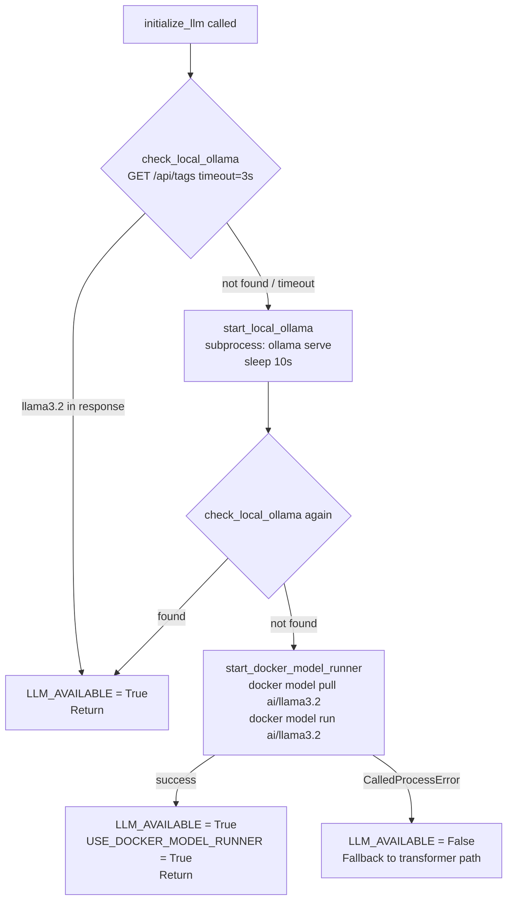

# Technical Requirements Document
## Amazon Review Multi-Task NLP System

**Version:** 1.0  
**Status:** Production  
**Last Updated:** 2026-06-01

---

## 1. System Overview

This is a single-process Python web application that runs three NLP models sequentially per request: a BiLSTM for sentiment classification, a text summarizer (T5-base or llama3.2), and an ABSA engine (spaCy + DistilBERT or llama3.2). The choice between LLM and transformer paths is made once at startup and is fixed for the lifetime of the process.

---

## 2. Flask Application Architecture

### 2.1 Process Model

Flask (`app.py`) runs as a single Python process. In development it uses Flask's built-in single-threaded server (`app.run(debug=True, host="0.0.0.0", port=5000)`). In production, gunicorn with multiple workers is recommended — each gunicorn worker is a separate OS process that loads all models independently into its own memory space.

**Implication:** There is no shared model state between workers. Each worker carries the full memory footprint: BiLSTM + tokenizer + DistilBERT + T5-base = approximately 1.26 GB per worker (transformer path). Ollama runs as a separate sidecar process and is shared across all workers via HTTP.

### 2.2 Thread-Local Database Connections

`db_connection.py` uses `threading.local()` to give each thread its own `pymysql` connection:

```python
_local = threading.local()

def get_connection():
    if not hasattr(_local, "db") or _local.db is None or not _local.db.open:
        _local.db = pymysql.connect(...)
    return _local.db
```

This prevents the race condition that would occur if a single global connection were shared across concurrent Flask requests. `autocommit=False` is set explicitly so all writes require an explicit `commit()` call — this gives `save_review_with_absa()` transactional control over the review + ABSA insert pair.

`@app.teardown_appcontext` calls `close_connection()` at the end of every request context, returning the connection to the pool rather than letting it linger.

### 2.3 Module-Level Model Loading (Eager)

All model artifacts are loaded at module import time, before the Flask server accepts its first request:

- `tf.keras.models.load_model("best_model.keras")` — loaded at module scope in `app.py` (lines 45)
- `pickle.load(open("tokenizer.pkl"))` — loaded at module scope in `app.py` (line 50)
- `T5Tokenizer`, `T5ForConditionalGeneration` — loaded at module scope in `summary.py` (lines 3-4)
- `AutoTokenizer`, `AutoModelForSequenceClassification` (DistilBERT) — loaded at module scope in `absa.py` (lines 18-19)
- `spacy.load("en_core_web_sm")` — loaded at module scope in `absa.py` (line 11)

If any artifact is missing or fails to load, the application raises an exception at startup and refuses to serve traffic. This is the correct behavior: a partial startup (e.g., BiLSTM loads but T5 fails) would serve inconsistent results.

**Tradeoff:** Eager loading means higher startup RAM and a slower cold start (10-30 seconds), but zero latency on first inference request. Lazy loading would reduce startup cost but introduce unpredictable latency spikes on first request — unacceptable for a web API.

---

## 3. ML Inference Architecture

### 3.1 Models Used

| Model | File / Source | Role | Approximate RAM |
|---|---|---|---|
| BiLSTM (custom trained) | `best_model.keras` | Overall sentiment classification (Positive / Neutral / Negative) | ~100 MB |
| Keras Tokenizer | `tokenizer.pkl` | Text tokenization for BiLSTM input; fitted to training corpus | ~5 MB |
| DistilBERT SST-2 | `distilbert-base-uncased-finetuned-sst-2-english` (HuggingFace) | Clause-level sentiment scoring for ABSA (transformer path) | ~260 MB |
| T5-base | `t5-base` (HuggingFace) | Abstractive review summarization (transformer path) | ~850 MB |
| spaCy en_core_web_sm | Auto-downloaded if missing | Dependency parsing, POS tagging, noun chunk extraction for ABSA | ~50 MB |
| llama3.2 via Ollama | Pulled by `llm_check.py` or Docker Model Runner | ABSA + summarization when LLM path is active | ~2.0 GB (separate Ollama process) |

### 3.2 Sentiment Classification Pipeline (BiLSTM)

1. `clean_text(review)` — lowercase, strip all non-alpha characters (`[^a-zA-Z\s]`), collapse whitespace
2. `tokenizer_obj.texts_to_sequences([cleaned])` — Keras Tokenizer converts to integer sequences
3. `pad_sequences(seq, maxlen=150, padding="post", truncating="post")` — fixed-length input tensor
4. `model.predict(padded, verbose=0)[0][0]` — sigmoid output scalar in [0.0, 1.0]
5. Threshold mapping: `> 0.5` → Positive, `>= 0.15` → Neutral, `< 0.15` → Negative

The `MAX_LENGTH=150` token window means reviews longer than ~150 words have their tail truncated. The `clean_text()` step removes punctuation before tokenization, which is intentional — the model was trained on the same preprocessing. Applying different preprocessing at inference would degrade accuracy.

### 3.3 ABSA Architecture — Dual Path

#### Traditional Path (`absa.py`)

Activated when `LLM_AVAILABLE = False`. Five extraction strategies in `extract_aspects_improved()`:

1. **Noun chunks** — spaCy noun chunk parser, 1-4 word phrases, normalized and filtered
2. **Dependency parse** — subject/object nouns (`nsubj`, `dobj`, `pobj`) + opinion verb objects
3. **Compound nouns** — token children with `dep_ == "compound"` concatenated to parent noun
4. **Regex patterns** — seven patterns covering `\w+ quality`, `\w+ life`, `\w+ performance`, etc.
5. **Qualifier-aware filter** — promotes qualifiers to standalone aspects only when they add unique context

Deduplication in `filter_and_deduplicate_aspects()`:
- Substring deduplication: keeps the more specific phrase (`"battery"` vs `"battery life"` → keeps `"battery life"`)
- Character n-gram cosine similarity grouping (`CountVectorizer(analyzer="char", ngram_range=(2,3))`), threshold 0.75

Sentiment scoring in `get_aspect_sentiment_improved()`:
- Extracts context: sentence(s) containing the aspect, split on contrastive conjunctions (`but`, `however`, `although`, `though`, `yet`, `nevertheless`, `nonetheless`)
- Runs DistilBERT SST-2 on each context clause, averages scores
- Threshold: `> 0.6` Positive, `< 0.4` Negative, else Neutral
- Falls back to lexicon counting (`analyze_clause_sentiment()`) if DistilBERT is unavailable

#### LLM Path (`absa_with_llm.py`)

Activated when `LLM_AVAILABLE = True`. Uses llama3.2 via `ollama.chat()` with `temperature=0` (deterministic) and `num_predict=400` tokens. The system prompt encodes ABSA rules: what counts as an aspect, exclusion list, sentiment rules for negation and implication, normalization rules, and strict output format.

Response parsing uses `_LINE_RE`:
```
^([a-zA-Z][a-zA-Z0-9 \-/]{1,58}):\s*(Positive|Negative|Neutral)\s*$
```

This rejects echoed prompt lines (e.g., `"Review: Positive"`), long runaway phrases, and single-character tokens. Retries once on empty parse; falls back to `aspect_based_sentiment_improved()` (traditional path) on both-attempt failure.

### 3.4 Summarization Architecture — Dual Path

#### T5-base Path (`summary.py`)

- Passthrough for reviews under 20 words (`_SHORT_REVIEW_THRESHOLD = 20`)
- Prepends `"summarize: "` prefix (required by T5's seq2seq training objective)
- Truncates input to 512 tokens (`_MAX_INPUT_TOKENS = 512`)
- Generation: `max_length=80`, `min_length=20`, `num_beams=4`, `no_repeat_ngram_size=3`, `length_penalty=2.0`
- Exception catch → `"Summary not available."` (never raises to caller)

#### LLM Path (`summary_with_llm.py`)

- Same 20-word passthrough threshold
- `temperature=0.3` (lower than typical generation — avoids hallucination while allowing natural phrasing variation)
- `num_predict=150` (generous cap for ~60 words of output with buffer)
- Retries once; falls back to `t5_summary()` (imports from `summary.py` dynamically) on both-attempt failure

---

## 4. LLM Availability Detection

`llm_check.initialize_llm()` runs exactly once at application startup (line 26 of `app.py`), before any route handlers are registered. It executes three stages in sequence:



After `initialize_llm()` returns, `app.py` does a conditional import at lines 28-35:

```python
if LLM_AVAILABLE:
    from absa_with_llm import aspect_based_sentiment_llm as aspect_based_sentiment
    from summary_with_llm import generate_summary
    ANALYSIS_SOURCE = "llm"
else:
    from absa import aspect_based_sentiment_improved as aspect_based_sentiment
    from summary import generate_summary
    ANALYSIS_SOURCE = "transformer"
```

This import is module-level and happens once. There is no per-request path selection — the function bound to the name `aspect_based_sentiment` is fixed for the process lifetime.

---

## 5. Database Design

### 5.1 Schema

**`reviews` table:**

| Column | Type | Constraints | Purpose |
|---|---|---|---|
| `id` | INT | AUTO_INCREMENT PK | Internal row ID |
| `review_hash` | CHAR(64) | UNIQUE NOT NULL | SHA-256 of raw `review.strip().encode("utf-8")` — fast duplicate detection |
| `review_text` | TEXT | NOT NULL | Original review text |
| `summarized_review` | TEXT | NULL | Output of `generate_summary()` |
| `overall_sentiment` | ENUM | NOT NULL | `'Positive'`, `'Neutral'`, `'Negative'` — ENUM enforces valid values at DB layer |
| `confidence_score` | DECIMAL(5,4) | NULL | BiLSTM raw sigmoid score (0.0000–1.0000) |
| `analysis_source` | ENUM | NOT NULL DEFAULT 'transformer' | `'llm'` or `'transformer'` — allows quality comparison queries |
| `created_at` | TIMESTAMP | DEFAULT CURRENT_TIMESTAMP | Index target for time-range trending queries |

**`absa_results` table:**

| Column | Type | Constraints | Purpose |
|---|---|---|---|
| `id` | INT | AUTO_INCREMENT PK | Internal row ID |
| `review_id` | INT | FK → reviews(id) CASCADE | Links aspect to parent review |
| `aspect` | VARCHAR(255) | NOT NULL | Extracted aspect text (e.g., `"battery life"`) |
| `sentiment` | ENUM | NOT NULL | `'Positive'`, `'Neutral'`, `'Negative'` |

**Composite unique key** `uq_review_aspect(review_id, aspect)`: prevents duplicate aspect rows even if the application layer has a bug. Combined with `INSERT IGNORE` in `save_review_with_absa()`, this creates a two-layer dedup guarantee.

### 5.2 Deduplication Logic

`save_review_with_absa()` (lines 108-150 of `app.py`) implements hash-first dedup:

1. Compute `hash_review(review)` — SHA-256 of `review.strip().encode("utf-8")`
2. `SELECT id FROM reviews WHERE review_hash = %s`
3. If row exists: return `existing["id"]` immediately — no insert attempted
4. If new: INSERT review row, then loop over aspects with `INSERT IGNORE INTO absa_results`
5. `commit()` after all aspect rows are inserted (single transaction)
6. On exception: `rollback()` to prevent partial writes

---

## 6. API Contract

| Endpoint | Method | Request | Response | DB Write |
|---|---|---|---|---|
| `/analyze` | POST | `{"review": "..."}` | `{Overall Sentiment, Confidence Score, Summary, Aspect-based Sentiments}` | Yes |
| `/api/sentiment` | POST | `{"review": "..."}` | Same as above | No |
| `/api/batch/analyze` | POST | `{"reviews": ["...", ...]}` | `{total, succeeded, failed, results[]}` | Yes (per item) |
| `/api/stats` | GET | — | `{total_reviews, sentiment_distribution, total_aspects_analyzed, most_recent_analysis}` | No |
| `/api/aspects/trending` | GET | `?days=30&limit=10` | `{days, trending_aspects[]}` | No |
| `/api/reviews` | GET | `?page=1&limit=20&sentiment=Positive` | `{reviews[], pagination{}}` | No |

**Validation:**
- All text inputs: stripped, non-empty check, length check (`> MAX_REVIEW_LENGTH=2000` → HTTP 400)
- Batch: list type check, `> MAX_BATCH_SIZE=10` → HTTP 400
- Trending: `limit` clamped to [1, 50]; `days` clamped to [1, 365]
- Reviews pagination: `limit` clamped to [1, 100]; `page` min 1; `sentiment` must be one of three ENUM values or ignored

---

## 7. Deployment Requirements

| Concern | Requirement | Rationale |
|---|---|---|
| WSGI server | gunicorn (not Flask dev server) | Flask dev server is single-threaded; gunicorn with `--workers 2` or `--threads 4` handles concurrent requests |
| Reverse proxy | nginx | TLS termination, static file serving, request buffering |
| Ollama sidecar | Required for LLM path | llama3.2 runs in a separate process; `OLLAMA_BASE_URL` env var configures the endpoint (default: `http://localhost:11434`) |
| MySQL | 5.7+ or 8.0 | Schema uses `utf8mb4`, ENUM types, composite unique keys; all features available in 5.7+ |
| Python artifacts | `best_model.keras`, `tokenizer.pkl` must be present at CWD | Startup raises `RuntimeError` if either is missing — app will not start |
| Environment variables | `DB_HOST`, `DB_USER`, `DB_PASSWORD`, `DB_NAME`, `OLLAMA_BASE_URL` | Read via `python-dotenv` from `.env` file or OS environment |
| Memory per worker | ~1.3 GB (transformer path) or ~350 MB + Ollama sidecar 2 GB (LLM path) | Size instances accordingly; do not run more workers than RAM permits |

---

## 8. Fallback Chain Summary

```
LLM ABSA (llama3.2)
  └─ attempt 1 → attempt 2 → fallback: Traditional ABSA (spaCy + DistilBERT)
       └─ DistilBERT unavailable → Rule-based lexicon scoring (analyze_clause_sentiment)

LLM Summary (llama3.2)
  └─ attempt 1 → attempt 2 → fallback: T5-base summary
       └─ T5 error → "Summary not available."

BiLSTM sentiment: no fallback (model must load at startup or app aborts)
```
