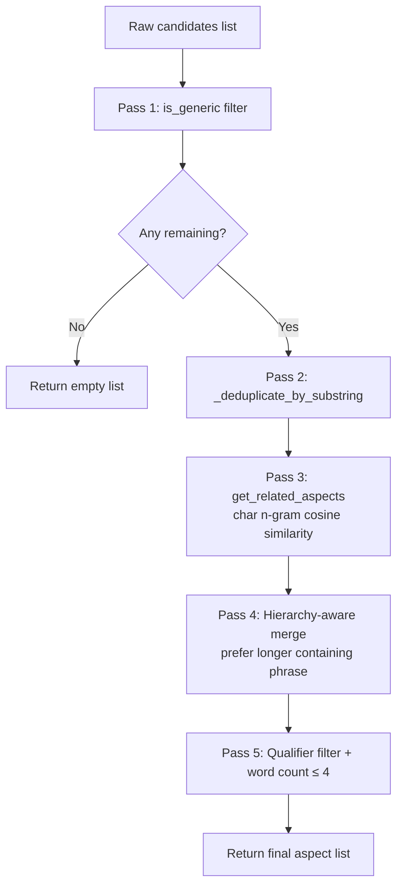
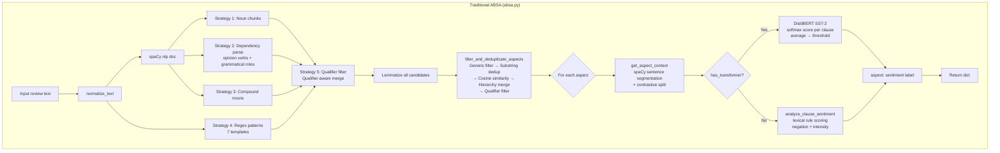
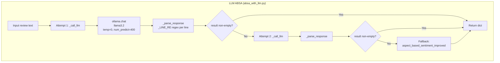
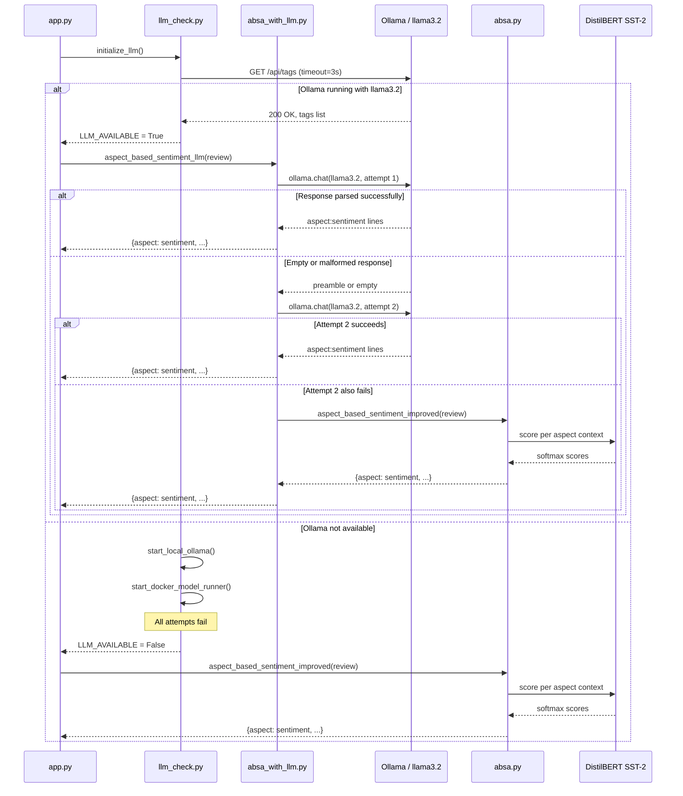

# Aspect-Based Sentiment Analysis (ABSA) Architecture

This document covers both ABSA implementations in detail: the traditional spaCy + DistilBERT pipeline (`absa.py`) and the LLM-driven pipeline (`absa_with_llm.py`). Both are production modules; the active one is selected at startup by `initialize_llm()` in `llm_check.py`.

---

## Table of Contents

1. [Traditional ABSA (`absa.py`)](#1-traditional-absa)
   - [Model Stack](#11-model-stack)
   - [Lexicons and Aspect Categories](#12-lexicons-and-aspect-categories)
   - [Aspect Extraction — 5 Strategies](#13-aspect-extraction--5-strategies)
   - [Deduplication Pipeline](#14-deduplication-pipeline)
   - [Negation Context Detection](#15-negation-context-detection)
   - [Contrastive Context Splitting](#16-contrastive-context-splitting)
   - [Sentiment Scoring](#17-sentiment-scoring)
   - [Intensity Modifiers](#18-intensity-modifiers)
   - [Critical Bugs Fixed](#19-critical-bugs-fixed)
2. [LLM ABSA (`absa_with_llm.py`)](#2-llm-absa)
   - [Prompt Architecture](#21-prompt-architecture)
   - [Few-Shot Examples](#22-few-shot-examples)
   - [Generation Parameters](#23-generation-parameters)
   - [Response Parser](#24-response-parser)
   - [Retry and Fallback Strategy](#25-retry-and-fallback-strategy)
3. [Comparison](#3-comparison)
   - [Side-by-Side Table](#31-side-by-side-table)
   - [When Traditional Wins](#32-when-traditional-wins)
   - [When LLM Wins](#33-when-llm-wins)
   - [Pipeline Flowcharts](#34-pipeline-flowcharts)
   - [Fallback Sequence Diagram](#35-fallback-sequence-diagram)

---

## 1. Traditional ABSA

### 1.1 Model Stack

| Component | Model | Purpose |
|---|---|---|
| NLP backbone | `spacy en_core_web_sm` | Dependency parsing, POS tagging, lemmatization, sentence segmentation |
| Sentiment scorer | `distilbert-base-uncased-finetuned-sst-2-english` | Softmax positive probability for extracted clauses |

Both models are loaded once at module import time. `_bert_model.eval()` disables dropout for deterministic inference. If DistilBERT fails to load (no internet, no cache), `has_transformer = False` is set and the system degrades gracefully to lexical rule scoring — the fallback is fully functional, not a placeholder.

### 1.2 Lexicons and Aspect Categories

**Sentiment lexicons** (module-level sets, not lists — O(1) membership test):

| Lexicon | Size | Role |
|---|---|---|
| `positive_indicators` | 55 words | Score baseline positive count |
| `negative_indicators` | 50 words | Score baseline negative count |
| `neutral_indicators` | 14 words | Force 0.5 score when no clear signal |
| `negation_words` | 18 words | Flip sentiment sign within a window |

`"not"` and `"no"` were deliberately removed from `negative_indicators`. Without this fix, the phrase `"not bad"` would score `pos=0, neg=2` producing a negative result. They now live exclusively in `negation_words`, where they flip an existing positive signal rather than add a negative one.

**Aspect categories** — 14 categories used for `get_aspect_category()` classification and for filtering redundant qualifiers:

```
display, battery, camera, performance, design, audio, storage,
software, connectivity, price, packaging, shipping, durability, comfort
```

**`generic_aspects`** and **`excluded_words`** are both sets of terms that should never surface as aspects. `is_generic()` checks both sets, plus digit presence, length ≤ 2, and all-stopwords composition.

### 1.3 Aspect Extraction — 5 Strategies

`extract_aspects_improved(text)` runs all five strategies on the spaCy-parsed document and accumulates candidates in a Python `set` (automatic deduplication at the raw level). The final output is lemmatized before returning.

#### Strategy 1 — Noun Chunks

```python
for chunk in doc.noun_chunks:
    if 1 <= len(chunk.text.split()) <= 4:
        candidate = normalize_aspect(chunk.text)
        if candidate and not is_generic(candidate):
            candidates.add(candidate)
```

spaCy's noun chunk detector groups a noun with its modifiers (determiners, adjectives). This catches naturally-phrased multi-word aspects: `"the excellent build quality"` → `"build quality"` after article normalization.

**What it catches:** Naturally noun-phrase aspects as a speaker would write them.
**What it misses:** Aspects expressed as verb objects (`"I love the screen"` — `"screen"` is caught here but the strategy is redundant with strategy 2 in that case), and aspects expressed as standalone nouns in passive constructions.

#### Strategy 2 — Dependency Parse: Opinion Verbs and Grammatical Roles

```python
opinion_verbs = positive_indicators | negative_indicators
for token in doc:
    if token.pos_ == "VERB" and token.lemma_.lower() in opinion_verbs:
        for child in token.children:
            if child.pos_ == "NOUN" and not is_generic(child.text):
                candidates.add(child.lemma_.lower())

    if token.pos_ == "NOUN" and token.dep_ in {"nsubj", "dobj", "pobj"}:
        if not is_generic(token.text):
            candidates.add(token.lemma_.lower())
```

Two sub-strategies run in the same loop:

1. **Opinion verb → object noun**: when a sentiment word is used as a verb (`"love"`, `"hate"`, `"failed"`), its syntactic children that are nouns are aspects. `"I love the camera"` → dep tree: `love(VERB) → camera(dobj,NOUN)` → extracts `"camera"`.

2. **Grammatical role nouns**: any noun serving as subject (`nsubj`), direct object (`dobj`), or prepositional object (`pobj`) is a candidate. This catches aspects in constructions like `"The display is bright"` (nsubj) and `"impressed with the battery"` (pobj).

**What it catches:** Aspects with clear syntactic roles; opinion verbs directing to objects.
**What it misses:** Aspects in appositive or list constructions without clear dependency roles.

#### Strategy 3 — Compound Nouns

```python
for token in doc:
    if token.pos_ == "NOUN" and not is_generic(token.text):
        compounds = [c.text for c in token.children if c.dep_ == "compound"]
        if compounds:
            phrase = " ".join([c.lower() for c in compounds] + [token.text.lower()])
            candidates.add(phrase)
```

spaCy marks compound modifiers with `dep_ == "compound"`. `"battery life"` parses as `life(NOUN) ← battery(compound)`. The strategy reconstructs the phrase left-to-right: `["battery"] + ["life"]` → `"battery life"`. This works for any compound depth: `"fast charging speed"` would yield `["fast", "charging"] + ["speed"]`.

**What it catches:** Technical multi-word product features that are compounds in English grammar.
**What it misses:** Aspects joined by prepositions (`"quality of the screen"`).

#### Strategy 4 — Regex Patterns

```python
patterns = [
    r"\b(\w+ quality)\b",
    r"\b(\w+ life)\b",
    r"\b(\w+ performance)\b",
    r"\b(low light \w+)\b",
    r"\b(\w+ resolution)\b",
    r"\b(\w+ speed)\b",
    r"\b(\w+ sensor)\b",
]
```

These patterns target domain-specific compound forms that appear frequently in electronics reviews. They operate directly on the raw text string (not the parse tree), which makes them fast and immune to spaCy tokenization decisions.

`r"\b(\w+ quality)\b"` catches `"build quality"`, `"audio quality"`, `"image quality"`.
`r"\b(low light \w+)\b"` catches `"low light photography"`, `"low light performance"` — specifically useful for camera reviews.

**What it catches:** High-frequency, predictable compound patterns in the product review domain.
**What it misses:** Unusual phrasings not covered by the templates; over-matches on `"low light" ` in contexts unrelated to cameras.

#### Strategy 5 — Qualifier-Aware Filter

```python
final = set()
for aspect in candidates:
    is_qual, _ = is_qualifier_not_aspect(text, aspect)
    if not is_qual:
        final.add(aspect)
    elif any(q in aspect for q in ["low light", "fast charging", "high quality"]):
        final.add(aspect)
```

`is_qualifier_not_aspect()` checks if a candidate is a *qualifier* of another already-extracted aspect rather than an independent aspect itself. For example, if `"camera"` is already a candidate and `"low light"` appears in the text, then `"low light"` alone is not an independent aspect — it qualifies camera. The exception list (`"low light"`, `"fast charging"`, `"high quality"`) promotes qualifiers that carry substantial standalone meaning even when their parent category is present.

**Final lemmatization:** Every surviving candidate is passed through spaCy's lemmatizer to collapse inflected forms. `"cameras"` → `"camera"`, `"charging speeds"` → `"charging speed"`.

### 1.4 Deduplication Pipeline

`filter_and_deduplicate_aspects(aspects, review_text)` runs four ordered passes. Order matters — each pass reduces the candidate set before the next, more expensive pass runs.



**Pass 1 — Generic filter:** Removes anything in `generic_aspects`, `excluded_words`, containing digits, length ≤ 2, or all-stopword compositions.

**Pass 2 — Substring deduplication (`_deduplicate_by_substring`):**

```python
by_length = sorted(aspects, key=len, reverse=True)
kept = []
for aspect in by_length:
    if not any(aspect in other and aspect != other for other in kept):
        kept.append(aspect)
```

Sorts candidates longest-first, then greedily keeps only aspects that are not proper substrings of an already-kept candidate. `["battery", "battery life"]` → sorts to `["battery life", "battery"]` → keeps `"battery life"`, skips `"battery"` (it is a substring of `"battery life"`).

This runs **before** cosine similarity for a reason: cosine on character n-grams would group `"camera"` and `"camera quality"` together (high similarity), but the grouping logic picks the longest — not necessarily the substring relationship. By removing substrings first, the cosine step operates on a cleaner set where groups reflect genuine semantic near-duplicates, not trivial containment.

**Pass 3 — Character n-gram cosine similarity (`get_related_aspects`):**

```python
vectorizer = CountVectorizer(analyzer="char", ngram_range=(2, 3))
matrix = vectorizer.fit_transform(aspects)
sim = cosine_similarity(matrix)
```

Character bigrams and trigrams are used rather than word-level features because aspect names are short phrases (often 1-3 words) where character overlap is a strong signal. `"camera quality"` and `"cam quality"` share many character n-grams: `ca`, `am`, `me`, `era`, `ity`, etc. Two aspects with cosine similarity > 0.7 are grouped, and the longest phrase in the group survives.

**Pass 4 — Hierarchy-aware merge:** Iterates within each cosine group. If aspect A appears as a substring of aspect B, A is mapped to B in a `hierarchy` dict. The selection then picks the hierarchy-resolved value.

**Pass 5 — Final qualifier filter:** Re-runs `is_qualifier_not_aspect()` on the now-deduplicated list. Also enforces `len(aspect.split()) <= 4` to reject run-on phrases that occasionally slip through regex extraction.

### 1.5 Negation Context Detection

```python
def check_negation_context(text, target_word, window_size=5):
    words = [re.sub(r"[^\w']", "", w) for w in text.lower().split()]
    target_clean = re.sub(r"[^\w']", "", target_word.lower())

    for idx, word in enumerate(words):
        if word != target_clean:
            continue
        window = words[max(0, idx - window_size):idx]
        if any(neg in window for neg in negation_words):
            return True
    return False
```

**Punctuation stripping:** `re.sub(r"[^\w']", "", w)` removes everything except word characters and apostrophes. This ensures `"great,"` matches `"great"` — without stripping, the trailing comma would prevent the match.

**Why a 5-word window:** English negation operates within the clause boundary. A window of 5 words backward captures the vast majority of practical negation patterns:

- `"is not very great"` — `not` is 3 positions before `great` ✓
- `"does not work at all"` — `not` is 4 positions before `all` ✓ (context applied to `work`)
- `"never once felt comfortable"` — `never` is 3 positions before `comfortable` ✓

A smaller window (3) would miss `"is absolutely not great"`. A larger window (8+) would produce false positives when a negation from a previous clause bleeds into the next (`"It is not bad. The camera is great"` — `not` from sentence 1 would wrongly flip `great` in sentence 2).

### 1.6 Contrastive Context Splitting

```python
_CONTRASTIVE_RE = re.compile(
    r"\b(but|however|although|though|yet|nevertheless|nonetheless)\b",
    re.IGNORECASE,
)
```

`get_aspect_context(review, aspect)`:

1. Uses spaCy's sentence segmentation to find sentences containing the target aspect.
2. Splits each sentence on `_CONTRASTIVE_RE`.
3. Keeps only the clause(s) that contain the aspect (matched by substring check), discarding the contrastive conjunction itself.

**Why this matters:** `"The battery life is terrible but the camera is excellent"` has two contradictory opinions. Without splitting, both clauses are fed to the sentiment scorer, which averages them toward Neutral for both aspects. After splitting:
- `"battery life"` context → `"The battery life is terrible"` → Negative
- `"camera"` context → `"the camera is excellent"` → Positive

The conjunction is not included in the kept part (filtered by `not _CONTRASTIVE_RE.match(p.strip())`), so it cannot pollute the sentiment of either side.

### 1.7 Sentiment Scoring

`get_aspect_sentiment_improved(review, aspect)` is the top-level scorer. It calls `get_aspect_context()` to obtain isolated clauses, then scores each clause.

**Transformer path (when `has_transformer = True`):**

`analyze_sentiment_with_transformer(context_text, aspect)`:

```python
inputs = _bert_tokenizer(context_text, return_tensors="pt", truncation=True, max_length=512)
logits = _bert_model(**inputs).logits
score = torch.softmax(logits, dim=1)[0][1].item()
```

DistilBERT SST-2 is a binary classifier trained on the Stanford Sentiment Treebank. Its output logits are `[negative_logit, positive_logit]`. After softmax, `logits[1]` is the positive probability, a float in `(0, 1)`.

**Why no bracket markers:** An earlier version wrapped the text as `"[camera] The camera is blurry"`. SST-2 was fine-tuned on natural movie review sentences — it was never trained to interpret bracket markers as aspect pointers. The brackets added noise to the tokenizer's attention and slightly degraded accuracy. Passing the clause directly gives cleaner results because SST-2 reads it as an ordinary sentence.

**Truncation at 512 tokens:** The DistilBERT encoder has a positional embedding limit of 512 tokens. `truncation=True` activates Hugging Face's automatic tail truncation. For aspect context windows (typically 1-2 sentences), this limit is never reached in practice, but it prevents crashes on pathologically long inputs.

**Threshold application:**

```python
avg = float(np.mean(scores))
if avg > 0.6:   return "Positive", avg
if avg < 0.4:   return "Negative", avg
return "Neutral", avg
```

| Range | Label | Rationale |
|---|---|---|
| > 0.6 | Positive | Prevents weak positives (0.5–0.6 are often mixed or ambiguous signals) |
| < 0.4 | Negative | Symmetric boundary |
| 0.4 – 0.6 | Neutral | Genuine uncertainty or mixed opinion |

The SST-2 model is calibrated toward binary extremes; reviews often contain hedged language (`"not terrible"`, `"fairly good"`). The 0.4/0.6 buffer absorbs these cases into Neutral rather than forcing a wrong binary label.

When multiple clauses exist (aspect appears in multiple sentences), all scores are averaged before thresholding. This handles repeated mentions with different sentiments.

**Lexical fallback path (when `has_transformer = False`):**

`analyze_clause_sentiment(clause, aspect)` counts positive and negative indicator hits, applies negation flipping, applies intensity factors, and returns a float 0.0–1.0 using the same thresholds.

### 1.8 Intensity Modifiers

```python
intensity_modifiers = {
    "strengthen": ["very", "extremely", "incredibly", "remarkably", "exceptionally",
                   "absolutely", "really", "truly", "insanely", "super"],
    "weaken":     ["somewhat", "slightly", "a bit", "a little", "kind of",
                   "sort of", "rather", "fairly", "pretty"],
}
```

Applied in `analyze_clause_sentiment()`:

```python
factor = 1.0
if any(w in clause_lower for w in intensity_modifiers["strengthen"]):
    factor = 1.5
elif any(w in clause_lower for w in intensity_modifiers["weaken"]):
    factor = 0.75

pos_count *= factor
neg_count *= factor
```

A strengthen modifier (`"extremely fast"`) multiplies both pos and neg counts by 1.5, making a positive signal stronger and a negative signal worse. A weaken modifier (`"somewhat slow"`) reduces both by 0.75, pulling the score toward neutral. The same factor applies to both directions — there is no separate amplify-positive / reduce-negative split, which keeps the logic simple and prevents asymmetric behavior.

### 1.9 Critical Bugs Fixed

**Bug 1 — UnboundLocalError in `analyze_clause_sentiment`:**

The original code used variable names `positive_indicators`, `negative_indicators`, `neutral_indicators` for local counters:

```python
# ORIGINAL (broken)
positive_indicators = sum(1 for w in positive_indicators if w in clause_lower)
```

Python 3's scoping rules classify a name as local if it is assigned anywhere in the function. The assignment `positive_indicators = ...` caused Python to treat `positive_indicators` on the right-hand side of the same line as local (not yet initialized) → `UnboundLocalError`. Fixed by renaming local vars to `pos_count`, `neg_count`, `neutral_count`.

**Bug 2 — `filter_and_deduplicate_aspects` returning `{}` instead of `[]`:**

The original early-exit return was:
```python
return {}  # dict, not list
```

Callers iterate the return value to build the aspects dict. An empty dict iterates correctly, but it is typed incorrectly — the function's contract is to return a list. This caused subtle failures downstream when the result was passed to functions expecting list behavior (e.g., `len()` on a list of aspects for logging). Fixed to `return []`.

---

## 2. LLM ABSA

### 2.1 Prompt Architecture

The prompt is split into two messages:

| Message | Role | Content |
|---|---|---|
| `_SYSTEM` | `system` | Definitions of what counts as an aspect, exclusion rules, sentiment rules, normalization rules, output format |
| `_USER_TEMPLATE` | `user` | 5 few-shot examples, then the actual review |

**Why system vs user split:** Ollama/llama3.2 (and llama-family models in general) treat system messages as persistent instructions that frame the entire conversation. Rules placed in the system message are more reliably followed than rules buried in the user message, because the model's RLHF training emphasizes adherence to system-level constraints. The few-shot examples go in the user message because they demonstrate the input-output pattern the model should match — they are examples, not rules.

### 2.2 Few-Shot Examples

Five examples cover the distinct edge cases that naive ABSA gets wrong:

| Example | Edge case demonstrated |
|---|---|
| `"Battery lasts all day but the camera is blurry in low light."` | Multi-aspect extraction; contrastive conjunction; qualifier (`"low light"`) attached to camera |
| `"Build quality feels cheap. Display is absolutely stunning."` | Adjective-predicate pattern; intensity amplifier on positive |
| `"Charging speed is not great. Price is fair for what you get. Sound is decent."` | Negation (`"not great"` → Negative); Neutral for hedged opinion; three aspects in one review |
| `"Works perfectly right out of the box. Bluetooth keeps disconnecting randomly."` | Implication (`"keeps disconnecting"` → Negative without explicit sentiment word); positive experience as aspect (`"setup"`) |
| `"Screen brightness could be better. Speakers are surprisingly loud and clear. Battery is not bad for a budget phone."` | Comparative negative (`"could be better"` → Neutral/Negative); double positive modifier; negation in budget context (`"not bad"` → Positive) |

Together these 5 examples demonstrate negation, implication, comparison, multi-aspect, contrastive, qualifier, and hedged opinion — the main failure modes of rule-based systems.

### 2.3 Generation Parameters

```python
options={
    "temperature": 0,    # deterministic output for a classification task
    "num_predict": 400,  # cap tokens — aspect lists are short
}
```

**`temperature=0`:** ABSA is a classification task — each aspect has exactly one correct label from `{Positive, Negative, Neutral}`. There is no benefit to sampling variation; a review's sentiment does not change between runs. Temperature=0 makes the model greedy-decode the highest-probability token at each step, producing deterministic output for the same input. This is essential for reproducibility and for avoiding inter-run inconsistency in the database.

**`num_predict=400`:** A review with 10 aspects would produce at most ~10 lines × ~15 tokens each = ~150 tokens. The 400-token cap provides a generous margin while preventing the model from rambling, outputting explanations, or repeating the examples from the user message. Without a cap, llama3.2 occasionally generates markdown formatting, apologies, or re-statements of the prompt.

### 2.4 Response Parser

```python
_LINE_RE = re.compile(
    r"^([a-zA-Z][a-zA-Z0-9 \-/]{1,58}):\s*(Positive|Negative|Neutral)\s*$",
    re.IGNORECASE,
)
```

**Design rationale for each component:**

| Component | Pattern | Rationale |
|---|---|---|
| Must start with letter | `[a-zA-Z]` | Rejects `"1. battery: Positive"`, `"- camera: Negative"` (markdown list prefixes) |
| Body characters | `[a-zA-Z0-9 \-/]{1,58}` | Allows product aspect names with hyphens (`"wi-fi"`) and slashes (`"charge/discharge"`); rejects parentheses, commas, colons that appear in echoed review text |
| Total length 2–59 | `{1,58}` (plus the leading char) | Rejects single-character garbage and multi-line runaway phrases the model occasionally produces |
| Sentiment alternatives | `(Positive|Negative|Neutral)` | Exact three-way match, case-insensitive |
| End-of-line anchor | `\s*$` | Rejects lines like `"camera: Positive (but could be better)"` — trailing parenthetical commentary is a hallucination signal |

`_parse_response()` applies this regex to every line independently. Lines that do not match are silently discarded. This means any preamble (`"Here are the aspect sentiments:"`), explanation, or malformed output is automatically stripped.

```python
def _parse_response(text: str) -> dict:
    result = {}
    for line in text.strip().splitlines():
        m = _LINE_RE.match(line.strip())
        if m:
            aspect = m.group(1).strip().lower()
            result[aspect] = m.group(2).capitalize()
    return result
```

Aspect names are lowercased; sentiments are title-cased (`Capitalize()`) regardless of what case the model outputs.

**Hallucination mitigation via regex rejection:** The strict pattern rejects aspects the model invents that do not conform to the expected format. Hallucinated aspects that do match the pattern are harder to reject without a ground-truth vocabulary — the system prompt's exclusion rules (`"Vague pronouns and generic nouns..."`) are the primary mitigation for those cases.

### 2.5 Retry and Fallback Strategy

```python
def aspect_based_sentiment_llm(review_text: str) -> dict:
    for attempt in range(2):
        try:
            result = _call_llm(review_text)
            if result:
                return result
            # Empty parse on attempt 0 — retry
        except Exception as e:
            print(f"[ABSA LLM] attempt {attempt + 1} failed: {e}")

    # Both attempts produced nothing — fall back to transformer ABSA
    from absa import aspect_based_sentiment_improved
    return aspect_based_sentiment_improved(review_text)
```

**Why a single retry (not more):** llama3.2 occasionally generates a preamble (`"I'll analyze this review for you..."`) on its first response, especially after a cold start. The second attempt with the identical prompt almost always produces correctly-formatted output because the model's KV cache has been primed by the first call. More than two attempts would add unacceptable latency without meaningfully improving success rate — if both attempts fail, the issue is likely a structural model problem (OOM, context overflow) that a third attempt will not fix.

**Fallback to transformer ABSA (not empty dict):** The fallback ensures the caller (`complete_pipeline()` in `app.py`) always receives a populated aspect dict. Returning `{}` would mean the stored `absa_results` rows for that review are empty — a silent data quality failure. The transformer ABSA is a fully correct fallback that produces real aspect-sentiment pairs from the same review.

---

## 3. Comparison

### 3.1 Side-by-Side Table

| Dimension | Traditional (spaCy + DistilBERT) | LLM (llama3.2) |
|---|---|---|
| Extraction strategy | Rule-based: 5 strategies on parse tree + regex | Generative: model produces aspect names and labels in one pass |
| Latency (single review) | 200–800ms (spaCy parse + N × DistilBERT calls) | 1000–5000ms (one Ollama call, model-dependent) |
| Aspect quality | Misses implied aspects; strong on explicit nouns | Catches implied aspects; handles comparative and contextual sentiment |
| Hallucination risk | Zero — only extracts words present in the text | Low-to-medium — regex parser rejects most; prompt exclusion rules mitigate |
| Explainability | Full — trace from word counts to sentiment score | Black box — no per-word attribution |
| Negation handling | Window-based (`check_negation_context`, 5-word window) | Example-driven — model learns from few-shot negation examples |
| Multi-aspect extraction | Yes, but limited by parse tree quality | Yes, with better handling of complex sentence structures |
| Dependency | spaCy model + DistilBERT (local, always available) | Ollama running llama3.2 (4GB RAM, may not be installed) |
| Determinism | Fully deterministic (same input → same output) | Deterministic at temperature=0 |
| Cost (marginal) | CPU only, zero external calls | CPU/GPU for llama3.2 inference |

### 3.2 When Traditional Wins

- **Production environments without GPU or where Ollama cannot be guaranteed:** The traditional pipeline requires only spaCy and the DistilBERT weights, both of which can be cached locally at container build time.
- **High-throughput batch processing:** spaCy's C-based tokenizer and the small DistilBERT model process aspect contexts much faster than a 3B-parameter LLM.
- **Explainability requirements:** If a downstream consumer needs to know *why* a sentiment was assigned (e.g., audit, debugging), the traditional pipeline exposes word counts, negation flags, and intensity factors. The LLM produces no such attribution.
- **Determinism guarantees:** Unit tests and integration tests can assert exact outputs from the traditional pipeline. LLM output is deterministic at temperature=0, but only if Ollama and the model weights are identical across environments.

### 3.3 When LLM Wins

- **Contextual implication:** `"stopped working after a week"` contains no negative sentiment word — it is negative by implication. The traditional pipeline cannot extract a negative sentiment for `"device"` from this text. The LLM does, because the few-shot examples teach it to interpret implication.
- **Budget-context negation:** `"not bad for a budget phone"` — the LLM correctly labels this Positive because the budget-context example demonstrates this pattern. The traditional pipeline's 5-word negation window sees `"not bad"` and flips it to Positive, which coincidentally produces the right answer — but through a simpler mechanism that fails on more complex comparative phrasing.
- **Complex sentence structures:** Reviews with multiple embedded clauses, comparative constructions, and multi-aspect sentences are handled better by the LLM's learned language model.

### 3.4 Pipeline Flowcharts





### 3.5 Fallback Sequence Diagram


