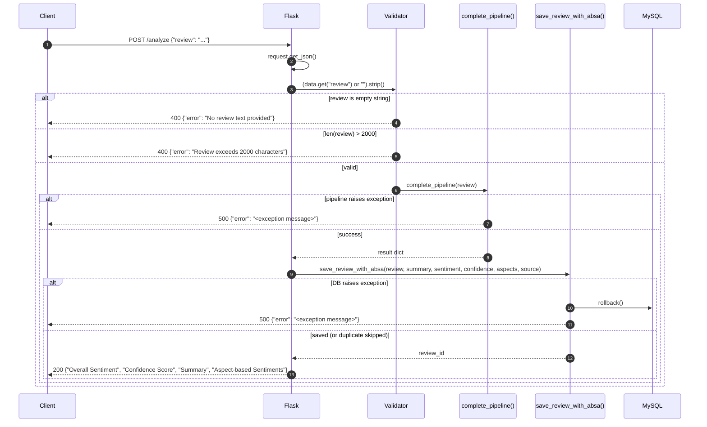
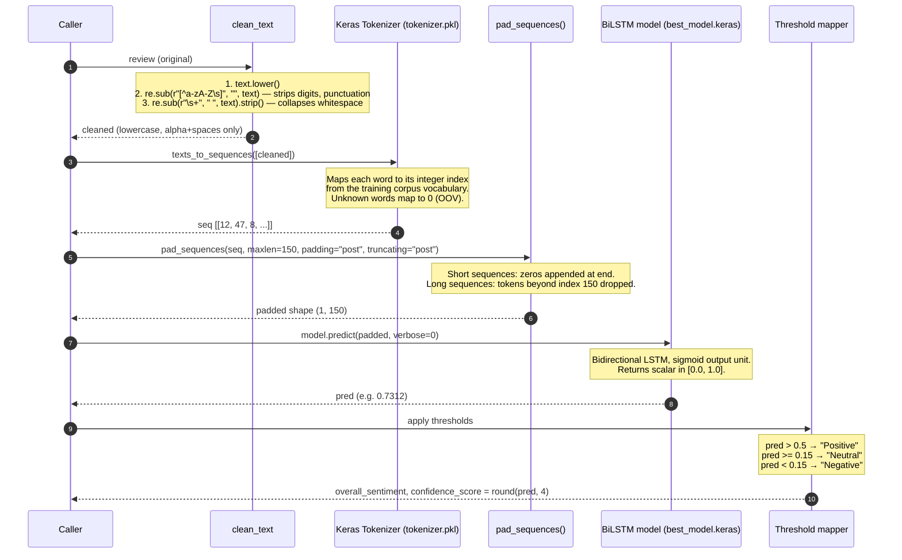
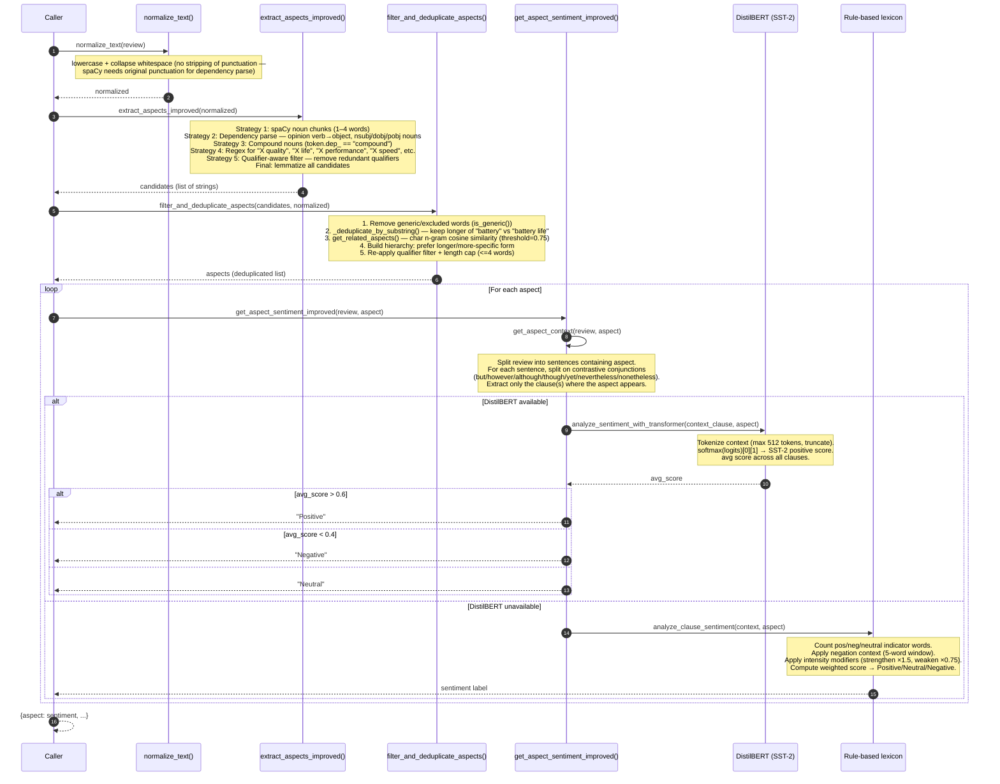
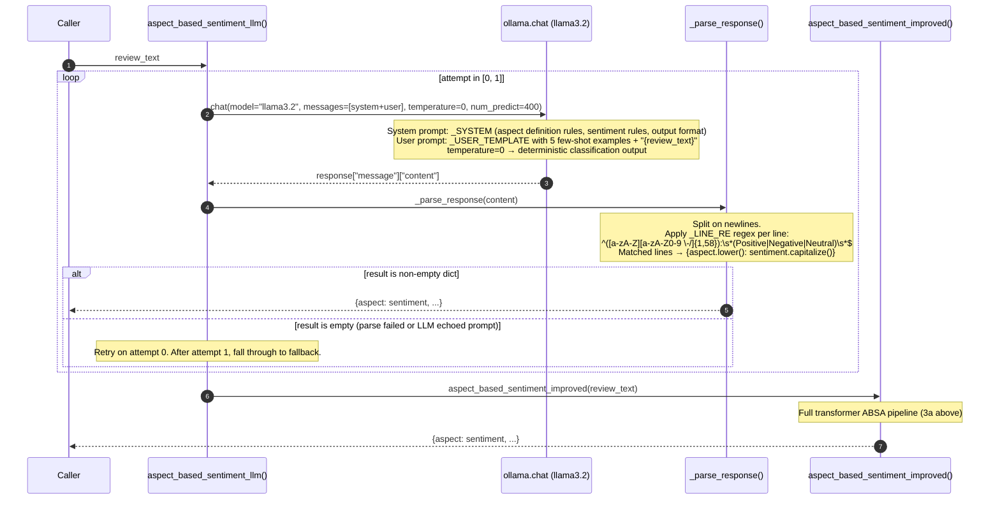
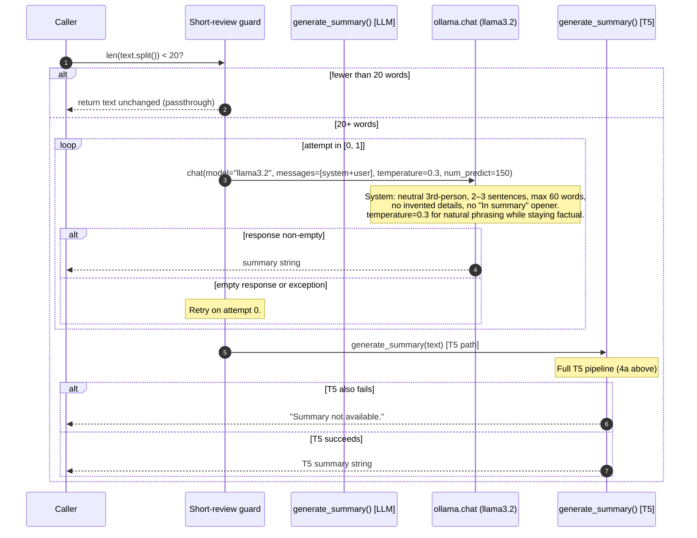
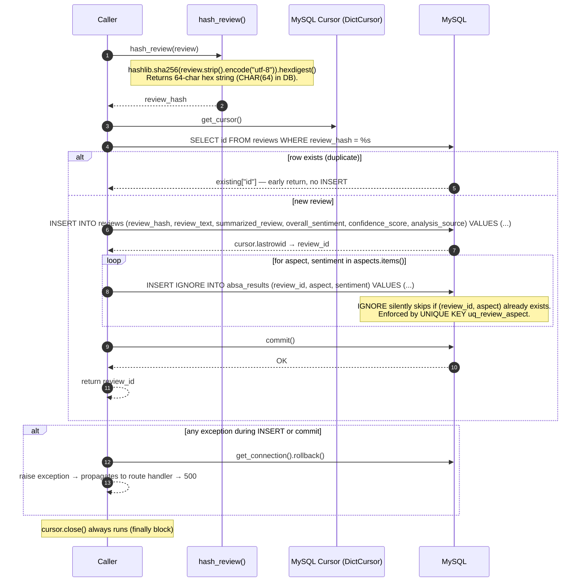
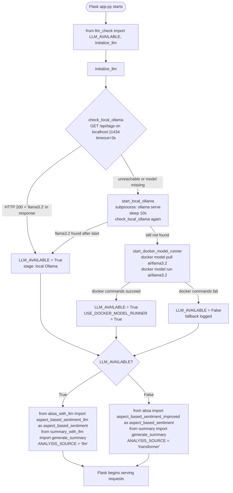
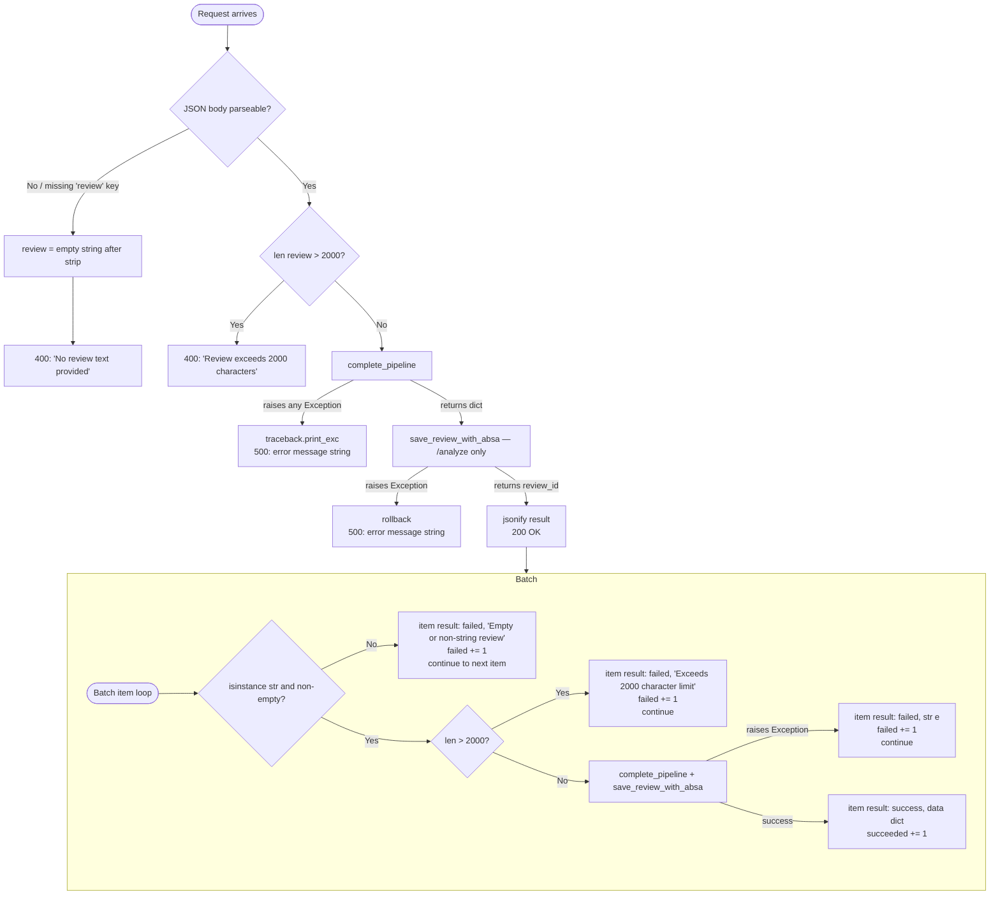
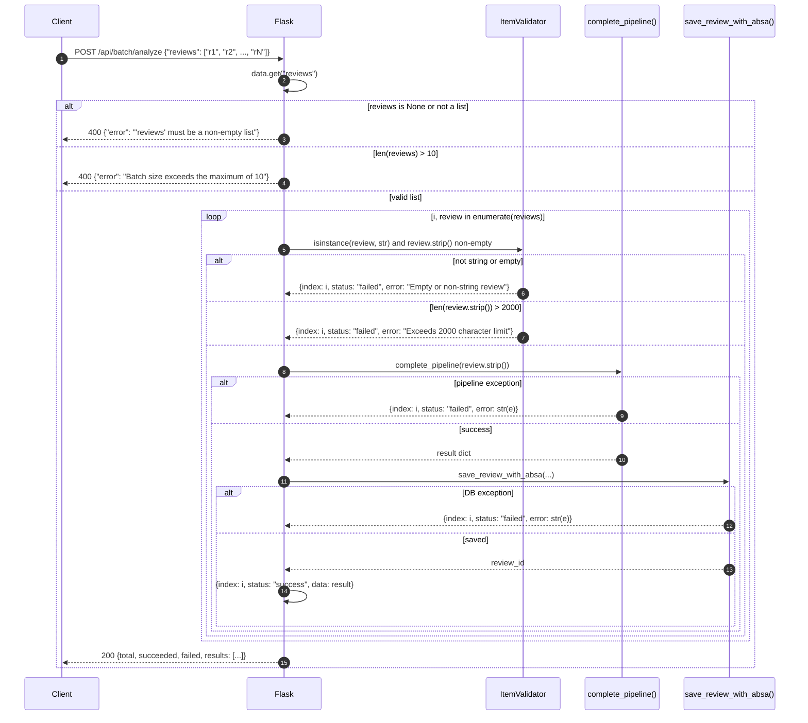

# Application Flow Documentation

This document describes every significant control flow in the Amazon Review Sentiment ABSA
backend. Each section covers the logical path through the code, all branching conditions, and
the precise function calls involved. Every flow includes a Mermaid sequence or flowchart diagram.

---

## Table of Contents

1. [Request Lifecycle](#1-request-lifecycle)
2. [Sentiment Prediction Flow](#2-sentiment-prediction-flow)
3. [ABSA Flow](#3-absa-flow)
4. [Summarization Flow](#4-summarization-flow)
5. [Database Write Flow](#5-database-write-flow)
6. [Model Selection at Startup](#6-model-selection-at-startup)
7. [Fallback Flow](#7-fallback-flow)
8. [Exception Flow](#8-exception-flow)
9. [Batch Processing Flow](#9-batch-processing-flow)

---

## 1. Request Lifecycle

All analysis requests follow the same outer lifecycle: HTTP arrives, Flask routes it, validation
runs, the NLP pipeline executes, the result is optionally persisted, and a JSON response is
returned. Errors at any stage produce a structured JSON error body.

The two single-review routes differ in only one step: `POST /analyze` writes to the database;
`POST /api/sentiment` does not.



### Route Differences

| Route | Saves to DB | Returns `_source` field |
|---|---|---|
| `POST /analyze` | Yes | No (popped before response) |
| `POST /api/sentiment` | No | No (popped via `.pop("_source", None)`) |
| `POST /api/batch/analyze` | Yes per item | No (popped per item) |

---

## 2. Sentiment Prediction Flow

`complete_pipeline()` in `app.py` handles all sentiment inference. The review text is cleaned
before model input, but the ORIGINAL un-cleaned text is forwarded to both the summarizer and
the ABSA module so that transformers see proper casing and punctuation.



### Threshold Mapping Table

| BiLSTM Output Range | Assigned Sentiment | Notes |
|---|---|---|
| `(0.5, 1.0]` | Positive | Model confident review is positive |
| `[0.15, 0.5]` | Neutral | Ambiguous or mixed signal |
| `[0.0, 0.15)` | Negative | Model confident review is negative |

The confidence score stored in the database is the raw sigmoid value rounded to 4 decimal
places, not a probability of the assigned class. For a Negative prediction of `0.03`, the
confidence score is `0.03` (close to 0 = strongly negative). For a Positive prediction of
`0.97`, the confidence score is `0.97`.

---

## 3. ABSA Flow

Aspect-Based Sentiment Analysis runs on the ORIGINAL review text (not cleaned). There are two
code paths depending on `LLM_AVAILABLE` set at startup.

### 3a. Traditional Path (spaCy + DistilBERT)



### 3b. LLM Path (llama3.2 via Ollama)



---

## 4. Summarization Flow

Summarization also runs on the ORIGINAL review text and has two paths.

### 4a. T5-base Path (transformer mode)

```mermaid
sequenceDiagram
    autonumber
    participant Caller
    participant Guard as Short-review guard
    participant T5Tok as T5Tokenizer
    participant T5Model as T5ForConditionalGeneration (t5-base)
    participant Decoder

    Caller->>Guard: len(text.split()) < 20?
    alt fewer than 20 words
        Guard-->>Caller: return text unchanged (passthrough)
    else 20+ words
        Guard->>T5Tok: tokenizer("summarize: " + text, max_length=512, truncation=True)
        Note over T5Tok: Prepends "summarize: " task prefix required by T5.<br/>Hard cap at 512 tokens; longer reviews are truncated.
        T5Tok-->>Guard: input_ids tensor

        Guard->>T5Model: model.generate(input_ids, max_length=80, min_length=20, num_beams=4, no_repeat_ngram_size=3, length_penalty=2.0, early_stopping=True)
        Note over T5Model: num_beams=4: beam search for quality.<br/>no_repeat_ngram_size=3: prevents phrase repetition.<br/>length_penalty=2.0: penalises verbose outputs.<br/>Output: token id sequence.
        T5Model-->>Guard: generated_ids

        Guard->>Decoder: tokenizer.decode(ids[0], skip_special_tokens=True)
        Decoder-->>Caller: summary string

        alt T5 raises exception
            T5Model-->>Caller: "Summary not available."
        end
    end
```

### 4b. LLM Path (llama3.2 via Ollama)



---

## 5. Database Write Flow

`save_review_with_absa()` in `app.py` handles all persistence. It is idempotent: submitting the
same review text twice results in one DB row, not two. Idempotency is enforced by a SHA-256
hash check before any INSERT.



---

## 6. Model Selection at Startup

Before Flask starts serving requests, `initialize_llm()` is called to probe whether a local LLM
is available. The result permanently sets `LLM_AVAILABLE` and determines which module is imported
for ABSA and summarization.



---

## 7. Fallback Flow

The system has multiple fallback layers to ensure that every request returns a meaningful
response rather than an unhandled exception.

```mermaid
flowchart TD
    A([complete_pipeline called]) --> B{LLM_AVAILABLE?}

    B -->|False — set at startup| C[Use transformer path\nabsa_with_llm NOT imported\nsummary_with_llm NOT imported]

    B -->|True| D[Call LLM functions]

    D --> E{LLM ABSA:\naspect_based_sentiment_llm}
    E -->|attempt 0 succeeds and parse non-empty| F[Return aspect dict]
    E -->|attempt 0: empty parse| G[Retry attempt 1]
    G -->|attempt 1 succeeds and non-empty| F
    G -->|attempt 1 fails or empty| H[Import and call\naspect_based_sentiment_improved\ntransformer fallback]
    H -->|transformer succeeds| F
    H -->|transformer also fails| I[Return empty dict {}]

    D --> J{LLM Summary:\ngenerate_summary LLM}
    J -->|attempt 0 returns non-empty string| K[Return summary]
    J -->|attempt 0 fails or empty| L[Retry attempt 1]
    L -->|attempt 1 returns non-empty string| K
    L -->|attempt 1 fails or empty| M[Import and call\ngenerate_summary T5 fallback]
    M -->|T5 succeeds| K
    M -->|T5 also raises exception| N[Return 'Summary not available.']

    C --> O[Transformer ABSA\nDistilBERT scoring]
    O -->|DistilBERT unavailable| P[Rule-based lexicon\nanalyze_clause_sentiment]
```

---

## 8. Exception Flow



---

## 9. Batch Processing Flow

`POST /api/batch/analyze` applies the full pipeline to each review independently. A failure for
one item never aborts processing for the remaining items.



### Batch Response Structure

```json
{
  "total": 3,
  "succeeded": 2,
  "failed": 1,
  "results": [
    {"index": 0, "status": "success", "data": { "Overall Sentiment": "Positive", "..." }},
    {"index": 1, "status": "failed",  "error": "Exceeds 2000 character limit"},
    {"index": 2, "status": "success", "data": { "Overall Sentiment": "Negative", "..." }}
  ]
}
```

HTTP status is always `200` for the batch endpoint. Partial failure is indicated in the
`failed` counter and per-item `status` fields — not via a non-200 HTTP status code.
