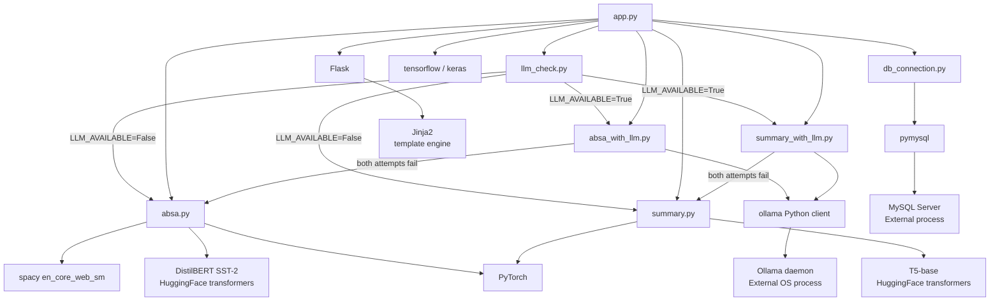
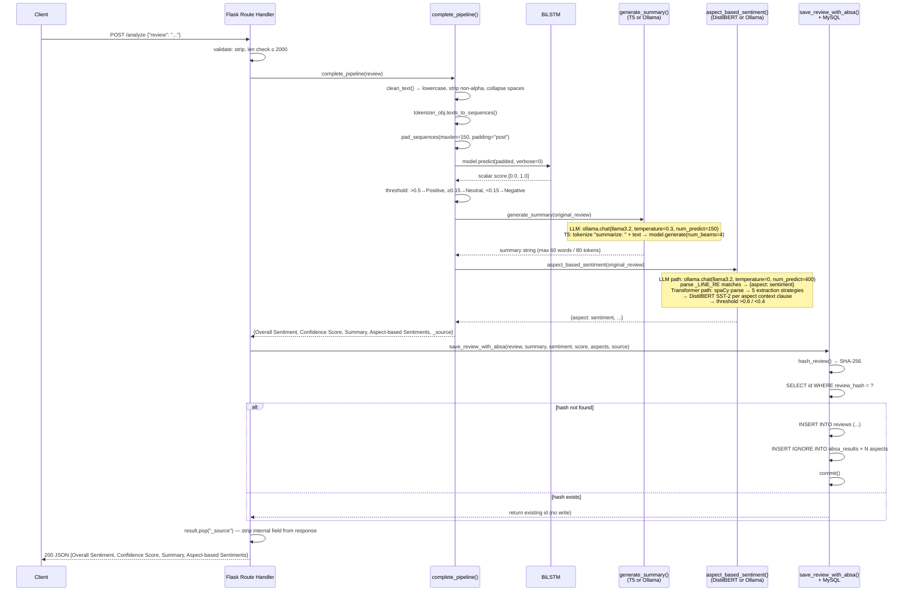

# Architecture Deep Dive
## Amazon Review Multi-Task NLP System

**Version:** 1.0  
**Last Updated:** 2026-06-01

---

## 1. Runtime Architecture

The application is a single Python process. All ML models are loaded into that process's heap at startup. There is no model server, no inference microservice, no RPC — model calls are in-process function calls. Ollama is the sole exception: when the LLM path is active, ABSA and summarization calls cross a local HTTP boundary to the Ollama daemon.

```
┌──────────────────────────────────────────────────────────────┐
│  OS Process: python app.py  (or gunicorn worker)             │
│                                                              │
│  ┌─────────────┐   ┌──────────────┐   ┌──────────────────┐  │
│  │  Flask/WSGI │   │  BiLSTM      │   │  Keras Tokenizer │  │
│  │  request    │   │  (TensorFlow)│   │  (tokenizer.pkl) │  │
│  │  handler    │   │  ~100 MB     │   │  ~5 MB           │  │
│  └──────┬──────┘   └──────────────┘   └──────────────────┘  │
│         │                                                    │
│  ┌──────▼──────────────────────────────────────────────────┐ │
│  │  complete_pipeline()                                    │ │
│  │  1. clean_text + tokenize + pad + BiLSTM.predict        │ │
│  │  2. generate_summary()  [T5 or LLM HTTP]                │ │
│  │  3. aspect_based_sentiment()  [DistilBERT or LLM HTTP]  │ │
│  └─────────────────────────────────────────────────────────┘ │
│                                                              │
│  [transformer path only]     [LLM path only]                 │
│  ┌────────────────────┐      ┌───────────────────────────┐  │
│  │ DistilBERT SST-2   │      │ ollama.chat() → HTTP      │  │
│  │ ~260 MB            │      │ → Ollama daemon (separate  │  │
│  │ T5-base ~850 MB    │      │   OS process, ~2 GB RAM)   │  │
│  │ spaCy ~50 MB       │      └───────────────────────────┘  │
│  └────────────────────┘                                      │
│                                                              │
│  ┌─────────────────────────────────────────────────────────┐ │
│  │  save_review_with_absa()  →  pymysql  →  MySQL server   │ │
│  └─────────────────────────────────────────────────────────┘ │
└──────────────────────────────────────────────────────────────┘
```

---

## 2. Module Dependency Graph



**Key architectural fact:** The import branches (`ABSA_LLM` / `SUM_LLM` vs `ABSA` / `SUM`) are resolved at Python import time — before any HTTP request arrives. Python's module system ensures each module is loaded at most once per process. All subsequent calls to `aspect_based_sentiment()` and `generate_summary()` go to whichever implementation was bound at startup.

---

## 3. LLM Detection Logic — Runtime Startup Sequence

`llm_check.initialize_llm()` is the first substantive call in `app.py` (line 26). It mutates the module-global `LLM_AVAILABLE` flag in `llm_check.py`. The conditional import in `app.py` (lines 28-35) reads this flag immediately after.

There is no thread involved here. The startup is single-threaded Python executing top-to-bottom at import time. The 10-second `time.sleep()` in `start_local_ollama()` is a blocking wall-clock wait — if Ollama needs to be launched, startup takes at minimum 10 extra seconds before the Flask server begins accepting connections.

The `OLLAMA_BASE_URL` is read from environment at module load time:
```python
OLLAMA_BASE_URL = os.getenv("OLLAMA_BASE_URL", "http://localhost:11434")
```

This means the URL is fixed at startup. Changing the env var at runtime has no effect.

---

## 4. Request Lifecycle — Full Sequence Diagram



---

## 5. Inference Engine Coordination

`complete_pipeline()` (lines 79-102 of `app.py`) calls the three inference engines **sequentially**. There is no parallelism:

1. **BiLSTM** runs first because the overall sentiment score is part of the API response and needed for the DB write. It is also the fastest step (<100 ms).
2. **Summarizer** runs second. The summary is independent of the ABSA output. No technical reason prevents running summarizer and ABSA in parallel, but the current implementation does not do so. This is a latency optimization opportunity.
3. **ABSA** runs third. It operates on the original (uncleaned) review text, not the cleaned text used by BiLSTM. This is intentional: DistilBERT and llama3.2 benefit from punctuation and capitalization that `clean_text()` strips.

Note that `generate_summary()` and `aspect_based_sentiment()` both receive the **original** `review` string (line 93-94 of `app.py`), not the `cleaned` string. Only the BiLSTM path uses `cleaned`.

---

## 6. Threading Implications

### Flask Development Server

Single-threaded, single-process. Requests are processed serially. The thread-local DB connection mechanism (`threading.local()`) is harmless but unnecessary in this mode — there is only ever one thread.

### Gunicorn — Recommended Production Mode

**Multi-worker (prefork):** Each worker is a forked OS process. Models load independently per worker. `threading.local()` per worker still ensures per-thread connections if workers are configured with `--threads > 1`.

**RAM cost:** With 2 workers on the transformer path, memory usage is approximately:
- 2 × (BiLSTM 100 MB + DistilBERT 260 MB + T5-base 850 MB + spaCy 50 MB + Keras tokenizer 5 MB) = ~2.53 GB

**With LLM path:** Workers do not load DistilBERT, T5, or spaCy (those modules are not imported). Each worker carries ~105 MB. Ollama runs once as a sidecar and all workers share it via HTTP.

### Database Connection Lifecycle

One connection per thread, created lazily on first use within a request, closed by `@app.teardown_appcontext → close_connection()` at request end. The connection is not pooled — it is fully closed. This is safe for low-to-moderate traffic but becomes a bottleneck at high request rates. A production deployment should introduce a connection pool (e.g., `sqlalchemy` + `pool_size`, or `ProxySQL` at the DB tier).

---

## 7. Performance Characteristics

| Component | Estimated Latency | Bottleneck Type | Notes |
|---|---|---|---|
| `clean_text()` + tokenize + pad | < 5 ms | CPU (string ops) | Negligible |
| BiLSTM `model.predict()` | 50–150 ms | CPU (TensorFlow) | GPU would cut this to <10 ms |
| T5-base `model.generate()` | 500 ms – 2 s | CPU (PyTorch beam search) | `num_beams=4` multiplies computation; GPU recommended |
| DistilBERT per-clause inference | 50–200 ms per clause | CPU (PyTorch) | Multiple aspects × multiple clauses; scales linearly |
| spaCy `nlp(text)` | 20–100 ms | CPU (C extension) | Dominated by dependency parse |
| `ollama.chat()` ABSA | 1,000 – 5,000 ms | Network + GPU/CPU in Ollama | Depends on Ollama hardware; GPU sidecar cuts to ~500 ms |
| `ollama.chat()` summary | 500 – 2,000 ms | Network + GPU/CPU in Ollama | 150 token cap limits generation time |
| MySQL write (hash check + INSERT) | 5–50 ms | I/O (network to DB) | Indexed hash lookup is O(1) |
| **Total (transformer path)** | **~1–4 seconds** | CPU-bound | Dominated by T5 summarization |
| **Total (LLM path)** | **~2–8 seconds** | Network-bound (Ollama) | Two serial Ollama calls |

**Production headroom:** A single CPU-only worker on the transformer path handles approximately 2-5 requests per second at steady state, assuming 2-second average request duration. For higher throughput, add workers (more RAM) or move to GPU inference.

---

## 8. Memory Implications at Startup

All models load before the first request. The startup sequence touches disk/network in this order:

1. `llm_check.initialize_llm()` — HTTP call to Ollama (may launch subprocess and wait 10s)
2. Conditional import of `absa_with_llm` or `absa` — if `absa.py`: loads spaCy model (disk read ~50 MB), then downloads DistilBERT from HuggingFace cache (~260 MB from disk)
3. Conditional import of `summary_with_llm` or `summary` — if `summary.py`: loads T5-base from HuggingFace cache (~850 MB from disk)
4. `tf.keras.models.load_model("best_model.keras")` — TensorFlow reads the Keras binary (~100 MB from disk)
5. `pickle.load(open("tokenizer.pkl"))` — deserialize the Keras Tokenizer object (~5 MB from disk)
6. Flask binds to `0.0.0.0:5000` and starts accepting requests

If step 4 fails (file missing): `RuntimeError("Model file not found: best_model.keras")` — process exits.
If step 5 fails (file missing): `RuntimeError("Tokenizer file not found: tokenizer.pkl")` — process exits.
If steps 2-3 fail (HuggingFace download or corrupt cache): exception propagates, process exits.

**Total cold-start time estimate:** 30-90 seconds on CPU-only hardware with warm HuggingFace cache. First startup with cache miss adds model download time.

---

## 9. ABSA Extraction Detail — Five-Strategy Pipeline

When running `extract_aspects_improved()` on `"Battery lasts all day but the camera is blurry in low light."`:

| Strategy | Extracted candidates | Notes |
|---|---|---|
| 1. Noun chunks | `"battery"`, `"camera"`, `"low light"` | spaCy chunks; articles stripped by `normalize_aspect()` |
| 2. Dependency parse | `"battery"`, `"camera"` | `nsubj` / `dobj` in sentence parse |
| 3. Compound nouns | (none for this example) | Would catch `"battery life"` if "life" were present |
| 4. Regex patterns | (none match) | Would catch `"camera quality"`, `"battery life"`, etc. |
| 5. Qualifier filter | `"low light"` kept | It is a qualifier of `"camera"` but retained because it matches the `"low light"` keep-rule |

After deduplication: `["battery", "camera", "low light"]`

Sentiment for `"camera"`: `get_aspect_context()` extracts the clause `"the camera is blurry in low light"` (post-contrastive split on `"but"`). DistilBERT scores this clause → low positive probability → `"Negative"`.

---

## 10. Known Architectural Limitations

1. **No async inference.** All model calls are synchronous within the request thread. A slow Ollama response blocks the thread for the full duration.
2. **No request queuing.** Under sustained load, gunicorn will start queuing connections at the OS level when all worker threads are busy.
3. **No GPU scheduling.** TensorFlow and PyTorch run on CPU by default. No CUDA device check, no GPU memory management.
4. **Single-node DB.** No read replica, no connection pool. Heavy analytics queries (`/api/aspects/trending`) run on the same MySQL instance as writes.
5. **LLM path has no timeout.** `ollama.chat()` uses no explicit request timeout. A hung Ollama daemon will hang the Flask worker indefinitely.
6. **`analysis_source` is set at import time.** If Ollama goes down after startup, the `ANALYSIS_SOURCE` variable still reads `"llm"`, but ABSA/summary calls will fail and trigger the fallback chain. The fallback results will be stored with `source = "llm"` in the DB — a minor data integrity issue.
