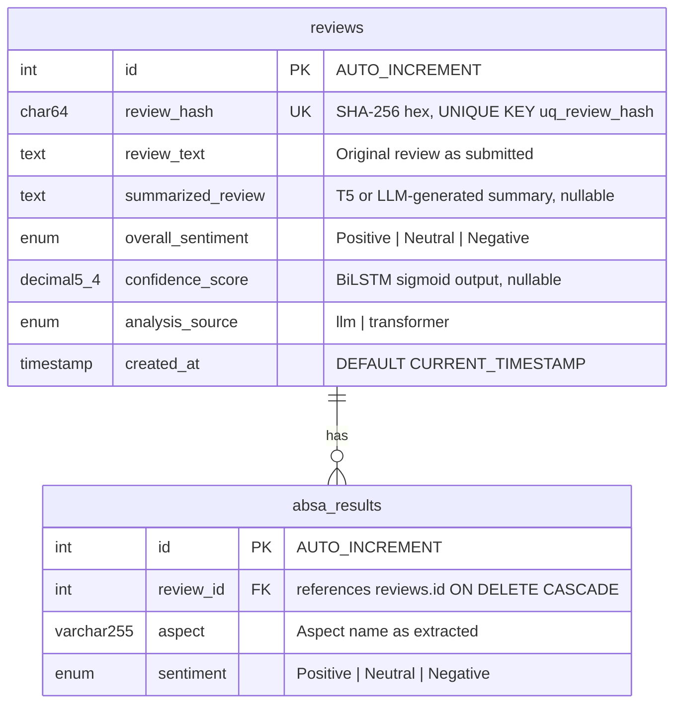

# Database Schema Documentation

This document covers every design decision in the two-table MySQL schema used by the Amazon
Review Sentiment ABSA backend. It includes column-level rationale, index design analysis,
normalization discussion, and future improvement paths.

---

## Table of Contents

1. [Schema Overview](#1-schema-overview)
2. [ER Diagram](#2-er-diagram)
3. [reviews Table](#3-reviews-table)
4. [absa_results Table](#4-absa_results-table)
5. [Index Design](#5-index-design)
6. [Normalization Analysis](#6-normalization-analysis)
7. [Deduplication Strategy](#7-deduplication-strategy)
8. [Query Optimization](#8-query-optimization)
9. [Normalization Tradeoffs](#9-normalization-tradeoffs)
10. [Future Schema Improvements](#10-future-schema-improvements)

---

## 1. Schema Overview

The schema consists of two tables in a parent-child (master-detail) relationship:

| Table | Role | Row represents |
|---|---|---|
| `reviews` | Master / parent | One analyzed product review and its aggregate sentiment |
| `absa_results` | Child / detail | One aspect-sentiment pair extracted from a specific review |

The relationship is **one-to-many**: one review can have zero or more aspect rows. The foreign
key `absa_results.review_id → reviews.id` enforces referential integrity at the database level.

Database and collation:
```sql
CREATE DATABASE IF NOT EXISTS nlp_app_db
    CHARACTER SET utf8mb4
    COLLATE utf8mb4_unicode_ci;
```

`utf8mb4` is used rather than MySQL's legacy `utf8` because `utf8` in MySQL is a 3-byte
encoding that cannot represent emoji and supplementary Unicode characters. Amazon reviews
frequently contain emoji in product descriptions.

---

## 2. ER Diagram



---

## 3. `reviews` Table

Full DDL:

```sql
CREATE TABLE reviews (
    id                INT AUTO_INCREMENT PRIMARY KEY,
    review_hash       CHAR(64)     NOT NULL,
    review_text       TEXT         NOT NULL,
    summarized_review TEXT,
    overall_sentiment ENUM('Positive', 'Neutral', 'Negative') NOT NULL,
    confidence_score  DECIMAL(5, 4),
    analysis_source   ENUM('llm', 'transformer') NOT NULL DEFAULT 'transformer',
    created_at        TIMESTAMP    NOT NULL DEFAULT CURRENT_TIMESTAMP,

    UNIQUE KEY uq_review_hash (review_hash),
    INDEX idx_sentiment (overall_sentiment),
    INDEX idx_created_at (created_at)
);
```

### Column Rationale

#### `id INT AUTO_INCREMENT PRIMARY KEY`

Synthetic surrogate key. An integer surrogate is preferred over using `review_hash` as the
primary key because:
- Integer join columns (`review_id INT`) are smaller than `CHAR(64)` — the `absa_results`
  foreign key and every index on `absa_results` benefits from the smaller type.
- `AUTO_INCREMENT` guarantees monotonically increasing IDs, which allows `ORDER BY id` as a
  cheaper proxy for insertion order when needed.

#### `review_hash CHAR(64) NOT NULL`

SHA-256 produces a 256-bit digest encoded as a 64-character hexadecimal string. `CHAR(64)` is
used instead of `VARCHAR(64)` because the length is always exactly 64. `CHAR` stores fixed-
length strings without the 1-byte length prefix overhead of `VARCHAR`, and comparisons on
`CHAR` columns are marginally faster because the optimizer knows the length statically.

The `UNIQUE KEY uq_review_hash` on this column enforces deduplication at the database layer
independent of application logic. Even if the application has a bug and attempts to insert the
same hash twice, the database rejects the second insertion.

**Why not `UNIQUE(review_text(255))`?** MySQL prefix indexes on `TEXT` columns only compare the
first N characters. Two reviews with identical first 255 characters but different endings would
be incorrectly treated as duplicates. The SHA-256 approach hashes the entire review text.

#### `review_text TEXT NOT NULL`

`TEXT` (65,535 byte max) is used instead of `VARCHAR(2000)` for two reasons:
1. The 2000-character application-layer limit is a business rule that may change. Using `TEXT`
   means the database does not need to be altered if the limit is raised.
2. `VARCHAR` columns over 255 characters are not stored inline in the row in older MySQL
   versions; `TEXT` makes the storage behavior explicit and consistent.

`NOT NULL` because a review row without review text is semantically meaningless.

#### `summarized_review TEXT` (nullable)

Nullable because:
- Reviews shorter than 20 words are returned as-is without running the summarizer; the
  passthrough result is stored directly.
- If summarization fails at the T5/LLM level and returns `"Summary not available."`, that
  string is stored — the column is never left as SQL `NULL` in practice except for rows
  migrated from older schema versions.

`TEXT` rather than `VARCHAR` — same rationale as `review_text`.

#### `overall_sentiment ENUM('Positive', 'Neutral', 'Negative') NOT NULL`

`ENUM` is chosen over `VARCHAR` for three reasons:
1. **Storage**: MySQL stores `ENUM` values as 1 or 2 bytes (index into the enumeration). A
   `VARCHAR(8)` storing "Positive" would use 9 bytes. With millions of rows, the difference
   is significant.
2. **Constraint**: The database enforces that only the three defined values can be inserted.
   An application bug that writes `"positive"` (lowercase) would be caught at the DB level.
3. **Index efficiency**: `ENUM` columns on which an index is defined (`idx_sentiment`) benefit
   from the small storage size — the index is compact and fits more entries per B-tree page.

`NOT NULL` because every analyzed review has a sentiment classification.

#### `confidence_score DECIMAL(5, 4)`

`DECIMAL(5, 4)` stores values from `-9.9999` to `9.9999` with exactly 4 decimal places.
In practice the BiLSTM sigmoid output is always in `[0.0000, 1.0000]`, so the full range is
used. `DECIMAL` is chosen over `FLOAT`/`DOUBLE` because:
- `DECIMAL` stores values exactly without floating-point rounding artifacts.
- Audit queries like `WHERE confidence_score < 0.2` produce exact, reproducible results.
- The 4-decimal precision matches `round(pred, 4)` in the application code, so no precision
  is lost in the round-trip.

Nullable because future schema migrations may add rows from sources that do not produce a
confidence score.

#### `analysis_source ENUM('llm', 'transformer') NOT NULL DEFAULT 'transformer'`

Tracks which inference path produced the analysis. This is stored to support:
- A/B quality comparison between LLM and transformer results.
- Reprocessing of `'transformer'` rows through the LLM after upgrading the model.
- Debugging: if an aspect list looks unusual, knowing the source narrows the investigation.

`DEFAULT 'transformer'` means older rows inserted before the LLM path was added are correctly
attributed to the transformer path.

#### `created_at TIMESTAMP NOT NULL DEFAULT CURRENT_TIMESTAMP`

`TIMESTAMP` stores values in UTC normalized to the MySQL server timezone and uses 4 bytes.
`DATETIME` (8 bytes) would allow a wider range (year 1000–9999) but is unnecessary for a
system that started recording in 2024. `DEFAULT CURRENT_TIMESTAMP` means the application
never needs to set this field; the database sets it atomically on INSERT.

---

## 4. `absa_results` Table

Full DDL:

```sql
CREATE TABLE absa_results (
    id        INT          AUTO_INCREMENT PRIMARY KEY,
    review_id INT          NOT NULL,
    aspect    VARCHAR(255) NOT NULL,
    sentiment ENUM('Positive', 'Neutral', 'Negative') NOT NULL,

    UNIQUE KEY uq_review_aspect (review_id, aspect),
    INDEX idx_aspect          (aspect),
    INDEX idx_absa_sentiment  (sentiment),

    FOREIGN KEY (review_id) REFERENCES reviews(id) ON DELETE CASCADE
);
```

### Column Rationale

#### `id INT AUTO_INCREMENT PRIMARY KEY`

Same rationale as `reviews.id`. A surrogate key makes future references to specific ABSA rows
straightforward.

#### `review_id INT NOT NULL`

Foreign key linking this aspect row to its parent review. `INT` matches `reviews.id`. `NOT NULL`
because an aspect row with no parent is semantically invalid.

The `ON DELETE CASCADE` on the foreign key ensures that if a review row is deleted (e.g., for
GDPR compliance), all its associated ABSA rows are automatically removed. This maintains
referential integrity without requiring the application to issue a separate DELETE.

#### `aspect VARCHAR(255) NOT NULL`

`VARCHAR(255)` rather than `TEXT` for two reasons:
1. Aspect names are short by design — they are product feature names like `"battery life"` or
   `"camera quality"`. 255 characters is a generous upper bound.
2. `VARCHAR(255)` columns can be used as the full column in index definitions (not a prefix
   index). The `UNIQUE KEY uq_review_aspect (review_id, aspect)` uses the full aspect value,
   making the uniqueness guarantee exact. A `TEXT` column in a unique key requires a prefix
   length, which would be a partial guarantee only.
3. The composite `UNIQUE KEY uq_review_aspect` and `INDEX idx_aspect` both benefit from the
   fixed-length optimization of `VARCHAR` over `TEXT` for index storage.

#### `sentiment ENUM('Positive', 'Neutral', 'Negative') NOT NULL`

Same rationale as `reviews.overall_sentiment`. The `idx_absa_sentiment` index and the
`SUM(CASE WHEN a.sentiment = 'Positive' THEN 1 ELSE 0 END)` expressions in the trending query
both benefit from the compact ENUM encoding.

### Foreign Key: `ON DELETE CASCADE`

If `DELETE FROM reviews WHERE id = ?` is executed:
- All rows in `absa_results` with `review_id = ?` are automatically deleted.
- No orphaned aspect rows can exist.
- The cascade is handled by the MySQL storage engine, not the application, making it
  atomic within the same transaction.

---

## 5. Index Design

### `UNIQUE KEY uq_review_hash` on `reviews(review_hash)`

**Purpose:** Enables O(1) duplicate detection in `save_review_with_absa()`.

**Query served:**
```sql
SELECT id FROM reviews WHERE review_hash = %s
```

Without this index, the query would scan all rows in `reviews` (`O(n)`). With the unique index,
MySQL uses a B-tree exact-match lookup (`O(log n)`), and the unique constraint prevents
concurrent inserts from creating duplicates even under race conditions.

This index replaces the original broken `UNIQUE(review_text(255))` prefix index. SHA-256
hashing of the full text makes the deduplication exact regardless of review length.

### `INDEX idx_sentiment` on `reviews(overall_sentiment)`

**Purpose:** Supports the `WHERE overall_sentiment = ?` filter in `GET /api/reviews`.

**Queries served:**
```sql
SELECT COUNT(*) AS total FROM reviews WHERE overall_sentiment = %s
SELECT ... FROM reviews WHERE overall_sentiment = %s ORDER BY created_at DESC LIMIT %s OFFSET %s
```

Without this index, both queries perform a full table scan. With `idx_sentiment`, MySQL uses
an index range scan to locate all rows with the given ENUM value. For the COUNT query the
index alone satisfies the query (covering index), since MySQL can count index entries without
touching the data rows.

Because `overall_sentiment` has only 3 distinct values, MySQL's optimizer may choose a full
table scan over the index on very small datasets (< ~1000 rows). On production datasets the
index is consistently used.

### `INDEX idx_created_at` on `reviews(created_at)`

**Purpose:** Supports the date-range filter in `GET /api/aspects/trending` and the sort in
`GET /api/reviews`.

**Queries served:**
```sql
-- Trending: date filter on joined table
WHERE r.created_at >= NOW() - INTERVAL %s DAY

-- Reviews: ordering
ORDER BY created_at DESC LIMIT %s OFFSET %s
```

For the trending query, `idx_created_at` allows MySQL to range-scan `reviews` within the date
window before joining to `absa_results`, rather than reading all reviews and filtering after
the join. This is critical for large datasets where the date window selects a small fraction
of all rows.

For the paginated reviews query, MySQL uses the index to avoid a sort operation (`filesort`)
when ordering by `created_at DESC`.

### `UNIQUE KEY uq_review_aspect` on `absa_results(review_id, aspect)`

**Purpose:** Prevents duplicate aspect rows per review at the database level.

**Enables the `INSERT IGNORE` pattern:**
```sql
INSERT IGNORE INTO absa_results (review_id, aspect, sentiment) VALUES (%s, %s, %s)
```

Without this constraint, a bug that called `save_review_with_absa` twice for the same review
(e.g., retry logic) would insert duplicate rows. `INSERT IGNORE` silently discards the second
insert when the composite key already exists. The uniqueness guarantee holds even if the
application bypasses the hash-dedup check.

The composite key `(review_id, aspect)` is ordered with `review_id` first because MySQL's
B-tree index is most efficient when the leftmost column appears in the query's `WHERE` clause.
All queries that look up ABSA rows always specify `review_id`.

### `INDEX idx_aspect` on `absa_results(aspect)`

**Purpose:** Supports `GROUP BY a.aspect` in the trending query.

**Query served:**
```sql
SELECT a.aspect, COUNT(*), SUM(...), SUM(...), SUM(...)
FROM absa_results a
JOIN reviews r ON a.review_id = r.id
WHERE r.created_at >= NOW() - INTERVAL %s DAY
GROUP BY a.aspect
ORDER BY total_mentions DESC
LIMIT %s
```

MySQL uses `idx_aspect` to resolve the `GROUP BY` without a sort. Without this index, the
database would need to read all matching rows and then perform an in-memory or disk-based sort
to group by aspect name.

### `INDEX idx_absa_sentiment` on `absa_results(sentiment)`

**Purpose:** Supports the `SUM(CASE WHEN a.sentiment = ...)` aggregations in the trending query.

In practice, MySQL often resolves `SUM(CASE ...)` expressions via the data rows rather than
the index alone, since the index does not cover all selected columns. However, for queries
that filter `WHERE a.sentiment = ?` directly (a potential future analytics endpoint), this
index would enable an index range scan.

---

## 6. Normalization Analysis

The schema is in **Second Normal Form (2NF)** and approaches Third Normal Form (3NF).

### Why ABSA results are in a separate table

A denormalized design that stored aspects in `reviews` would require a repeating group:

```
-- Denormalized (violates 1NF)
reviews(id, review_text, sentiment, aspect_1, sentiment_1, aspect_2, sentiment_2, ...)
```

This is impractical because:
- The number of aspects per review is variable (0 to ~15).
- It would require a fixed maximum number of aspect columns, wasting space for most rows.
- Adding a new aspect to an existing review would require an `UPDATE` touching all aspect
  columns, rather than an `INSERT`.

The 2NF design separates the fact that depends on the full key `(review_id, aspect)` — namely
the `sentiment` — into its own table. `reviews` holds facts that depend only on `review_id`.

### Functional dependencies

`reviews` table:
- `id → review_hash, review_text, summarized_review, overall_sentiment, confidence_score, analysis_source, created_at`
- `review_hash → id` (via UNIQUE constraint)

`absa_results` table:
- `(review_id, aspect) → sentiment`
- `id → review_id, aspect, sentiment`

No partial dependency exists in either table. The schema is in 2NF.

### 3NF consideration

`overall_sentiment` in `reviews` is functionally dependent on `confidence_score` via the
threshold mapping: `confidence_score > 0.5 → "Positive"`, etc. Strictly, a 3NF design would
store only `confidence_score` and derive `overall_sentiment` via a view or application logic.

The current design stores both because:
- Querying `WHERE overall_sentiment = 'Negative'` on a `CHAR/ENUM` column with an index is
  significantly faster than `WHERE confidence_score < 0.15`.
- The threshold mapping could change in future model versions; storing `overall_sentiment`
  directly records the classification that was made at the time, not a recomputed value.
- `analysis_source` affects the interpretation of `confidence_score` (LLM path does not
  produce a sigmoid score from the BiLSTM), so the derivation is not purely mechanical.

---

## 7. Deduplication Strategy

Duplicate detection is a two-layer system:

### Layer 1: Application-level hash check

```python
def hash_review(text: str) -> str:
    return hashlib.sha256(text.strip().encode("utf-8")).hexdigest()
```

Before any INSERT, the application:
1. Computes the SHA-256 hash of `review.strip()` (trailing whitespace normalized).
2. Queries `SELECT id FROM reviews WHERE review_hash = ?`.
3. If the row exists, returns the existing `id` immediately.

This check prevents the INSERT from being attempted at all, which is faster than relying on
the database to reject a duplicate key error.

### Layer 2: Database-level UNIQUE KEY

`UNIQUE KEY uq_review_hash (review_hash)` provides a hard guarantee even if:
- Two concurrent requests arrive with the same review at exactly the same time (race condition
  between the SELECT check and the INSERT).
- A bug in the application bypasses the hash check.
- An external tool inserts rows directly.

In the race condition case, one of the two concurrent INSERTs will receive a duplicate key
error. The application does not currently handle this explicitly — the exception propagates to
the route handler and returns a 500. A production improvement would be to catch
`pymysql.err.IntegrityError` and treat it as a successful dedup (return the existing row).

### Why SHA-256 over other approaches

| Approach | Issue |
|---|---|
| `UNIQUE(review_text(255))` prefix index | Only checks first 255 characters — exact duplicates with same first 255 chars treated as duplicates; different reviews sharing first 255 chars incorrectly blocked |
| Full-text search | Finds similar reviews, not exact duplicates |
| `UNIQUE(review_text)` (no prefix) | Not supported by MySQL on TEXT columns |
| MD5 hash | 128-bit; collision probability is negligible in practice but SHA-256 is the industry standard for content hashing |
| SHA-256 (current) | 256-bit; effectively collision-free for practical dataset sizes; O(1) lookup via B-tree index |

---

## 8. Query Optimization

### `GET /api/stats` — Four Separate Queries

```sql
SELECT COUNT(*) AS total FROM reviews;
SELECT overall_sentiment, COUNT(*) AS cnt FROM reviews GROUP BY overall_sentiment;
SELECT COUNT(*) AS total FROM absa_results;
SELECT MAX(created_at) AS last FROM reviews;
```

**Index usage:**
- `COUNT(*) FROM reviews` — MySQL uses any index (or the clustered primary key) for a fast
  count on InnoDB. With InnoDB's MVCC, this is an approximate count on very large tables;
  exact for this use case.
- `GROUP BY overall_sentiment` — `idx_sentiment` enables an index scan group-by. MySQL can
  read the index in order and count runs without sorting.
- `COUNT(*) FROM absa_results` — same as above.
- `MAX(created_at)` — `idx_created_at` is a B-tree index; MySQL reads the rightmost (maximum)
  entry directly in O(log n).

**Potential table scan:** `COUNT(*) FROM absa_results` on InnoDB reads the primary key index
(clustered); no secondary index is needed.

### `GET /api/aspects/trending` — JOIN with Aggregation

```sql
SELECT a.aspect, COUNT(*) AS total_mentions,
       SUM(CASE WHEN a.sentiment = 'Positive' THEN 1 ELSE 0 END) AS positive,
       SUM(CASE WHEN a.sentiment = 'Negative' THEN 1 ELSE 0 END) AS negative,
       SUM(CASE WHEN a.sentiment = 'Neutral'  THEN 1 ELSE 0 END) AS neutral
FROM absa_results a
JOIN reviews r ON a.review_id = r.id
WHERE r.created_at >= NOW() - INTERVAL %s DAY
GROUP BY a.aspect
ORDER BY total_mentions DESC
LIMIT %s
```

**Execution plan analysis:**

1. MySQL evaluates `r.created_at >= NOW() - INTERVAL N DAY` using `idx_created_at` on the
   `reviews` table to produce a set of qualifying `review_id` values.
2. For each qualifying `review_id`, MySQL looks up matching rows in `absa_results` via the
   leftmost column of `uq_review_aspect (review_id, aspect)`.
3. `GROUP BY a.aspect` is resolved using `idx_aspect` if the optimizer chooses it, or via a
   filesort. For small `LIMIT` values, a filesort on a small result set may be faster than
   an index scan.
4. `ORDER BY total_mentions DESC` is a computed column and always requires a sort after
   aggregation.

**Performance characteristic:** This query scales with the number of reviews in the date window
multiplied by the average number of aspects per review. For a 30-day window on a large
production dataset, this query benefits significantly from `idx_created_at` filtering rows
early. Without that index, the query would read all ABSA rows and then filter by date after
the join — an O(n*m) operation.

### `GET /api/reviews` — Paginated Read

```sql
SELECT COUNT(*) AS total FROM reviews WHERE overall_sentiment = %s;
SELECT id, review_text, summarized_review, overall_sentiment,
       confidence_score, created_at
FROM reviews
WHERE overall_sentiment = %s
ORDER BY created_at DESC
LIMIT %s OFFSET %s
```

**Index usage:** `idx_sentiment` is used for the `WHERE` clause. However, `ORDER BY created_at`
requires a different index (`idx_created_at`). MySQL cannot efficiently use both indexes
simultaneously for a filtered + sorted query.

**Deep pagination problem:** `OFFSET` scans and discards rows from the start of the result set.
For `page=50, limit=20`, MySQL reads and discards the first 980 matching rows before returning
20. This degrades as `page` increases. A keyset pagination pattern (using `WHERE id < ?` from
the last seen row) would avoid this but requires API changes.

---

## 9. Normalization Tradeoffs

### Current 2-table design vs alternatives

| Design | Pros | Cons |
|---|---|---|
| **2-table (current)** | Clean separation of facts; variable-length aspect lists; ABSA rows can be queried independently; CASCADE delete for compliance | JOIN required for trending queries; two inserts per review |
| **Denormalized (ABSA JSON in reviews)** | Single-table read for `/api/reviews`; no JOIN for simple fetches | Cannot efficiently GROUP BY aspect; JSON extraction is slow without generated columns; schema migration required to add aspect-level indexes |
| **3-table (aspects dictionary)** | Aspect names stored once; normalized text reduces storage | Additional JOIN for every ABSA query; aspect vocabulary is open-ended so the dictionary table grows unboundedly |

The 2-table design is the correct choice for this workload. ABSA queries that aggregate by
aspect (`GET /api/aspects/trending`) are more common than queries that need all aspects for a
single review, and the JOIN cost is acceptable given MySQL's join optimizer.

---

## 10. Future Schema Improvements

### Partitioning by `created_at`

For datasets exceeding ~10 million reviews, range partitioning by month on `created_at` would
dramatically improve the trending query:

```sql
ALTER TABLE reviews PARTITION BY RANGE (UNIX_TIMESTAMP(created_at)) (
    PARTITION p2025_01 VALUES LESS THAN (UNIX_TIMESTAMP('2025-02-01')),
    PARTITION p2025_02 VALUES LESS THAN (UNIX_TIMESTAMP('2025-03-01')),
    -- ...
    PARTITION p_future VALUES LESS THAN MAXVALUE
);
```

MySQL's partition pruning would restrict the trending query to only the partitions within the
requested date window, skipping older partitions entirely.

### `tags` Table for LLM-Extracted Topics

The current schema treats aspects as flat strings. A future design could extract higher-level
topics (categories like `"audio"`, `"camera"`, `"packaging"`) and store them alongside raw
aspects:

```sql
CREATE TABLE aspect_tags (
    id        INT AUTO_INCREMENT PRIMARY KEY,
    absa_id   INT NOT NULL,
    tag       VARCHAR(50) NOT NULL,
    FOREIGN KEY (absa_id) REFERENCES absa_results(id) ON DELETE CASCADE
);
```

This would enable queries like "all reviews where audio is mentioned negatively" at the
category level without relying on keyword matching in the `aspect` string.

### `model_runs` Table for A/B Experiment Tracking

The current `analysis_source ENUM('llm', 'transformer')` column captures which path was used
but not the specific model version or configuration. A separate `model_runs` table would
support systematic A/B experiments:

```sql
CREATE TABLE model_runs (
    id           INT AUTO_INCREMENT PRIMARY KEY,
    review_id    INT NOT NULL,
    model_name   VARCHAR(100) NOT NULL,
    model_version VARCHAR(50),
    inference_ms INT,
    run_at       TIMESTAMP NOT NULL DEFAULT CURRENT_TIMESTAMP,
    FOREIGN KEY (review_id) REFERENCES reviews(id) ON DELETE CASCADE
);
```

This would allow comparing llama3.2 vs llama3.3, or T5-base vs T5-large, on the same review
corpus without losing historical data.

### Composite Index for Filtered Trending

The trending query currently requires two index lookups (date range on `reviews`, aspect group
on `absa_results`). A covering composite index on `absa_results` could reduce the join cost:

```sql
ALTER TABLE absa_results
    ADD INDEX idx_review_sentiment_aspect (review_id, sentiment, aspect);
```

This composite index would allow the join to `absa_results` to resolve both the `review_id`
filter and the `sentiment` aggregation from the index without touching the data rows, provided
the MySQL optimizer chooses to use it.

### `review_hash` Index on `absa_results`

Currently, finding all ABSA results for a given piece of text requires joining through
`reviews` on `review_hash`. Adding `review_hash` as a column on `absa_results` (denormalized)
or ensuring efficient covering indexes would speed up `SELECT` queries that start from a hash.
This is a low-priority optimization given the current query patterns.
