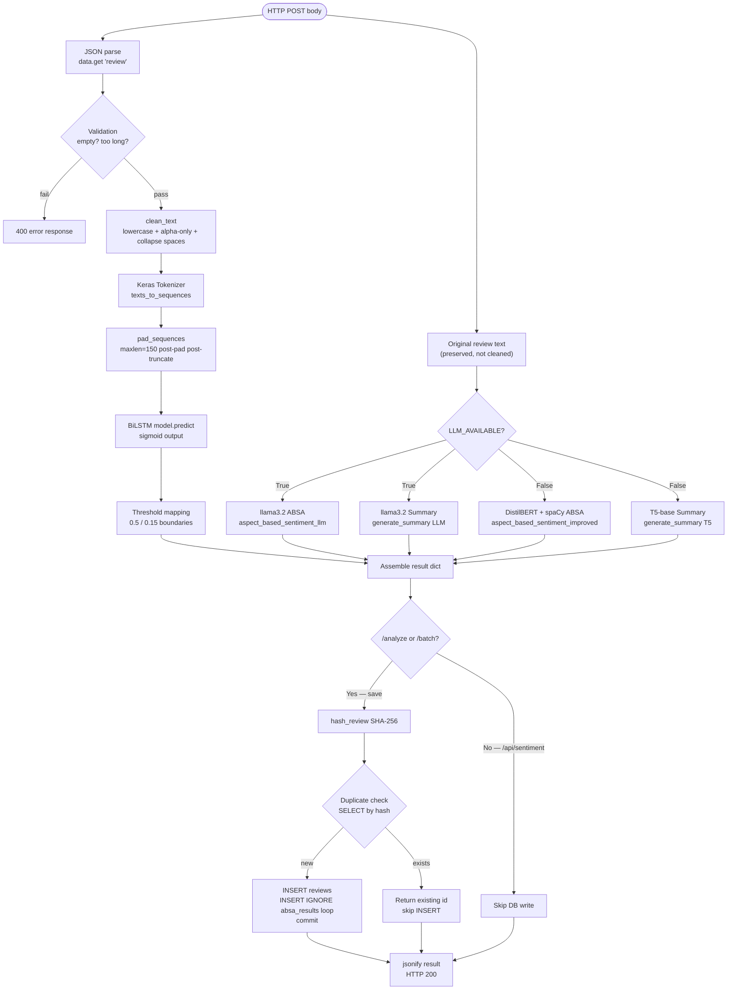
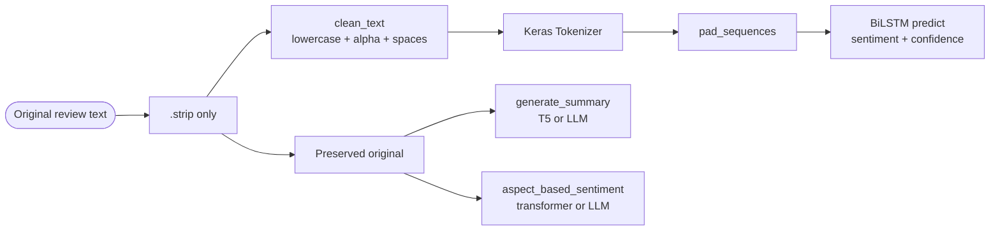
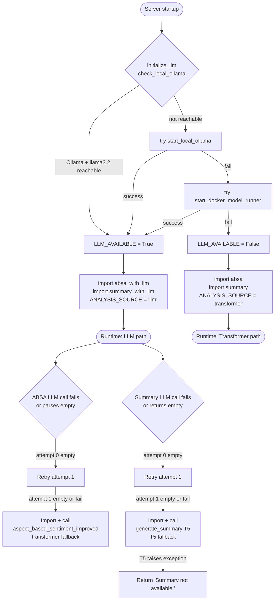
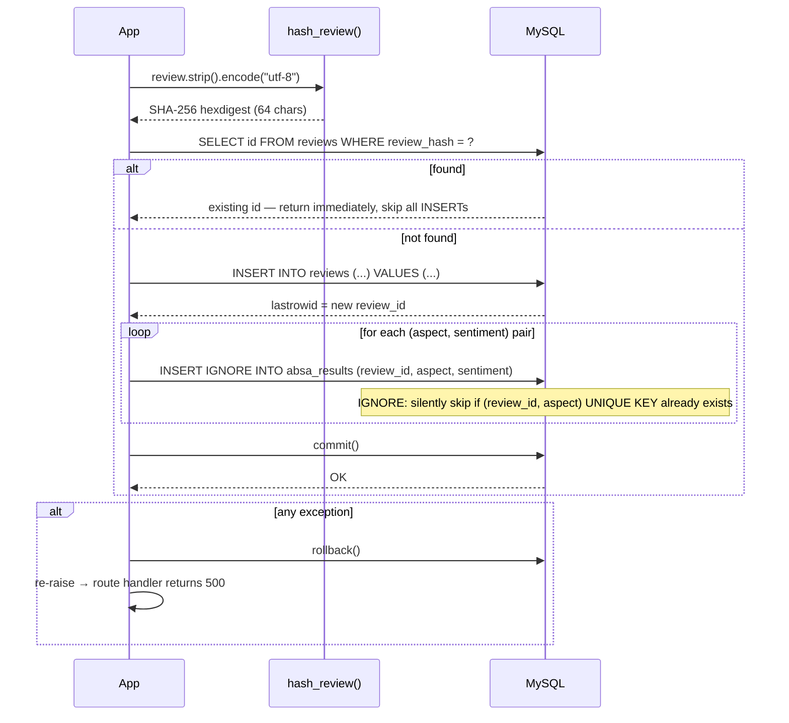
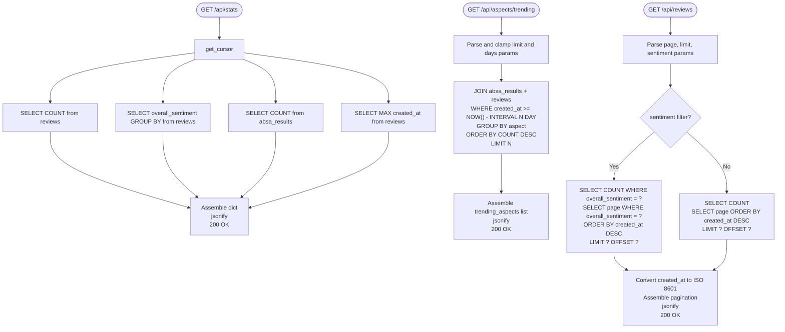

# Data Pipeline Documentation

This document traces the journey of a product review from the moment it arrives as an HTTP
request body to the moment its analysis is committed to MySQL. It also covers the analytics
query path, which reads from already-stored data without running the NLP pipeline again.

---

## Table of Contents

1. [Pipeline Overview](#1-pipeline-overview)
2. [Stage 1 — Review Ingestion](#2-stage-1--review-ingestion)
3. [Stage 2 — Preprocessing (clean_text)](#3-stage-2--preprocessing-clean_text)
4. [Stage 3 — Tokenization](#4-stage-3--tokenization)
5. [Stage 4 — Sequence Padding](#5-stage-4--sequence-padding)
6. [Stage 5 — BiLSTM Inference](#6-stage-5--bilstm-inference)
7. [Stage 6 — Inference Routing (cleaned vs original)](#7-stage-6--inference-routing-cleaned-vs-original)
8. [Stage 7 — Fallback Routing](#8-stage-7--fallback-routing)
9. [Stage 8 — DB Persistence](#9-stage-8--db-persistence)
10. [Stage 9 — Output Formatting](#10-stage-9--output-formatting)
11. [Analytics Query Path](#11-analytics-query-path)
12. [Data Transformation Table](#12-data-transformation-table)

---

## 1. Pipeline Overview



---

## 2. Stage 1 — Review Ingestion

**Code location:** `app.py` route handlers (`analyze`, `sentiment_api`, `batch_analyze`)

Flask calls `request.get_json()` which parses the `Content-Type: application/json` request body.
The review text is extracted with a safe fallback:

```python
review = (data.get("review") or "").strip()
```

The `or ""` guard means that if `data` is `None` (malformed JSON), `data.get("review")` returns
`None`, and the expression evaluates to `""` instead of raising an `AttributeError`. The
`.strip()` call removes leading and trailing whitespace before any length validation.

Validation sequence:
1. If `review` is empty string after strip → `400: "No review text provided"`
2. If `len(review) > 2000` → `400: "Review exceeds 2000 characters"`
3. Otherwise → enter `complete_pipeline(review)`

The review string that enters the pipeline is the version produced by `.strip()`. No other
normalization has been applied yet at this stage.

---

## 3. Stage 2 — Preprocessing (`clean_text`)

**Code location:** `app.py`, `clean_text()` function

```python
def clean_text(text: str) -> str:
    text = text.lower()
    text = re.sub(r"[^a-zA-Z\s]", "", text)
    text = re.sub(r"\s+", " ", text).strip()
    return text
```

Three operations in sequence:

| Step | Operation | What it removes |
|---|---|---|
| 1 | `text.lower()` | Case information — "Excellent" becomes "excellent" |
| 2 | `re.sub(r"[^a-zA-Z\s]", "", text)` | Digits, punctuation, emoji, special characters — "5/5!" becomes "  " |
| 3 | `re.sub(r"\s+", " ", text).strip()` | Extra whitespace created by step 2 |

**Why this matters:** The Keras tokenizer and BiLSTM model were trained on text in this exact
form. Feeding un-cleaned text would map tokens to `0` (OOV) and degrade prediction quality.

**Critical design decision:** `clean_text` output is ONLY used for BiLSTM sentiment inference.
Summarization and ABSA receive the ORIGINAL review text (see Stage 6) because:
- T5 and DistilBERT expect natural text with punctuation and mixed case.
- Removing numbers and punctuation from "the battery lasts 8 hours, not bad" before ABSA
  would degrade aspect extraction quality.
- LLM prompts require readable text for meaningful in-context examples.

---

## 4. Stage 3 — Tokenization

**Code location:** `app.py`, `complete_pipeline()`

```python
seq = tokenizer_obj.texts_to_sequences([cleaned])
```

`tokenizer_obj` is a Keras `Tokenizer` instance deserialized from `tokenizer.pkl` at startup.
It holds a `word_index` dictionary built during training that maps each word in the training
vocabulary to a unique integer.

Behavior:
- Known word → integer index (e.g., `"battery"` → `47`)
- Out-of-vocabulary word → `0` (OOV index, treated as padding by the model)
- Input is a list of strings; `texts_to_sequences` returns a list of lists of ints

For the cleaned text `"great camera battery life display"`:
```
texts_to_sequences(["great camera battery life display"])
→ [[12, 47, 8, 203, 31]]
```

The result is a Python list of lists (variable length). The length equals the number of
recognized tokens in the cleaned text.

---

## 5. Stage 4 — Sequence Padding

**Code location:** `app.py`, `complete_pipeline()`

```python
padded = pad_sequences(seq, maxlen=MAX_LENGTH, padding="post", truncating="post")
```

Where `MAX_LENGTH = 150`.

The BiLSTM model requires a fixed-length input tensor. `pad_sequences` normalizes variable-
length token sequences to exactly 150 integers.

| Scenario | Action |
|---|---|
| Sequence shorter than 150 tokens | Zeros are appended at the END (`padding="post"`) |
| Sequence longer than 150 tokens | Tokens beyond index 150 are DROPPED from the END (`truncating="post"`) |
| Sequence exactly 150 tokens | No change |

**Why post-padding?** Post-padding (zeros at the end) is consistent with how the BiLSTM was
trained. The model reads from left to right; the recurrent layers complete their pass through
the meaningful tokens before encountering the padding zeros. Pre-padding would force the BiLSTM
to start processing zeros before reaching real content, which degrades accuracy.

**Why post-truncating?** Reviews are typically front-loaded with their main sentiment signal
(the overall experience, the main feature being praised or criticized). Dropping tokens from
the end is less damaging than dropping from the beginning. Reviews exceeding 150 tokens after
cleaning are uncommon, but this is a hard guard.

Output shape: `(1, 150)` — a 2D NumPy array with batch size 1 and sequence length 150.

---

## 6. Stage 5 — BiLSTM Inference

**Code location:** `app.py`, `complete_pipeline()`

```python
pred = float(model.predict(padded, verbose=0)[0][0])
```

`model` is a TensorFlow/Keras `BiLSTM` model loaded from `best_model.keras`. The model
architecture terminates in a single sigmoid output neuron. `model.predict()` returns a 2D
array of shape `(1, 1)`. `[0][0]` extracts the scalar float.

Threshold mapping:

```python
if pred > 0.5:
    overall_sentiment = "Positive"
elif pred >= 0.15:
    overall_sentiment = "Neutral"
else:
    overall_sentiment = "Negative"
```

The sigmoid output `pred` becomes the `confidence_score` stored in the database:

```python
"Confidence Score": round(pred, 4)
```

Interpretation:
- `pred = 0.92` → Positive, confidence 0.92 (strongly positive)
- `pred = 0.35` → Neutral, confidence 0.35 (ambiguous)
- `pred = 0.08` → Negative, confidence 0.08 (close to 0 = strongly negative)

The confidence score is NOT the probability of the assigned class for Neutral and Negative
predictions. It is the raw sigmoid output from a model trained to distinguish positive from
negative text.

---

## 7. Stage 6 — Inference Routing (cleaned vs original)

This stage clarifies which version of the text flows to which model:



| Pipeline stage | Input text | Reason |
|---|---|---|
| `clean_text()` | Stripped original | Prepare for BiLSTM vocabulary matching |
| `texts_to_sequences()` | Cleaned (lowercase, alpha-only) | Must match training corpus format |
| `pad_sequences()` | Token ID sequence | Fixed-length tensor for model |
| `model.predict()` | Padded tensor | BiLSTM inference |
| `generate_summary()` | ORIGINAL (stripped) | T5/LLM need readable natural language with punctuation |
| `aspect_based_sentiment()` | ORIGINAL (stripped) | spaCy dependency parse and DistilBERT need real text |

Passing the cleaned text to the summarizer or ABSA module would strip punctuation that spaCy
depends on for sentence segmentation, remove digits that appear in specs (e.g., "8-hour battery"),
and lowercase text that LLM prompts expect in their natural form.

---

## 8. Stage 7 — Fallback Routing

`LLM_AVAILABLE` is set once at startup by `initialize_llm()` and does not change while the
server is running. It determines which module is imported as `aspect_based_sentiment` and
`generate_summary`.



The fallback chain is:
1. LLM (llama3.2 via Ollama) — primary when `LLM_AVAILABLE = True`
2. Retry same LLM call once — handles transient Ollama hiccups
3. Transformer ABSA (spaCy + DistilBERT) / T5-base summary — reliable local fallback
4. Empty dict `{}` for ABSA / `"Summary not available."` for summary — last resort

---

## 9. Stage 8 — DB Persistence

**Code location:** `app.py`, `save_review_with_absa()`

Only called from `POST /analyze` and `POST /api/batch/analyze`. Never called from
`POST /api/sentiment`.



**Why SHA-256 hash for dedup?** A `UNIQUE` constraint on `TEXT` columns cannot be used in
MySQL without specifying a prefix length (e.g., `UNIQUE(review_text(255))`), which only checks
the first 255 characters. Two different reviews sharing the same first 255 characters would
incorrectly be treated as duplicates. SHA-256 applied to the full text produces a fixed 64-char
hex string that can carry a true `UNIQUE KEY` constraint and provides O(1) lookup.

**Why `INSERT IGNORE` for ABSA rows?** The `UNIQUE KEY uq_review_aspect (review_id, aspect)`
constraint prevents inserting duplicate aspect rows for a review. Using `INSERT IGNORE` instead
of `INSERT` allows the application to safely attempt re-insertion (e.g., due to a retry or a
bug) without raising a duplicate key exception or requiring a prior SELECT.

**Connection management:** `db_connection.py` uses `threading.local()` to maintain one MySQL
connection per thread. Flask's development server is single-threaded; the production WSGI
server (e.g., Gunicorn) spawns multiple threads. `@app.teardown_appcontext` calls
`close_connection()` after every request to return the connection cleanly.

---

## 10. Stage 9 — Output Formatting

**Code location:** `app.py` route handlers

```python
return jsonify(result)
```

Flask's `jsonify()`:
- Serializes the Python dict to a JSON string using `json.dumps`
- Sets `Content-Type: application/json` on the response
- Returns HTTP 200 by default

The `_source` field (`"llm"` or `"transformer"`) is popped from the dict before serialization
so internal routing information is not exposed to clients. It is used before removal to call
`save_review_with_absa(..., source)` which writes it to `analysis_source` in the DB.

For `GET /api/reviews`, `created_at` is a Python `datetime` object from MySQL. It is converted
to an ISO 8601 string via `.isoformat()` before inclusion in the dict, because `jsonify` does
not automatically serialize `datetime` objects.

---

## 11. Analytics Query Path

The analytics endpoints (`GET /api/stats`, `GET /api/aspects/trending`, `GET /api/reviews`)
do NOT run the NLP pipeline. They execute SQL aggregations against already-stored data.



Each analytics request opens a cursor from the thread-local connection, executes one or more
queries, and closes the cursor in a `finally` block. The connection itself is not closed per
analytics request (it is reused for the request lifetime and closed by `teardown_appcontext`).

---

## 12. Data Transformation Table

| Stage | Input | Output | Key operation |
|---|---|---|---|
| HTTP ingestion | Raw HTTP body bytes | `review` string (stripped) | `request.get_json()`, `.strip()` |
| Validation | `review` string | Validated string OR 400 response | Empty check, length check |
| `clean_text` | `review` (stripped) | `cleaned` string | Lowercase, strip non-alpha, collapse spaces |
| `texts_to_sequences` | `[cleaned]` (list of 1 string) | `[[int, int, ...]]` (list of list of ints) | Vocabulary lookup from `tokenizer.pkl` |
| `pad_sequences` | `[[int, ...]]` (variable length) | `ndarray shape (1, 150)` | Zero-pad or truncate to 150 positions |
| `model.predict` | `ndarray (1, 150)` | `float` in `[0.0, 1.0]` | BiLSTM sigmoid forward pass |
| Threshold mapping | `float` (sigmoid score) | `str` sentiment + `float` confidence | Comparisons against 0.5 and 0.15 |
| `generate_summary` | Original `review` string | Summary `str` (or passthrough if < 20 words) | T5 beam search OR llama3.2 chat |
| `aspect_based_sentiment` | Original `review` string | `{aspect: sentiment}` dict | spaCy+DistilBERT pipeline OR llama3.2 chat |
| `hash_review` | Original `review` string | 64-char hex string | SHA-256 of `.strip().encode("utf-8")` |
| DB INSERT `reviews` | All pipeline outputs | `review_id` integer | Parameterized INSERT, `lastrowid` |
| DB INSERT `absa_results` | `review_id` + aspects dict | Rows in `absa_results` | Loop + `INSERT IGNORE` per aspect |
| `jsonify` | Python dict | JSON bytes + HTTP headers | `json.dumps` + `Content-Type: application/json` |
