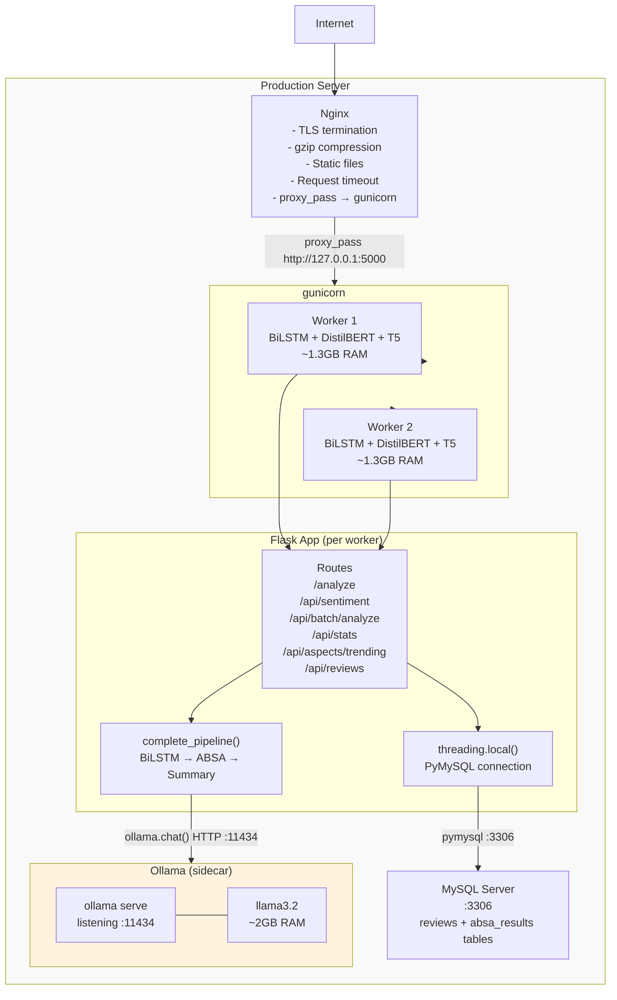

# Deployment Architecture
## Amazon Review Sentiment & ABSA System

---

## Current State: Development Server

```python
if __name__ == "__main__":
    app.run(debug=True, host="0.0.0.0", port=5000)
```

This is Flask's built-in Werkzeug development server. It is:

- **Single-threaded by default:** only one request handled at a time (though `threaded=True` is the Werkzeug default in newer versions)
- **Debug mode enabled:** auto-reloads on code changes, shows stack traces in browser — a security risk in production
- **Not production-grade:** does not handle TLS, graceful shutdown, worker crashes, or request queuing
- **Officially unsupported for production use:** Flask docs state explicitly "Do not use the development server in production"

This configuration is acceptable for local development and demos. Any public-facing deployment requires gunicorn + Nginx.

---

## Production Deployment Architecture



---

## Component 1: Nginx Configuration

Nginx acts as a reverse proxy and handles:
- TLS termination (HTTPS → HTTP to gunicorn)
- gzip compression for JSON responses
- Request timeout enforcement (kills stalled connections)
- Static file serving (HTML/CSS/JS for the frontend)

```nginx
server {
    listen 80;
    server_name yourdomain.com;
    return 301 https://$server_name$request_uri;
}

server {
    listen 443 ssl;
    server_name yourdomain.com;

    ssl_certificate     /etc/ssl/certs/server.crt;
    ssl_certificate_key /etc/ssl/private/server.key;
    ssl_protocols TLSv1.2 TLSv1.3;

    # Generous timeout for slow LLM inference
    proxy_read_timeout 120s;
    proxy_connect_timeout 10s;

    gzip on;
    gzip_types application/json text/html;

    location / {
        proxy_pass http://127.0.0.1:5000;
        proxy_set_header Host $host;
        proxy_set_header X-Real-IP $remote_addr;
        proxy_set_header X-Forwarded-For $proxy_add_x_forwarded_for;
    }

    # Serve static files directly (no gunicorn overhead)
    location /static/ {
        root /app;
        expires 1d;
    }
}
```

**Why `proxy_read_timeout 120s`:** T5 inference on CPU can take up to 2 seconds; llama3.2 on CPU can take up to 60+ seconds for long reviews. Without a generous timeout, Nginx would return 504 Gateway Timeout before the analysis completes. 120s is the gunicorn `--timeout` value — they should match.

---

## Component 2: Gunicorn Configuration

```bash
gunicorn app:app \
  --workers 2 \
  --threads 4 \
  --bind 127.0.0.1:5000 \
  --timeout 120 \
  --keep-alive 5 \
  --log-level info \
  --access-logfile /var/log/gunicorn/access.log \
  --error-logfile /var/log/gunicorn/error.log
```

**Worker count rationale:**

Each gunicorn worker is a separate OS process. Each process loads all models independently at startup. RAM requirement:

| Workers | RAM (transformer path) | RAM (LLM path) | Min Server RAM |
|---|---|---|---|
| 1 | 1.3GB + Ollama 2GB = 3.3GB | 1.3GB + 2GB | 4GB |
| 2 | 2.6GB + Ollama 2GB = 4.6GB | 2.6GB + 2GB | 8GB |
| 4 | 5.2GB + Ollama 2GB = 7.2GB | 5.2GB + 2GB | 12GB |

For a 4GB server: 1 worker only. For 8GB: 2 workers. For 16GB: up to 4 workers.

**Thread count rationale:**

Threads within a worker share memory (including loaded models). Each thread handles one concurrent request. The Python GIL prevents true parallel CPU execution, but:
- Threads are beneficial when requests block on I/O (Ollama HTTP calls, MySQL)
- During `ollama.chat()` (HTTP request), the GIL is released → other threads can run Python code
- During `model.predict()` (TF computation), GIL may be held → threads don't parallelize model inference

4 threads per worker: allows 4 concurrent requests per worker. Under LLM path load (30s per request), 4 threads means 4 concurrent in-flight requests without blocking.

**`--bind 127.0.0.1:5000`:** Bind to localhost only. Only Nginx (on the same machine) can reach gunicorn. External traffic never hits gunicorn directly.

---

## Component 3: Docker Deployment

### Dockerfile

```dockerfile
FROM python:3.11-slim

WORKDIR /app

# Install system dependencies
RUN apt-get update && apt-get install -y \
    gcc \
    curl \
    && rm -rf /var/lib/apt/lists/*

# Install Python dependencies
COPY requirements.txt .
RUN pip install --no-cache-dir -r requirements.txt

# Download spaCy model at build time
RUN python -m spacy download en_core_web_sm

# HuggingFace models are downloaded on first run and cached in volume
# (downloading at build time makes the image too large; caching in volume is preferred)

# Copy application code
COPY . .

# Do NOT include best_model.keras download here — mount as volume
# or copy as build artifact

EXPOSE 5000

CMD ["gunicorn", "app:app", "--workers", "2", "--threads", "4", 
     "--bind", "0.0.0.0:5000", "--timeout", "120"]
```

### docker-compose.yml

```yaml
version: "3.9"

services:
  app:
    build: .
    ports:
      - "5000:5000"
    volumes:
      # Model artifacts (trained BiLSTM + tokenizer)
      - ./best_model.keras:/app/best_model.keras:ro
      - ./tokenizer.pkl:/app/tokenizer.pkl:ro
      # HuggingFace cache: DistilBERT and T5 downloaded once, persisted
      - hf_cache:/root/.cache/huggingface
    env_file:
      - .env
    environment:
      OLLAMA_BASE_URL: http://ollama:11434
    depends_on:
      ollama:
        condition: service_healthy
    restart: unless-stopped

  ollama:
    image: ollama/ollama:latest
    volumes:
      # llama3.2 model data persisted across container restarts
      - ollama_models:/root/.ollama
    ports:
      - "11434:11434"  # Expose for local debugging (remove in production)
    healthcheck:
      test: ["CMD", "curl", "-sf", "http://localhost:11434/api/tags"]
      interval: 15s
      timeout: 5s
      retries: 8
      start_period: 30s
    restart: unless-stopped

  # Optional: Nginx in front of app
  nginx:
    image: nginx:alpine
    ports:
      - "80:80"
      - "443:443"
    volumes:
      - ./nginx.conf:/etc/nginx/conf.d/default.conf:ro
      - ./ssl:/etc/ssl:ro
    depends_on:
      - app
    restart: unless-stopped

volumes:
  ollama_models:
  hf_cache:
```

**Why `depends_on: condition: service_healthy`:** Without the health check condition, Docker starts the `app` container as soon as the `ollama` container is created — but Ollama takes 10-30 seconds to initialize. The `app` container would start, `llm_check.py` would ping Ollama and get a connection refused, set `LLM_AVAILABLE=False`, and import transformer modules — even though Ollama would have been ready 20 seconds later. The healthcheck ensures Ollama is actually accepting connections before the app starts.

### First-Run: Pulling llama3.2

The `ollama_models` volume persists Ollama's model store across container restarts. On first run (empty volume), llama3.2 must be pulled:

```bash
# After docker-compose up (first time)
docker exec <ollama_container_id> ollama pull llama3.2
```

Subsequent starts: model already in volume, no download needed. This is why the Ollama container should use a named volume rather than a bind mount — Docker manages the storage lifecycle.

---

## Model Artifact Management

| Artifact | Size | Storage Strategy | Update Process |
|---|---|---|---|
| `best_model.keras` | ~15MB | Git LFS or artifact volume mount | Retrain → copy to volume → restart app |
| `tokenizer.pkl` | ~2MB | Git LFS or artifact volume mount | Refit with new data → copy → restart |
| DistilBERT SST-2 | ~260MB | HuggingFace Hub → HF cache volume | Pin model version in code; update = code change |
| T5-base | ~850MB | HuggingFace Hub → HF cache volume | Pin version; update = code change |
| en_core_web_sm | ~50MB | Downloaded at Docker build time | Rebuild image for spaCy version update |
| llama3.2 | ~2GB | Ollama volume (`/root/.ollama`) | `docker exec ... ollama pull llama3.2` |

**HuggingFace model pinning:** In production, always pin to a specific model revision:
```python
AutoTokenizer.from_pretrained(
    "distilbert-base-uncased-finetuned-sst-2-english",
    revision="af0f99b"  # specific commit hash
)
```
This prevents a silent model update from HuggingFace Hub breaking production behavior.

---

## Resource Requirements Table

| Configuration | CPU | RAM | Disk | Notes |
|---|---|---|---|---|
| Minimum (transformer only) | 2 cores | 2GB | 5GB | No Ollama; DistilBERT + T5 only |
| Recommended (transformer) | 4 cores | 4GB | 10GB | 2 gunicorn workers |
| Minimum (LLM path) | 4 cores | 6GB | 12GB | 1 gunicorn worker + Ollama |
| Recommended (LLM path) | 8 cores | 8GB | 16GB | 2 gunicorn workers + Ollama |
| Production (LLM path) | 8-16 cores | 16GB | 32GB | 4 workers + Ollama + OS headroom |
| GPU-accelerated | 8 cores + GPU 8GB | 8GB | 16GB | GPU → 10-50× faster inference |

---

## CPU vs GPU Considerations

**Current state:** All inference is CPU-only. No `.cuda()` calls. Explicit `.to(torch.device("cpu"))` in `absa.py`. This was an intentional choice for portability — the system runs on any machine.

**GPU impact:**
- DistilBERT (260MB): CPU 100-300ms → GPU ~5-20ms (10-20× speedup)
- T5-base (850MB): CPU 500-2000ms → GPU ~50-200ms (10× speedup)
- llama3.2 (Ollama): CPU 1-5s → GPU (Ollama auto-detects) 100-500ms (5-10× speedup)

**GPU enablement:**

For PyTorch models (DistilBERT, T5):
```python
device = torch.device("cuda" if torch.cuda.is_available() else "cpu")
_bert_model.to(device)
# And during inference:
inputs = _bert_tokenizer(...).to(device)
```

For Ollama: automatic. Ollama detects NVIDIA GPU via CUDA and routes inference to GPU with no code changes.

**Docker with GPU:**
```yaml
services:
  app:
    runtime: nvidia
    environment:
      NVIDIA_VISIBLE_DEVICES: all
  ollama:
    runtime: nvidia
    environment:
      NVIDIA_VISIBLE_DEVICES: all
```
Requires `nvidia-container-runtime` installed on the host.

---

## Concurrency Architecture Detail

### Request Flow Under gunicorn

```
Incoming Request
       │
       ▼
gunicorn master process
(listens on :5000)
       │
       ├── Worker 1 (PID 1234) ──── Thread 1 → handles request A
       │                       ├── Thread 2 → handles request B
       │                       ├── Thread 3 → handles request C
       │                       └── Thread 4 → waiting
       │
       └── Worker 2 (PID 1235) ──── Thread 1 → handles request D
                               ├── Thread 2 → waiting
                               ├── Thread 3 → waiting
                               └── Thread 4 → waiting
```

**Memory sharing within a worker:** All threads share the BiLSTM, DistilBERT, T5-base, spaCy objects loaded at startup. TensorFlow and PyTorch model inference with `torch.no_grad()` is thread-safe for reading (weights are not modified). However, due to the Python GIL, only one thread actually executes Python-level model code at any instant.

**Ollama as bottleneck:** Both Worker 1 and Worker 2 send HTTP requests to the same Ollama process (on port 11434). Ollama queues these requests. Under high concurrency, all 8 threads (2 workers × 4 threads) may be waiting on Ollama. This is the primary concurrency bottleneck.

---

## Observability: Current State vs Target

| Observability Concern | Current Implementation | Target Implementation |
|---|---|---|
| Request logging | None (Flask dev server default) | Structured JSON per request (gunicorn access log) |
| Error logging | `traceback.print_exc()` to stdout | Structured error with request_id, route, error type |
| Latency tracking | None | Prometheus histogram per route |
| Model confidence distribution | Stored in DB (query manually) | Prometheus histogram exported |
| LLM fallback rate | `print()` logs | Counter metric per fallback reason |
| DB connection health | None | Gauge: connections open per thread |
| Ollama health | Startup check only | Background health ping every 30s |
| Request ID | None | UUID per request in header and logs |

**Minimal production logging setup:**
```python
import logging
import json

class JSONFormatter(logging.Formatter):
    def format(self, record):
        return json.dumps({
            "timestamp": self.formatTime(record),
            "level": record.levelname,
            "message": record.getMessage(),
            "module": record.module,
        })

handler = logging.StreamHandler()
handler.setFormatter(JSONFormatter())
app.logger.addHandler(handler)
app.logger.setLevel(logging.INFO)
```

Structured JSON logs are parseable by Splunk, Datadog, CloudWatch, Loki, and any modern log aggregation platform — unlike `print()` statements which produce unstructured text.

---

## Startup Sequence

1. Gunicorn master process starts, forks worker processes
2. Each worker process runs `app.py` module-level code:
   a. Load environment variables (.env)
   b. `initialize_llm()` → 3-stage LLM check (up to 40s if Ollama needs starting)
   c. Import ABSA and summary modules based on `LLM_AVAILABLE`
   d. `tf.keras.models.load_model("best_model.keras", compile=False)` (~5s)
   e. Load `tokenizer.pkl` (<1s)
   f. DistilBERT and T5 loaded by respective modules on import (~20s first run, faster if HF cache warm)
3. Worker ready to accept requests
4. **Total startup time:** 30-60s (cold start, no HF cache) or 15-30s (warm HF cache)

**Health check endpoint for Kubernetes/Docker:**
```python
@app.route("/health")
def health():
    return jsonify({"status": "ok", "llm": ANALYSIS_SOURCE}), 200
```
Kubernetes liveness probe: `GET /health` every 30s, timeout 10s, failure threshold 3.
Initial delay: 60s (allows startup to complete before probing begins).
