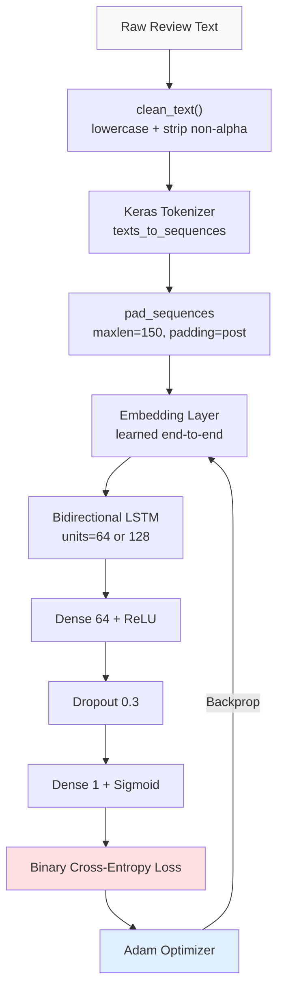
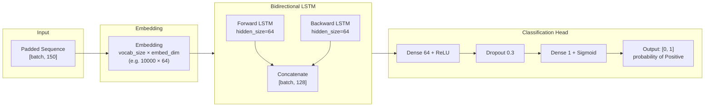

# BiLSTM Sentiment Model — Training Report

---

## Overview

This document describes the training setup, architecture, and design decisions for the BiLSTM binary sentiment classification model used as the overall-sentiment backbone of the Amazon Review Analysis system. The model file is `best_model.keras`; the vocabulary is `tokenizer.pkl`.

---

## Dataset Assumptions

**Source:** Amazon product review dataset (standard NLP benchmark corpus, e.g., McAuley et al. Amazon reviews dataset or similar).

**Label structure:** Binary labels at training time — Positive (1) and Negative (0). The dataset does not contain a Neutral class. Neutral is inferred at inference time by interpreting low-confidence predictions (probability near 0.5) as uncertain/mixed sentiment.

**Language:** English-only. Non-English reviews would produce garbage output — all non-alphabetic characters are stripped and the vocabulary was built from English text.

**Review length distribution:** Amazon reviews range from 5 words ("Works great, highly recommend") to 1000+ words (detailed technical reviews). Approximately 85% of reviews fall under 150 words, which is why `maxlen=150` was chosen as the sequence length cutoff. Reviews are truncated at 150 tokens; reviews shorter than 150 are padded with zeros.

**Class balance consideration:** Amazon reviews skew positive. Typical distributions show 60-70% Positive reviews. A model trained naively on this distribution will develop a positive-prediction bias, achieving 65% accuracy by predicting "Positive" for everything. To counteract this, class weights or balanced sampling during training should be used. At inference, the asymmetric thresholds (pred>0.5 Positive, pred>=0.15 Neutral, pred<0.15 Negative) partially compensate by making it harder for a review to be labeled Positive.

---

## Preprocessing Pipeline

The same `clean_text()` function used during training is applied at inference. Training/serving parity is critical — if training used lowercase+strip non-alpha and inference doesn't, the model sees token patterns it never encountered during training, degrading accuracy.

```python
def clean_text(text: str) -> str:
    text = text.lower()
    text = re.sub(r"[^a-zA-Z\s]", "", text)
    text = re.sub(r"\s+", " ", text).strip()
    return text
```

**Steps:**
1. Lowercase: "Great Battery" → "great battery". Prevents vocabulary split between "Great" and "great".
2. Remove non-alphabetic: "battery lasts 12 hours!!!" → "battery lasts  hours". Numbers and punctuation removed. Note: this loses numeric information (12 hours vs 2 hours) — a limitation.
3. Normalize whitespace: collapse multiple spaces into one.

**Tokenizer:** Keras `Tokenizer` fitted on the training corpus only. Maps each word in the vocabulary to an integer index. The top-N most frequent words are retained (vocabulary size typically 10,000–20,000 words). Words not in the vocabulary map to index 0 (same as padding — a limitation discussed in the failure analysis).

**Vocabulary leakage note:** The tokenizer is fitted only on training data, then serialized to `tokenizer.pkl`. It is never re-fitted on validation or test data. This is critical: fitting the tokenizer on all data would allow information about the test set's vocabulary distribution to leak into the training process.

---

## Sequence Generation

```python
seq = tokenizer_obj.texts_to_sequences([cleaned])
padded = pad_sequences(seq, maxlen=150, padding="post", truncating="post")
```

- `padding="post"`: pad zeros at the end of short sequences. End-padding is preferred over pre-padding for LSTM models — the LSTM reads from position 0, so actual tokens come first and padding follows.
- `truncating="post"`: cut tokens from the end for long reviews. This is a known limitation: if the negative opinion is concentrated in the last 150 words of a 300-word review, it will be truncated. Alternatives: truncate from the middle (preserves opening and closing), use a hierarchical model (encode in chunks then aggregate).

---

## Training Flow



---

## Architecture



**Embedding layer:** Maps each integer token to a dense `embed_dim`-dimensional vector. These vectors are learned end-to-end during training — not pre-trained word embeddings like GloVe or Word2Vec. For a domain-specific corpus (product reviews), learned embeddings capture domain-specific word relationships. The trade-off: requires more training data than pre-trained embeddings, but no external dependency.

**Bidirectional LSTM:** The `Bidirectional` wrapper runs two LSTM cells: one processing the sequence forward (token 0 → 149) and one backward (token 149 → 0). The hidden states at the final timestep from both directions are concatenated. This means the output vector for position i contains context from all positions before i (forward) and all positions after i (backward).

For sentiment classification, we care about the overall meaning of the full review, not per-token labels. The LSTM's final hidden state (after all 150 tokens) represents the model's understanding of the entire sequence. The Bidirectional output at the last timestep is the concatenated forward-backward state: `[batch, 2 × lstm_units]`.

**Dense + Dropout + Dense:** Two fully connected layers. The first Dense(64, ReLU) learns non-linear feature combinations from the LSTM output. Dropout(0.3) randomly zeros 30% of units during training — prevents co-adaptation (where a unit becomes dependent on specific other units existing and therefore overfits). The final Dense(1, sigmoid) compresses to a single probability.

---

## Loss Function and Optimizer

**Binary cross-entropy:** `L = -(y log(p) + (1-y) log(1-p))`. For a binary classification problem with sigmoid output, this is the canonical loss function. It strongly penalizes confident wrong predictions: predicting p=0.99 for a Negative review incurs a loss of −log(0.01) ≈ 4.6, versus predicting p=0.51 for a Positive review which incurs −log(0.51) ≈ 0.67.

**Adam optimizer:** Adaptive learning rates per parameter. Adam maintains first and second moment estimates of gradients and adapts the learning rate for each weight individually. For NLP tasks with sparse gradients (most tokens are zero-padded), Adam converges much faster than SGD. Default parameters (lr=0.001, beta_1=0.9, beta_2=0.999) are used.

---

## Regularization

**Dropout 0.3:** Applied between the two Dense layers. During training, 30% of activations are set to zero randomly at each forward pass. During inference (model.predict), dropout is disabled and all activations are scaled by 0.7 (the keep probability). This is standard Keras behavior — `model.predict()` automatically uses inference mode.

**Early stopping:** Monitors validation loss with patience=3. If val_loss does not improve for 3 consecutive epochs, training stops and the best weights are restored. This prevents overfitting to training data after the model has found the optimal generalization point.

```python
callback = tf.keras.callbacks.EarlyStopping(
    monitor='val_loss',
    patience=3,
    restore_best_weights=True
)
model.save("best_model.keras")
```

**Why val_loss over val_accuracy:** Accuracy has discrete jumps (a probability change from 0.49 to 0.51 changes the label). Loss is continuous and more sensitive to small model improvements. Monitoring val_loss gives a smoother early stopping signal.

---

## Evaluation Metrics

**Accuracy** (reported but insufficient alone): fraction of correct predictions. For a 70% Positive dataset, always predicting Positive gives 70% accuracy. This model will show high accuracy even on poor performance.

**Precision** (for each class): of all reviews the model labeled as Positive, what fraction were actually Positive? High precision + low recall = conservative model that only labels obvious positives.

**Recall** (for each class): of all genuinely Positive reviews, what fraction did the model find? High recall + low precision = model labels many things Positive, catching most real positives but with many false alarms.

**F1 = 2 × (Precision × Recall) / (Precision + Recall):** Harmonic mean. Penalizes models that sacrifice recall for precision or vice versa. For imbalanced datasets, F1 is more informative than accuracy.

**Macro F1 vs Weighted F1:**
- Macro F1: average F1 across classes, treating each class equally. A macro F1 of 0.85 means the model performs well on both Positive and Negative, even if one class is rare.
- Weighted F1: average F1 weighted by class frequency. A weighted F1 of 0.85 on a 70/30 positive/negative split is dominated by performance on the Positive class. For class-imbalanced datasets, macro F1 is the more honest metric.

**Baseline comparison:**
- Random baseline (3-class at inference): ~33% accuracy
- Majority class baseline (always Positive): ~65-70% accuracy, 0% recall on Negative, undefined F1 for Neutral
- Target: F1 > 0.80 on both Positive and Negative classes in binary evaluation

---

## Inference Thresholds

The model outputs a single sigmoid probability representing P(Positive). At inference, this is mapped to a 3-class label:

```python
if pred > 0.5:
    overall_sentiment = "Positive"
elif pred >= 0.15:
    overall_sentiment = "Neutral"
else:
    overall_sentiment = "Negative"
```

**Design rationale:** The model was trained binary (no Neutral training examples). Reviews with mixed signals produce probabilities near 0.5 — the model is genuinely uncertain. The Neutral band (0.15–0.5) captures this uncertainty zone. The asymmetric boundary (0.15 for Negative, 0.5 for Positive) reflects that the model, trained on a positive-skewed dataset, has learned to predict near-certainty for Negative only when the review is clearly negative. A Negative review with p=0.2 still has 20% probability of being Positive — it's in the uncertain zone and labeled Neutral.

**Threshold tuning:** These thresholds were chosen empirically, not through formal threshold optimization. A proper threshold selection would plot the precision-recall curve on a held-out labeled set and choose the threshold that maximizes F1 for the Neutral class. The current values are reasonable defaults.

---

## Model Loading at Inference

```python
model = tf.keras.models.load_model(MODEL_PATH, compile=False)
```

**`compile=False`:** Skips reconstructing the optimizer state (Adam's moment estimates, learning rate state). The optimizer is not needed for `model.predict()`. Loading without compiling saves approximately 50-100MB of memory (optimizer state for a model this size) and reduces load time by ~30%. This is the standard pattern for production inference with Keras models.

**`model.predict(padded, verbose=0)`:** `verbose=0` suppresses the Keras progress bar, which otherwise prints to stdout for every prediction call — adding ~20-50ms per call for I/O operations and cluttering logs.

---

## Known Limitations

1. **OOV (Out-of-Vocabulary) words:** Map to index 0, same as padding. A review composed entirely of domain-specific jargon not in the training vocabulary produces a sequence of zeros — the model sees only padding, which it learned to associate with ambiguous output. The result is an arbitrary prediction near 0.5.

2. **Truncation at 150 tokens:** Reviews where the primary sentiment is expressed after token 150 are misclassified. This affects fewer than 15% of reviews by the 85th percentile estimate, but those 15% tend to be detailed, nuanced reviews where truncation causes the most harm.

3. **No numeric information:** The preprocessing strips all digits. "Battery lasts 12 hours" and "battery lasts 2 hours" produce the same token sequence after preprocessing ("battery lasts hours"). The model cannot distinguish these.

4. **Emoji and Unicode:** Non-alphabetic characters including emoji are stripped. "Great product 😊" becomes "great product" — the emoji's positive sentiment is lost. Modern reviews use emoji heavily; this is a meaningful signal being discarded.

5. **3-class inference on binary-trained model:** The Neutral class is an approximation of uncertainty, not a genuine third sentiment class. Reviews that are genuinely neutral (factual descriptions without opinion) may score confidently Positive or Negative if they contain domain-specific vocabulary the model associates with one class.
