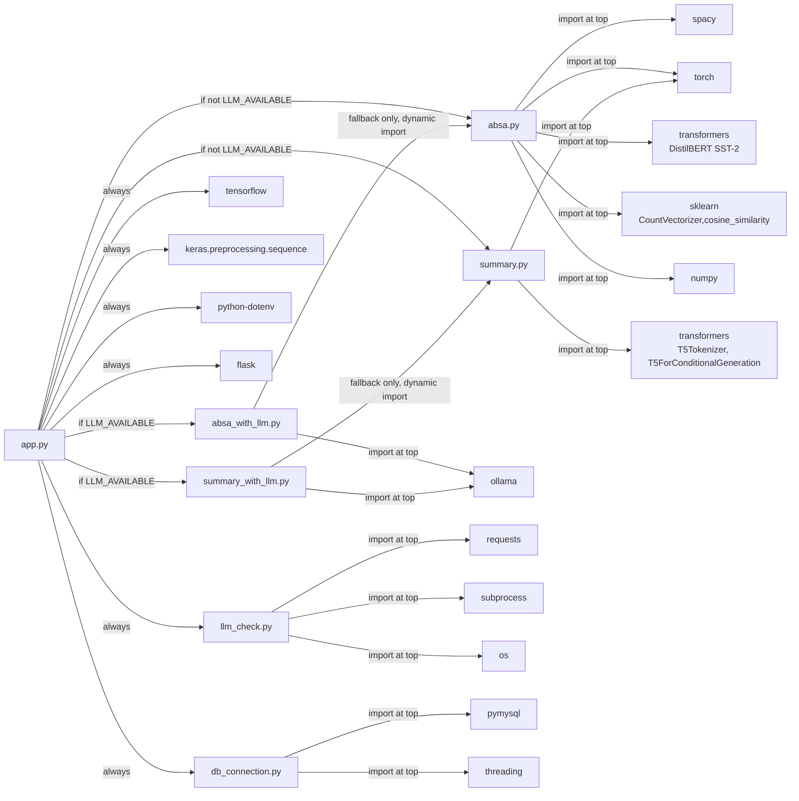
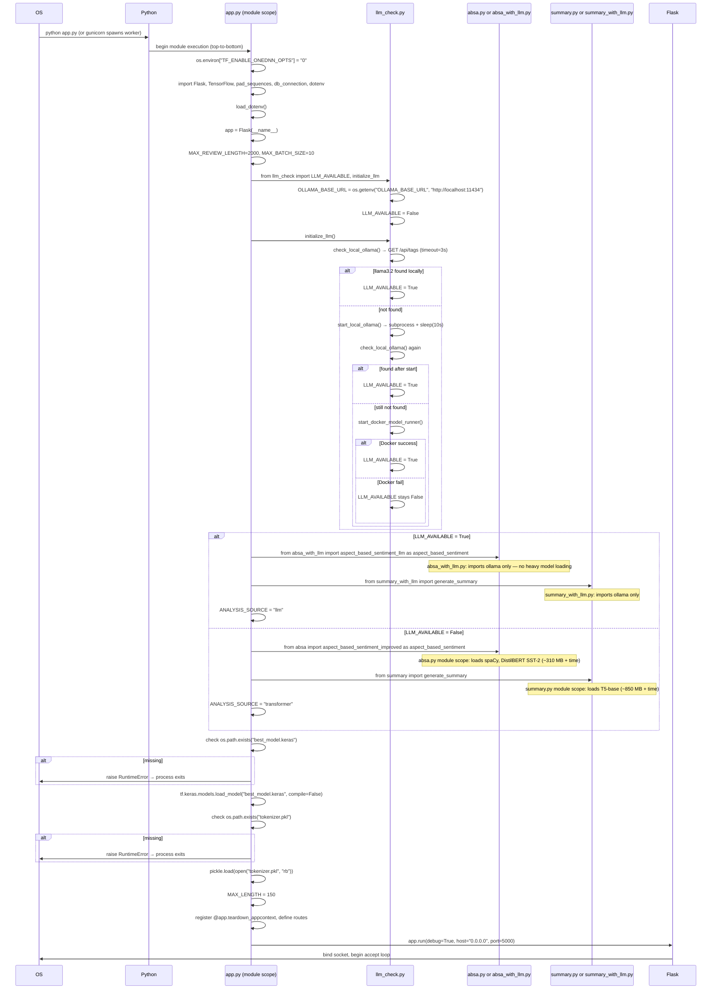

# Project Structure
## Amazon Review Multi-Task NLP System

**Version:** 1.0  
**Last Updated:** 2026-06-01

---

## 1. Directory Tree

```
amazon-review-sentiment-absa/
│
├── app.py                    # Flask application: routes, pipeline orchestration, DB writes
├── absa.py                   # Traditional ABSA: spaCy + DistilBERT SST-2
├── absa_with_llm.py          # LLM ABSA: prompt engineering, llama3.2 via Ollama, fallback
├── summary.py                # T5-base abstractive summarization
├── summary_with_llm.py       # LLM summarization: llama3.2 via Ollama, fallback to T5
├── db_connection.py          # Thread-local PyMySQL connection management
├── llm_check.py              # 3-stage LLM availability detection at startup
├── nlp_app_db.sql            # MySQL schema DDL: reviews + absa_results tables
├── requirements.txt          # Python package dependencies
│
├── best_model.keras          # Trained BiLSTM model artifact (TensorFlow/Keras binary)
├── tokenizer.pkl             # Keras Tokenizer fitted to training corpus (pickle)
│
├── Amazon_Reviews.ipynb      # Jupyter notebook: model training, EDA, evaluation
│
├── templates/
│   └── index.html            # Jinja2 template: web UI for single review submission
│
├── static/
│   └── styles.css            # CSS for the web UI
│
├── documentation/            # Engineering documentation (this directory)
│   ├── PRD.md
│   ├── TRD.md
│   ├── architecture_deep_dive.md
│   └── project_structure.md
│
└── __pycache__/              # Python bytecode cache (generated, not tracked in git logic)
```

---

## 2. File Responsibilities

### `app.py` — Flask Routes and Pipeline Orchestration

The entry point and the only file that knows about all subsystems. Its responsibilities:

- **Constants:** `MAX_REVIEW_LENGTH = 2000`, `MAX_BATCH_SIZE = 10`, `MAX_LENGTH = 150`
- **Startup sequence:** Calls `initialize_llm()`, does conditional imports, loads `best_model.keras` and `tokenizer.pkl` — all before Flask accepts connections
- **`clean_text(text)`:** Lowercases, strips `[^a-zA-Z\s]`, collapses whitespace. Applied only to the BiLSTM path — ABSA and summarizer receive the original text
- **`hash_review(text)`:** `hashlib.sha256(text.strip().encode("utf-8")).hexdigest()` — 64-char hex string used as the dedup key in `reviews.review_hash`
- **`complete_pipeline(review)`:** Calls `clean_text` → tokenize → pad → BiLSTM predict → threshold → `generate_summary` → `aspect_based_sentiment` → returns dict with `_source`
- **`save_review_with_absa()`:** Hash lookup → skip or INSERT review + INSERT IGNORE ABSA rows → commit
- **Routes:** `POST /analyze`, `POST /api/sentiment`, `POST /api/batch/analyze`, `GET /api/stats`, `GET /api/aspects/trending`, `GET /api/reviews`, `GET /`

`/analyze` and `/api/batch/analyze` save to DB. `/api/sentiment` is stateless — no DB write.

### `absa.py` — Traditional ABSA Engine

Contains everything needed to extract aspect-sentiment pairs without an LLM. Loaded only when `LLM_AVAILABLE = False` (or as a fallback from `absa_with_llm.py`).

Key components:
- **Lexicons:** `negative_indicators` (44 words), `positive_indicators` (50 words), `neutral_indicators` (14 words), `negation_words` (18 entries), `intensity_modifiers` (10 strengtheners, 9 weakeners)
- **`aspect_categories`:** 14 categories mapping product features to keyword lists (display, battery, camera, performance, design, audio, storage, software, connectivity, price, packaging, shipping, durability, comfort)
- **`generic_aspects` / `excluded_words`:** Blocklists preventing low-signal tokens from being returned as aspects
- **`extract_aspects_improved(text)`:** 5-strategy extraction (noun chunks, dependency parse, compound nouns, regex, qualifier filter) — returns list of candidate aspect strings
- **`filter_and_deduplicate_aspects(aspects, review_text)`:** Substring dedup → character n-gram cosine similarity grouping (threshold 0.75) → qualifier filter → returns final list
- **`check_negation_context(text, target_word, window_size=5)`:** Scans 5-word left window for negation tokens
- **`analyze_clause_sentiment(clause, aspect)`:** Lexicon counting with negation swap and intensity multiplication — fallback when DistilBERT unavailable
- **`analyze_sentiment_with_transformer(context_text, aspect)`:** DistilBERT SST-2 inference on a clause; returns POSITIVE class probability (index 1 of softmax)
- **`get_aspect_context(review, aspect)`:** Extracts sentences containing the aspect, then splits on `_CONTRASTIVE_RE` (`but|however|although|though|yet|nevertheless|nonetheless`) to isolate the relevant clause side
- **`get_aspect_sentiment_improved(review, aspect)`:** Averages DistilBERT scores across context clauses; threshold >0.6 Positive, <0.4 Negative; falls back to lexicon if transformer unavailable
- **`aspect_based_sentiment_improved(review)`:** Public entry point — normalize → extract → deduplicate → score each aspect → return `{aspect: sentiment}` dict

### `absa_with_llm.py` — LLM ABSA Engine

Loaded when `LLM_AVAILABLE = True`. Replaces `absa.py` as the ABSA engine.

Key components:
- **`_SYSTEM`:** Detailed system prompt encoding ABSA rules — what counts as an aspect, exclusion list, sentiment rules (negation, implication, comparative), normalization, output format
- **`_USER_TEMPLATE`:** 5 few-shot examples plus `Review: "{review_text}"` placeholder
- **`_LINE_RE`:** `^([a-zA-Z][a-zA-Z0-9 \-/]{1,58}):\s*(Positive|Negative|Neutral)\s*$` — strict parse to reject garbage lines, echoed prompt content, and runaway phrases
- **`_parse_response(text)`:** Splits on newlines, applies `_LINE_RE` per line, returns dict
- **`_call_llm(review_text)`:** `ollama.chat(model="llama3.2", temperature=0, num_predict=400)` — deterministic classification
- **`aspect_based_sentiment_llm(review_text)`:** 2-attempt retry loop → if both produce empty parse, imports and calls `aspect_based_sentiment_improved()` from `absa.py` as fallback

### `summary.py` — T5-base Summarizer

Loaded when `LLM_AVAILABLE = False` (or as a fallback from `summary_with_llm.py`).

- Model: `t5-base` from HuggingFace (encoder-decoder, ~850 MB)
- Passthrough threshold: `_SHORT_REVIEW_THRESHOLD = 20` words
- Input: prepends `"summarize: "` (T5 task prefix), truncates at `_MAX_INPUT_TOKENS = 512` tokens
- Generation: `max_length=80`, `min_length=20`, `num_beams=4`, `no_repeat_ngram_size=3`, `length_penalty=2.0`
- Exception safety: any error returns `"Summary not available."` — never raises to caller

### `summary_with_llm.py` — LLM Summarizer

Loaded when `LLM_AVAILABLE = True`.

- Same 20-word passthrough threshold as `summary.py`
- `_SYSTEM`: 2-3 sentence, third-person, factual, max 60 words, no `"In summary"` openers, no hallucination
- `temperature=0.3` — lower than typical generation for factual accuracy; `num_predict=150` cap
- 2-attempt retry; on failure imports `summary.generate_summary` from `summary.py` as fallback

### `db_connection.py` — Thread-Local Connection Manager

- `_local = threading.local()` — one `pymysql` connection per OS thread
- `get_connection()`: creates connection if `_local.db` is None or closed; `charset="utf8mb4"`, `cursorclass=DictCursor`, `autocommit=False`
- `get_cursor()`: calls `get_connection().cursor()` — returns a `DictCursor` so all `fetchone()`/`fetchall()` results are dicts
- `commit()`: explicit commit on the thread's connection
- `close_connection()`: closes and nulls `_local.db` — called by `@app.teardown_appcontext`

### `llm_check.py` — LLM Availability Detection

- `OLLAMA_BASE_URL = os.getenv("OLLAMA_BASE_URL", "http://localhost:11434")` — configurable via env
- `LLM_AVAILABLE = False` — module-global flag mutated by `initialize_llm()`
- `check_local_ollama()`: `GET {OLLAMA_BASE_URL}/api/tags` with 3-second timeout; checks `"llama3.2"` in response text
- `start_local_ollama()`: `subprocess.Popen("ollama serve", shell=True)`, `time.sleep(10)`, re-checks
- `start_docker_model_runner()`: `subprocess.run("docker model pull ai/llama3.2")` then `subprocess.run("docker model run ai/llama3.2")` — sets `USE_DOCKER_MODEL_RUNNER = True` on success
- `initialize_llm()`: calls the three functions in sequence; first success returns immediately

### `nlp_app_db.sql` — Schema DDL

Creates database `nlp_app_db` (utf8mb4 / utf8mb4_unicode_ci) and two tables:

- `reviews`: `id`, `review_hash CHAR(64) UNIQUE`, `review_text TEXT`, `summarized_review TEXT`, `overall_sentiment ENUM('Positive','Neutral','Negative')`, `confidence_score DECIMAL(5,4)`, `analysis_source ENUM('llm','transformer') DEFAULT 'transformer'`, `created_at TIMESTAMP`
  - Indexes: `uq_review_hash`, `idx_sentiment`, `idx_created_at`
- `absa_results`: `id`, `review_id FK→reviews(id) ON DELETE CASCADE`, `aspect VARCHAR(255)`, `sentiment ENUM('Positive','Neutral','Negative')`
  - Indexes: `uq_review_aspect(review_id, aspect)`, `idx_aspect`, `idx_absa_sentiment`

### `requirements.txt` — Python Dependencies

See Section 6 for full table with roles.

### `best_model.keras` — Trained BiLSTM Artifact

TensorFlow/Keras binary format. Contains the full BiLSTM model graph and weights. Trained on Amazon review corpus (training code in `Amazon_Reviews.ipynb`). Must be present at the working directory on startup — `app.py` raises `RuntimeError` if it is missing.

### `tokenizer.pkl` — Keras Tokenizer Artifact

Python pickle of a `tensorflow.keras.preprocessing.text.Tokenizer` object fitted to the same training corpus used for `best_model.keras`. Must use matching vocabulary — loading `best_model.keras` with a different tokenizer produces garbage predictions. Must be present at the working directory on startup.

### `Amazon_Reviews.ipynb` — Training Notebook

Jupyter notebook containing exploratory data analysis, preprocessing pipeline construction, BiLSTM model definition and training, and evaluation metrics. This is not used at inference time.

---

## 3. Import Relationships



**Dynamic imports (fallback paths only):**
- `absa_with_llm.py` imports `absa.aspect_based_sentiment_improved` inside the fallback block (line 143) — not at module load time
- `summary_with_llm.py` imports `summary.generate_summary` inside the fallback block (line 69) — not at module load time

This means: when `LLM_AVAILABLE = True`, `absa.py` and `summary.py` are **not** imported unless a fallback is triggered. The 1+ GB of transformer weights are not loaded into the LLM-path worker.

---

## 4. Startup Execution Flow



---

## 5. Request Lifecycle Summary

```
HTTP POST arrives
   │
   ▼
Flask route handler (/analyze or /api/batch/analyze or /api/sentiment)
   │
   ├─ validate: strip whitespace, check non-empty, check len ≤ 2000
   │
   ▼
complete_pipeline(review)
   │
   ├─ clean_text()          → lowercased, alpha-only string
   ├─ texts_to_sequences()  → integer list
   ├─ pad_sequences(150)    → shape (1, 150) numpy array
   ├─ model.predict()       → scalar [0.0, 1.0]
   ├─ threshold             → "Positive" / "Neutral" / "Negative"
   ├─ generate_summary()    → string ≤ 60 words
   └─ aspect_based_sentiment() → {aspect: sentiment, ...}
   │
   ▼ (only for /analyze and /api/batch/analyze)
save_review_with_absa()
   │
   ├─ hash_review()                       → 64-char SHA-256 hex
   ├─ SELECT WHERE review_hash = ?        → duplicate check
   ├─ (if new) INSERT INTO reviews        → get review_id
   ├─ (if new) INSERT IGNORE absa_results × N
   └─ commit()
   │
   ▼
JSON response
   {
     "Overall Sentiment": "Positive",
     "Confidence Score": 0.8234,
     "Summary": "The reviewer finds...",
     "Aspect-based Sentiments": {"battery life": "Positive", "camera": "Negative"}
   }
```

---

## 6. Python Package Dependency Table

| Package | Version Constraint | Role in System |
|---|---|---|
| `flask` | Any | HTTP request routing, Jinja2 template rendering, `teardown_appcontext` hook |
| `tensorflow` | Any | BiLSTM model loading (`tf.keras.models.load_model`) and inference (`model.predict`) |
| `transformers` | Any | DistilBERT SST-2 (`AutoTokenizer`, `AutoModelForSequenceClassification`) in `absa.py`; T5-base (`T5Tokenizer`, `T5ForConditionalGeneration`) in `summary.py` |
| `torch` | Any | Runtime for DistilBERT and T5-base (PyTorch backend); `torch.no_grad()` context for inference |
| `spacy` | Any | Dependency parsing, POS tagging, noun chunk extraction in `absa.py`; `en_core_web_sm` model |
| `scikit-learn` | Any | `CountVectorizer(analyzer="char", ngram_range=(2,3))` and `cosine_similarity` for aspect deduplication in `absa.py` |
| `numpy` | Indirect | `np.mean(scores)` for averaging DistilBERT clause scores in `absa.py` |
| `ollama` | Any | Python client for `ollama.chat()` calls in `absa_with_llm.py` and `summary_with_llm.py` |
| `pymysql` | Any | MySQL driver with `DictCursor` and `autocommit=False` in `db_connection.py` |
| `python-dotenv` | Any | Loads `.env` file into `os.environ` in `app.py` and `db_connection.py` |
| `sentencepiece` | Any | Required by T5 tokenizer (`T5Tokenizer` uses SentencePiece BPE internally) |
| `protobuf` | Any | Required by TensorFlow and HuggingFace serialization formats |
| `rapidfuzz` | Any | Listed in `requirements.txt`; not currently called in source — reserved for future fuzzy aspect matching |
| `requests` | Any | HTTP call to Ollama `/api/tags` in `llm_check.check_local_ollama()` |

Note: `numpy`, `pandas`, `matplotlib`, `seaborn`, `nltk` are listed as comments in `requirements.txt` — they are used in the `Amazon_Reviews.ipynb` training notebook, not at inference time.

---

## 7. Environment Variables

| Variable | Default | Used In | Purpose |
|---|---|---|---|
| `DB_HOST` | None (required) | `db_connection.py` | MySQL server hostname |
| `DB_USER` | None (required) | `db_connection.py` | MySQL username |
| `DB_PASSWORD` | None (required) | `db_connection.py` | MySQL password |
| `DB_NAME` | None (required) | `db_connection.py` | MySQL database name (create with `nlp_app_db.sql`) |
| `OLLAMA_BASE_URL` | `http://localhost:11434` | `llm_check.py` | Ollama API base URL; override for remote/Docker Ollama instances |
| `TF_ENABLE_ONEDNN_OPTS` | Set to `"0"` by `app.py` | TensorFlow | Disables oneDNN custom ops that cause numeric inconsistencies on some CPUs |
