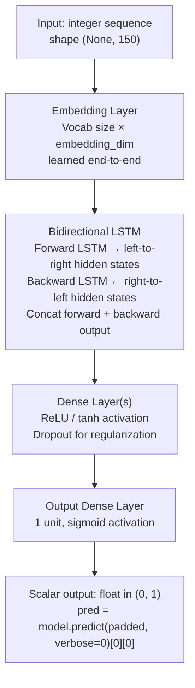
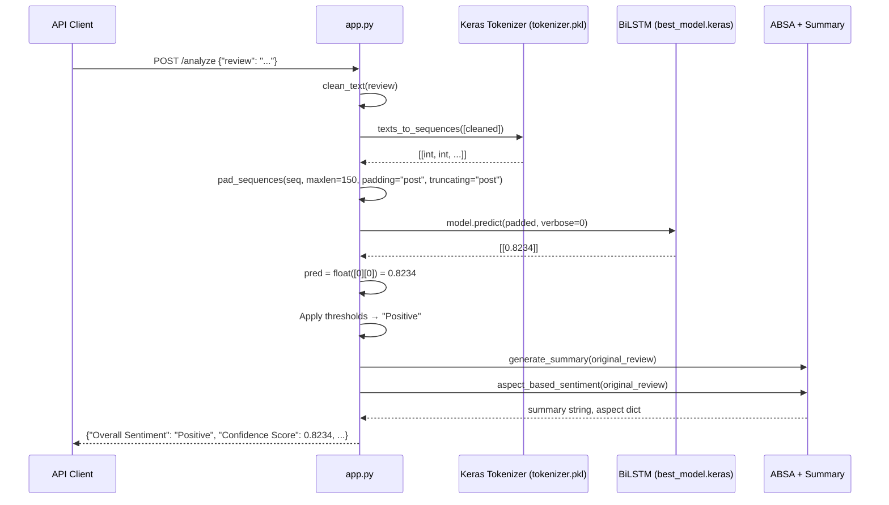

# Sentiment Analysis Architecture — BiLSTM Classifier

This document covers the overall sentiment classification system implemented in `app.py`. The BiLSTM model assigns one of three labels (Positive, Neutral, Negative) to a full review and is the first component in every pipeline variant.

---

## Table of Contents

1. [Preprocessing Pipeline](#1-preprocessing-pipeline)
2. [Tokenization](#2-tokenization)
3. [Sequence Padding](#3-sequence-padding)
4. [Model Architecture](#4-model-architecture)
5. [Inference Flow](#5-inference-flow)
6. [Thresholds and Output](#6-thresholds-and-output)
7. [Design Trade-offs vs BERT](#7-design-trade-offs-vs-bert)
8. [Model Loading](#8-model-loading)
9. [Reference Tables](#9-reference-tables)

---

## 1. Preprocessing Pipeline

```python
def clean_text(text: str) -> str:
    text = text.lower()
    text = re.sub(r"[^a-zA-Z\s]", "", text)
    text = re.sub(r"\s+", " ", text).strip()
    return text
```

Three sequential transformations:

**Step 1 — Lowercase:** Normalizes vocabulary so `"Great"`, `"GREAT"`, and `"great"` all map to the same token index. Without this, the Keras tokenizer treats each capitalization variant as a distinct word, fragmenting the effective vocabulary and causing OOV (out-of-vocabulary) on capitalized forms not seen in training.

**Step 2 — Strip non-alphabetic characters:** `re.sub(r"[^a-zA-Z\s]", "", text)` removes:
- Punctuation (`!`, `.`, `,`, `?`, `-`, `'`)
- Digits (`5`, `100`, `2024`)
- Special characters (`@`, `#`, `*`, emoji codepoints)
- URLs and product codes

**Trade-offs of stripping these characters:**

| Removed | Loss | Acceptable because |
|---|---|---|
| Punctuation | Exclamation emphasis (`"great!"` → `"great"`) | The BiLSTM learns sentiment from word co-occurrence, not punctuation; `"great"` and `"great!"` both map to the same embedding |
| Digits | Star ratings mentioned in text (`"5 stars"`) | Digits in review text are typically redundant with the sentiment expressed in surrounding words |
| Apostrophes | `"don't"` → `"dont"`, `"it's"` → `"its"` | These out-of-vocabulary contractions would map to OOV token (index 0) anyway if not in the training vocabulary; stripping produces the stem which may be present |
| URLs | Product link context | URLs carry no sentiment signal |

**Step 3 — Collapse whitespace:** `re.sub(r"\s+", " ", text).strip()` ensures a single space between tokens after the character removal step (which can leave double spaces where punctuation was between words).

The cleaned text is what goes to the tokenizer. Importantly, `generate_summary()` and `aspect_based_sentiment()` receive the **original** uncleaned review — only the BiLSTM classification step uses `clean_text()`. This is intentional: DistilBERT and T5 are trained on natural text with punctuation and casing.

---

## 2. Tokenization

```python
with open(TOKENIZER_PATH, "rb") as f:
    tokenizer_obj = pickle.load(f)

seq = tokenizer_obj.texts_to_sequences([cleaned])
```

`tokenizer_obj` is a serialized Keras `Tokenizer` instance fitted on the training corpus (Amazon review dataset). The vocabulary maps each word to a unique integer index based on frequency rank (most frequent word = index 1).

**Vocabulary-based vs subword tokenization:**

| Property | Keras Tokenizer (this system) | BERT / SentencePiece |
|---|---|---|
| Unit | Whole words | Sub-words (byte-pair encoding or unigram) |
| OOV handling | Maps unknown words to 0 | Decomposes into known sub-words |
| Vocabulary size | Fixed at training time | Fixed at tokenizer training time |
| Transfer learning | Only if vocabularies match | Language model embeddings transfer |

`texts_to_sequences()` maps each word in the cleaned text to its integer index. Words not in the vocabulary map to 0 (the OOV token). For Amazon electronics reviews with a well-fitted training vocabulary, OOV rates are typically low — common product review words (`"excellent"`, `"disappointed"`, `"battery"`) are reliably in vocabulary.

---

## 3. Sequence Padding

```python
padded = pad_sequences(seq, maxlen=MAX_LENGTH, padding="post", truncating="post")
```

**`maxlen=150`:** The BiLSTM expects a fixed-length input tensor. 150 was chosen based on the length distribution of the training corpus — it covers the majority of Amazon product reviews without excessive padding on typical reviews. A typical review of 80-120 words produces 60-90 tokens after cleaning (contractions collapse, etc.) — well within the 150-token window.

**`padding="post"`:** Zero tokens are appended at the end (right-padding). This means the actual review content starts at index 0 of the sequence, and the BiLSTM reads meaningful tokens first before encountering padding zeros. Post-padding is the standard choice for LSTM-based models because:
- Pre-padding would place meaningful content at the end, making the final hidden state (which has the most influence on the output) reflect padding tokens.
- Post-padding lets the forward LSTM accumulate review content progressively; the backward LSTM starts from the end of the meaningful content.

**`truncating="post"`:** Reviews exceeding 150 tokens are cut from the end. The tail of a review typically contains closing remarks (`"would recommend"`, `"overall good buy"`) that may carry sentiment but are less critical than the opening sentiment statement. This is a trade-off — very long, detailed reviews lose tail context. The alternative (pre-truncation, keeping the tail) would discard the opening context, which is generally more information-dense.

---

## 4. Model Architecture

The model is stored in `best_model.keras` and loaded with the Keras model serialization format. The architecture is a Bidirectional LSTM:



**Embedding Layer:** Converts each integer token index to a dense vector of `embedding_dim` dimensions. These vectors are learned end-to-end from the sentiment classification objective — not initialized from GloVe or Word2Vec. This means the embeddings are optimized specifically for sentiment discrimination on Amazon review vocabulary, at the cost of no pre-trained linguistic knowledge. The trade-off is acceptable here because the training corpus is large and domain-specific.

**Bidirectional LSTM — why bidirectionality matters for sentiment:**

A standard (forward) LSTM reads tokens left-to-right, updating its hidden state `h_t` at each step. The final hidden state `h_150` captures a recency-weighted summary of the sequence — tokens seen later have stronger influence. This creates a systematic bias for reviews where the sentiment shifts mid-text:

> `"Worst phone I've ever owned... but the camera is surprisingly great."`

A forward LSTM over-weights `"great"` (near the end) relative to `"Worst"` (near the beginning), and may misclassify the overall review as Positive despite the dominant negative tone.

A Bidirectional LSTM runs two LSTMs in parallel:
- **Forward LSTM:** reads positions 0 → 149, produces `h_forward` at each step
- **Backward LSTM:** reads positions 149 → 0, produces `h_backward` at each step

At each position, both hidden states are concatenated. The final representation fed to the dense layers sees both the opening and closing sentiment signals with equal recency weighting. This allows the model to weight `"Worst"` (strong signal near the beginning, high weight in the backward LSTM's final state) appropriately against `"great"` (near the end, high weight in forward LSTM's final state).

**Dense output layer with sigmoid:** Maps the concatenated BiLSTM output to a scalar in `(0, 1)`. Sigmoid is appropriate for binary classification; the model was trained with a binary cross-entropy loss. The output is interpreted as "positive probability" — above 0.5 indicates positive sentiment.

---

## 5. Inference Flow



Note that ABSA and summarization receive the **original** review text, not `cleaned`. This is intentional — both DistilBERT (in traditional ABSA) and llama3.2 are trained on natural text and benefit from proper punctuation and casing. The BiLSTM tokenizer requires cleaned text because its vocabulary was built on cleaned text during training.

---

## 6. Thresholds and Output

```python
pred = float(model.predict(padded, verbose=0)[0][0])

if pred > 0.5:
    overall_sentiment = "Positive"
elif pred >= 0.15:
    overall_sentiment = "Neutral"
else:
    overall_sentiment = "Negative"
```

The raw sigmoid output `pred` is a continuous float in `(0, 1)`. Three-class mapping:

| Range | Label | Rationale |
|---|---|---|
| `pred > 0.5` | Positive | Above the sigmoid decision boundary — model confidence in positive class |
| `0.15 ≤ pred ≤ 0.5` | Neutral | Below positive threshold but not strongly negative — hedged or mixed reviews |
| `pred < 0.15` | Negative | Model is strongly confident the review is negative |

The asymmetric boundary (0.5 for Positive, 0.15 for Negative) reflects the characteristic output distribution of a model trained on Amazon reviews, where negative reviews tend to use stronger language and produce lower sigmoid outputs. The Neutral band `[0.15, 0.5]` is intentionally wide — it absorbs ambiguous reviews rather than forcing a binary decision.

```python
"Confidence Score": round(pred, 4)
```

The raw sigmoid output is stored as the confidence score, rounded to 4 decimal places. This is the model's positive probability estimate, not a calibrated confidence interval. A score of `0.92` means the model assigned 92% probability to the positive class under its learned distribution, not that there is a 92% chance the review is positive in an absolute sense. Users should interpret it as a relative ordering signal rather than a calibrated probability.

---

## 7. Design Trade-offs vs BERT

| Dimension | BiLSTM (this system) | BERT |
|---|---|---|
| Memory (loaded) | ~100MB | ~400MB (bert-base), ~250MB (distilbert) |
| Inference latency | ~50–150ms (CPU, no attention computation) | ~200–500ms (CPU, 12 attention layers) |
| Training requirement | Train from scratch on labeled Amazon data | Fine-tune on labeled data (easier, less data needed) |
| Accuracy on short text | Competitive — BiLSTMs are strong on short text classification | Higher accuracy, especially on hedged or complex phrasing |
| Subword handling | Whole-word vocabulary (OOV on rare words) | SentencePiece sub-words (no OOV) |
| Bidirectionality | Native (architecture design) | Native (masked attention is inherently bidirectional) |
| Deployment complexity | Single `.keras` file + `.pkl` tokenizer | Model weights + tokenizer config directory |
| Suitable for | High-throughput, memory-constrained, CPU-only deployment | Higher accuracy requirement, GPU available |

The BiLSTM was chosen for this system because:
1. The application runs on CPU (no GPU assumed in the deployment environment).
2. The ~100MB footprint allows it to coexist with T5-base (~880MB) and DistilBERT (~260MB) in a single process without OOM.
3. Amazon product reviews are short-to-medium length text where BiLSTMs are competitive with BERT.
4. Training infrastructure for a BiLSTM is simpler than BERT fine-tuning, requiring no gradient accumulation, mixed-precision training, or learning rate warmup.

---

## 8. Model Loading

```python
model = tf.keras.models.load_model(MODEL_PATH, compile=False)
```

**`compile=False`:** Skips reconstructing the optimizer state from the saved model. During training, the optimizer (typically Adam) maintains momentum and variance accumulators for each parameter — these are saved in the `.keras` file but are only needed to resume training. For inference-only deployment, reconstructing the optimizer wastes time (it requires re-initializing and loading optimizer state for 220M+ parameters) and memory. `compile=False` loads only the model weights and architecture, reducing startup time.

Both the model and tokenizer are loaded **once at module import time** (Flask startup), not per-request. This is critical for performance — loading a `.keras` file takes 2-5 seconds and loading the tokenizer pickle takes ~200ms. Per-request loading would make every API call 5+ seconds slower.

The `os.path.exists()` check before loading raises a descriptive `RuntimeError` at startup rather than a confusing `FileNotFoundError` mid-request. This fail-fast pattern ensures misconfigured deployments (missing model file) are detected immediately.

---

## 9. Reference Tables

### Model Tensor Shapes

| Layer | Input Shape | Output Shape | Notes |
|---|---|---|---|
| Input | `(None, 150)` | — | Batch of padded integer sequences |
| Embedding | `(None, 150)` | `(None, 150, embedding_dim)` | Integer → dense vector |
| BiLSTM | `(None, 150, embedding_dim)` | `(None, lstm_units × 2)` | Forward + backward concatenated |
| Dense | `(None, lstm_units × 2)` | `(None, hidden_dim)` | Intermediate representation |
| Output Dense | `(None, hidden_dim)` | `(None, 1)` | Sigmoid scalar |

### Threshold Mapping

| Sigmoid output | Sentiment label | Stored as |
|---|---|---|
| > 0.5 | Positive | `"Positive"` in DB |
| 0.15 – 0.50 | Neutral | `"Neutral"` in DB |
| < 0.15 | Negative | `"Negative"` in DB |

### Key Constants in `app.py`

| Constant | Value | Purpose |
|---|---|---|
| `MAX_LENGTH` | 150 | `pad_sequences` maxlen |
| `MAX_REVIEW_LENGTH` | 2000 chars | Input validation before pipeline |
| `MAX_BATCH_SIZE` | 10 | `/api/batch/analyze` limit |
| `MODEL_PATH` | `"best_model.keras"` | BiLSTM weights |
| `TOKENIZER_PATH` | `"tokenizer.pkl"` | Keras Tokenizer vocab |
