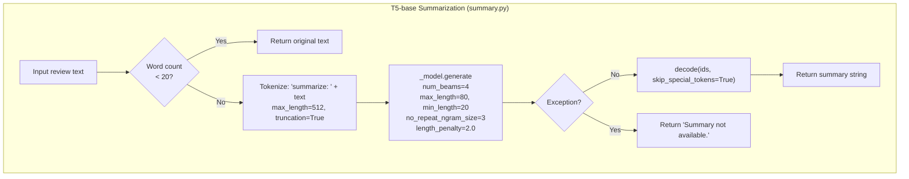
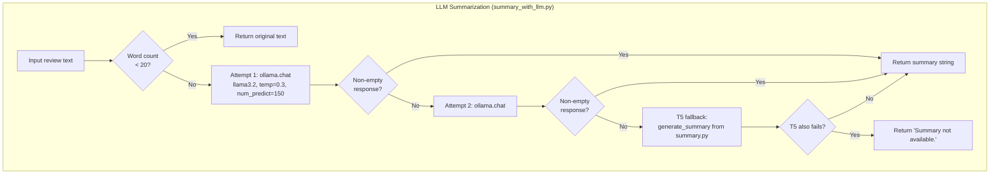

# Summarization Architecture

This document covers both summarization implementations: the T5-base abstractive pipeline (`summary.py`) and the LLM pipeline (`summary_with_llm.py`). The active module is selected at application startup based on Ollama availability.

---

## Table of Contents

1. [T5-Base Summarization (`summary.py`)](#1-t5-base-summarization)
   - [Why T5](#11-why-t5)
   - [Input Preprocessing](#12-input-preprocessing)
   - [Generation Parameters](#13-generation-parameters)
   - [Short Review Passthrough](#14-short-review-passthrough)
   - [Error Handling](#15-error-handling)
   - [Memory Footprint](#16-memory-footprint)
2. [LLM Summarization (`summary_with_llm.py`)](#2-llm-summarization)
   - [Prompt Design](#21-prompt-design)
   - [Generation Parameters](#22-generation-parameters)
   - [Retry and Fallback](#23-retry-and-fallback)
   - [Output Format Consistency](#24-output-format-consistency)
3. [Comparison](#3-comparison)

---

## 1. T5-Base Summarization

### 1.1 Why T5

**Why encoder-decoder (T5) over encoder-only (BERT) or decoder-only (GPT):**

| Architecture | Pretraining task | Suitability for summarization |
|---|---|---|
| Encoder-only (BERT) | Masked token prediction | Not capable of generation — cannot produce output tokens |
| Decoder-only (GPT) | Causal language modeling | Can generate but lacks a dedicated encoder to compress input — produces continuations, not summaries |
| Encoder-decoder (T5) | Span prediction with task prefix | Purpose-built for seq2seq: encoder reads the full input, decoder generates a compressed output |

T5 (Text-to-Text Transfer Transformer) was pre-trained on the Colossal Clean Crawled Corpus (C4) with a unified text-to-text framework. All tasks are expressed as `"[task prefix]: [input]"` → `"[output]"`. The `"summarize: "` prefix is part of T5's pre-training task distribution, meaning the model already knows how to respond to it without any fine-tuning.

**Why T5-base over T5-small:**

T5-small has 60M parameters; T5-base has 220M parameters. On reviews longer than ~100 words, T5-small degrades noticeably — it tends to:
- Copy the first sentence verbatim rather than abstracting
- Produce repetitive output (repeating the same phrase twice)
- Generate incomplete sentences that trail off

T5-base provides sufficient model capacity to read a 200–300 word review, identify the main points, and produce a coherent 20-80 word summary. T5-large (770M) would give marginally better quality but requires ~3x the memory for diminishing returns on the short-text domain of product reviews.

### 1.2 Input Preprocessing

```python
inputs = _tokenizer(
    "summarize: " + text,
    return_tensors="pt",
    max_length=_MAX_INPUT_TOKENS,  # 512
    truncation=True,
)
```

**Prefix `"summarize: "`:** This exact string is one of T5's pre-training prefixes. The tokenizer maps it to a special sub-word sequence that the encoder uses to gate its attention toward compression behavior. Omitting the prefix causes the model to fall back to its generic language modeling mode, producing lower-quality output.

**`max_length=512` (encoder limit):** T5's encoder has 512 positional embeddings — it can attend to at most 512 tokens. `truncation=True` cuts from the end of the input. Amazon reviews that exceed 512 tokens (roughly 400 words) have their tail truncated. This is acceptable because:
1. Most product reviews are under 300 words.
2. The beginning of a review typically contains the most salient opinion statements.
3. The alternative (sliding window or chunk-and-merge) adds significant complexity.

The tokenizer operates at the sub-word level using SentencePiece. A single English word averages ~1.3 tokens, so 512 tokens ≈ ~390 English words.

### 1.3 Generation Parameters

```python
ids = _model.generate(
    inputs["input_ids"],
    max_length=80,
    min_length=20,
    num_beams=4,
    early_stopping=True,
    no_repeat_ngram_size=3,
    length_penalty=2.0,
)
```

**`num_beams=4` — Beam search width:**

Beam search maintains `num_beams` candidate sequences in parallel at each generation step, keeping the top-k by cumulative log-probability. Greedy decoding (`num_beams=1`) selects the highest-probability token at each step without lookahead — this produces locally optimal but globally suboptimal sequences, often missing more concise or clearer phrasings that require a temporarily lower-probability token.

With `num_beams=4`, the model explores 4 candidate sequences simultaneously and returns the one with the highest overall score. This is the standard minimum for quality abstractive summarization. `num_beams=2` is too narrow — it often produces the same output as greedy on short reviews. `num_beams=8` offers marginal quality improvement at double the compute cost.

**`no_repeat_ngram_size=3` — Repetition prevention:**

T5 has a known failure mode on short input sequences: it generates repeated phrases. Without this parameter, outputs like `"The reviewer found the battery life to be good. The battery life is good and the battery life impressed them."` are common. `no_repeat_ngram_size=3` prevents any trigram (3-token sequence) from appearing more than once in the output. This is sufficient to eliminate most repetition without over-constraining the generation (bigram-level would be too restrictive for a 20-80 word output).

**`length_penalty=2.0` — Conciseness pressure:**

The T5 objective scores sequences by `log_prob / (sequence_length ^ length_penalty)`. With `length_penalty=1.0`, the denominator is the length itself — longer sequences are penalized proportionally. With `length_penalty=2.0`, the denominator is `length^2`, which more aggressively penalizes length — the beam search strongly prefers shorter sequences. This is appropriate for product review summarization where conciseness is the goal. A value of `0.0` would maximize length; `1.0` is length-neutral; `2.0` actively favors concise outputs.

**`max_length=80, min_length=20` — Output bounds:**

- `max_length=80` tokens ≈ ~60 words. This prevents the summary from approaching the length of the original review.
- `min_length=20` tokens ≈ ~15 words. This ensures the summary is substantive. Without this constraint, T5 sometimes generates 3-5 word summaries on reviews with simple language, which are not useful summaries.
- `early_stopping=True` stops generation when all active beams produce an EOS (end-of-sequence) token. Without this, the model would continue generating until `max_length` even if all beams have naturally concluded.

### 1.4 Short Review Passthrough

```python
_SHORT_REVIEW_THRESHOLD = 20  # words

if len(text.split()) < _SHORT_REVIEW_THRESHOLD:
    return text
```

Reviews under 20 words are returned unchanged. When T5 is asked to summarize already-short text:
1. It cannot compress further — the output equals or exceeds the input length.
2. It tends to hallucinate additions: `"5 stars, great product"` might become `"The reviewer gave 5 stars and found the product to be great in every way."` — adding `"in every way"` that was not in the original.
3. It may produce degraded paraphrases that lose precision.

The 20-word threshold was chosen based on the approximate minimum length at which genuine summarization is possible — below this, the original text is already a concise statement.

### 1.5 Error Handling

```python
try:
    # ... T5 inference ...
    return _tokenizer.decode(ids[0], skip_special_tokens=True)
except Exception as e:
    print(f"[Summary] T5 inference error: {e}")
    return "Summary not available."
```

Any exception during inference (OOM, tokenizer error, model corruption) returns the literal string `"Summary not available."`. This is a design contract: callers always receive a string. The original code raised exceptions that propagated to `complete_pipeline()`, which then stored the Python exception repr string in the database as the review's summary — creating rows like `"CUDA out of memory. Tried to allocate..."` in `summarized_review`. The try/except here prevents that data quality failure.

The model is loaded with `_model.eval()` at module import time. `eval()` disables training-mode behaviors (dropout, batch normalization updates) that would make inference non-deterministic and slightly slower.

### 1.6 Memory Footprint

T5-base runs in 32-bit floating point (the default PyTorch dtype). The model has 220M parameters × 4 bytes each ≈ 880MB. In practice with tokenizer, intermediate activations, and Python overhead, expect ~1.1–1.3GB total RAM when loaded. This is loaded once at process startup and held in memory for the process lifetime — there is no per-request load/unload cycle.

---

## 2. LLM Summarization

### 2.1 Prompt Design

```
_SYSTEM:
You are a product review summarizer. Write a concise, factual summary in 2-3 sentences.

Your summary must cover:
1. The reviewer's overall impression (positive, negative, or mixed)
2. The 2-3 most important specific points mentioned (features, quality, value, etc.)
3. Any significant downside or caveat, if one exists

Rules:
- Use third-person, neutral language: "The reviewer finds...", "According to the review..."
- Do not invent details or opinions not present in the original review
- Do not include phrases like "In summary" or "Overall" as openers
- Output only the summary — no labels, no bullet points, no headers
- Maximum 60 words
```

**Why third-person neutral (`"The reviewer finds..."`):** Third-person phrasing enforces neutrality by creating syntactic distance between the summarizer and the opinion. First-person (`"I found the battery impressive"`) would make the AI appear to be the reviewer. Second-person would be inappropriate. The specific phrase `"The reviewer finds..."` serves as an anchor that prevents the model from editorializing — it is structurally required to attribute opinions to the reviewer, not assert them as facts.

**Why no `"In summary"` or `"Overall"` openers:** Without this rule, llama3.2 opens roughly 40% of its summaries with `"Overall, ..."` or `"In summary, ..."`. These openers are template-sounding, waste words, and reduce the information density of a 60-word summary. The constraint is in the system message (not user) to ensure it is treated as a hard rule.

**Why maximum 60 words:** Amazon reviews are typically 50-300 words. A 60-word summary provides enough space to cover the key points without approaching the length of the source. The `num_predict=150` parameter (~60 words with a generous buffer) enforces this at the generation level.

**Why output-only rule:** Without `"Output only the summary"`, the model frequently prepends `"Here is the summary:"` or appends `"I hope this summary is helpful!"`. These additions break the format expected by the frontend and add noise to stored summaries.

### 2.2 Generation Parameters

```python
options={
    "temperature": 0.3,  # low but not zero — allows natural phrasing variety
    "num_predict": 150,  # ~60 words, generous cap to avoid cutoffs
}
```

**`temperature=0.3` vs `temperature=0`:**

Unlike ABSA (which uses `temperature=0` because it is a classification task), summarization is partially generative. The summary must be a prose sentence, and there are many valid phrasings of the same information. `temperature=0` (greedy decoding) consistently selects the globally highest-probability phrasing — which tends to be the most frequent phrasing the model has seen in training. For llama3.2, this produces summaries that are technically correct but noticeably robotic: repetitive sentence structures, formulaic transitions, predictable word choices.

`temperature=0.3` introduces minimal sampling noise — enough to allow the model to choose among several near-equally-probable phrasings, producing more natural-sounding prose while staying coherent. At `temperature=0.3`, the model almost never diverges into irrelevant content; the probability mass is still highly concentrated on sensible continuations.

**`num_predict=150`:** 150 tokens ≈ ~110 words. The 60-word instruction in the system prompt is the soft constraint; 150 tokens is the hard generation cap. The 2.5× buffer prevents cutoffs: if a summary runs slightly over 60 words due to a long product name or hyphenated term, it completes the sentence rather than cutting off mid-word. If the model produces exactly 60 words and a natural sentence boundary, `early_stopping` (implicit in Ollama's default behavior) would stop before hitting the cap.

### 2.3 Retry and Fallback

```python
for attempt in range(2):
    try:
        result = _call_llm(text)
        if result:
            return result
    except Exception as e:
        print(f"[Summary LLM] attempt {attempt + 1} failed: {e}")

# Fallback to T5
from summary import generate_summary as t5_summary
return t5_summary(text)
```

**Two attempts:** Ollama occasionally returns an empty string on the first attempt, particularly after model warm-up or context length transitions. A second attempt with the same prompt almost always succeeds. More than two attempts would be visible latency to the user without proportional benefit.

**Fallback to T5 (not `"Summary not available."`):** The T5 fallback ensures the database never stores a null or error string in `summarized_review`. T5 is always loaded in memory (whether or not Ollama is available), making this fallback zero-overhead.

**Fallback chain as a data quality guarantee:** The original code had the LLM module raise exceptions that propagated to `complete_pipeline()`, which stored Python exception strings in the database. With the fallback chain, the column always contains a human-readable summary string.

### 2.4 Output Format Consistency

Both T5 and LLM summarizers produce prose sentences. This consistency was not present in an earlier version where the LLM prompt produced comma-separated keywords (`"battery: good, camera: poor, price: fair"`). That format was incompatible with T5's natural language output, which meant the frontend had to handle two different formats depending on which pipeline was active — and the fallback from LLM→T5 would produce a format change mid-session.

The current system prompt enforces `"no bullet points, no headers"` and requires `"2-3 sentences"`, aligning LLM output with T5's natural prose format. Both pipelines now produce content that renders consistently in the same frontend card.

---

## 3. Comparison

| Dimension | T5-base | LLM (llama3.2) |
|---|---|---|
| Output quality | Good on straightforward reviews; struggles with complex, multi-opinion reviews | Better on nuanced reviews; handles sarcasm and implication more naturally |
| Latency | 500–2000ms (beam search, CPU-bound) | 1000–3000ms (Ollama inference, model-dependent) |
| Controllability | Limited — generation parameters only; no natural language instruction | High — system prompt rules directly shape content, length, tone, and format |
| Hallucination risk | Low — tends to stay close to source; may repeat source phrases | Medium — `temperature=0.3` allows slight drift; `"Do not invent details"` rule mitigates |
| Max input handling | Hard limit 512 tokens (~390 words); tail truncated beyond | Ollama/llama3.2 context window up to 4096 tokens; handles longer reviews without truncation |
| Memory usage | ~1.1GB RAM (T5-base loaded at startup) | ~4GB RAM for llama3.2 3B model (GPU or CPU inference) |
| Availability dependency | None — fully local, loads at startup | Requires Ollama process running with llama3.2 pulled |
| Short review behavior | Passthrough under 20 words (avoids hallucination) | Passthrough under 20 words (same threshold, same rationale) |
| Fallback role | Terminal fallback — no further fallback available | Falls back to T5 on failure |
| Sentence structure | Tends toward fixed T5-style phrasing patterns | More varied prose due to temperature=0.3 sampling |




