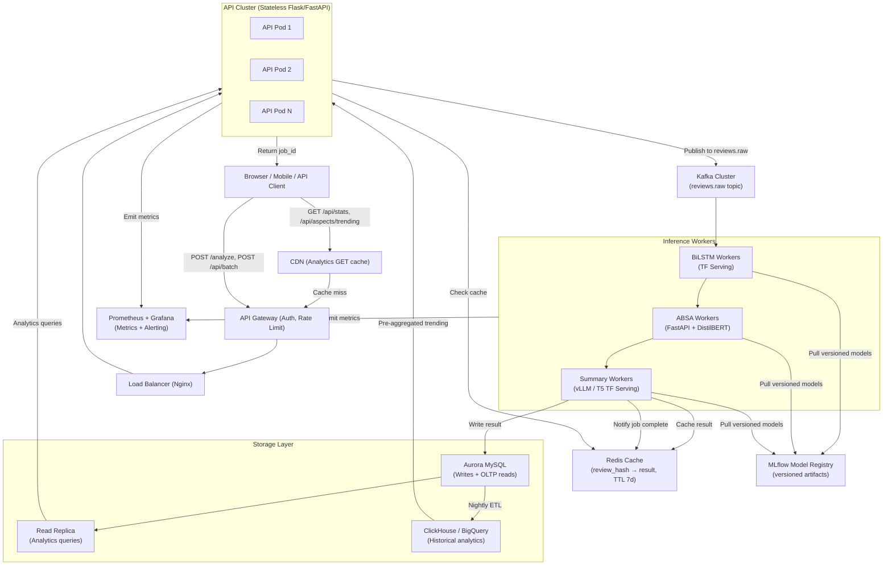

# System Design Interview Guide
## Design a Review Intelligence Platform — 10 Million Reviews/Day

---

## Current System Limitations

Before discussing scale, understand what the current system actually is:

| Limitation | Root Cause | Impact |
|---|---|---|
| Single-process Ollama | Ollama runs one inference at a time | Concurrent LLM requests queue serially |
| Synchronous Flask | No async I/O | One slow request blocks a worker thread |
| In-process model loading | All models loaded per gunicorn worker | 4 workers = 4 × 1.3GB RAM |
| MySQL single instance | No read replicas | Analytics and write queries compete |
| No message queue | POST /analyze is synchronous | User waits 5-15 seconds per review |
| No caching layer | Same review analyzed twice runs full pipeline | Redundant compute on popular products |
| No batch model inference | N aspects = N DistilBERT calls | Linear latency scaling with aspect count |
| No distributed coordination | Stateless only within a worker | No job tracking across workers |

**Current throughput ceiling:**
- Transformer path: ~2-5 requests/second (single worker, CPU)
- LLM path: ~0.5-1 requests/second (Ollama bottleneck)
- At 10M reviews/day: ~116 reviews/second sustained — **100x beyond current capacity**

---

## Capacity Planning

| Metric | Calculation | Value |
|---|---|---|
| Reviews/day | Given | 10,000,000 |
| Reviews/second (sustained) | 10M / 86400 | 115.7 req/s |
| Reviews/second (peak 3x) | 115.7 × 3 | ~347 req/s |
| Storage/review (text + summary) | ~2KB average | — |
| Storage/review (ABSA: 5 aspects avg) | ~200 bytes | — |
| Storage/day | (2KB + 200B) × 10M | ~22 GB/day |
| Storage/year | 22GB × 365 | ~8 TB/year |
| BiLSTM inference RAM per worker | ~100MB | — |
| DistilBERT RAM per worker | ~260MB | — |
| T5-base RAM per worker | ~850MB | — |
| ABSA workers needed (at 100ms/review) | 347 / 10 per instance | ~35 pods |
| Summary workers needed (at 1s/review) | 347 / 1 per instance | ~347 pods |

Summary at 1s/review is the bottleneck. Solution: LLM summarization with vLLM (30-50 req/s per GPU instance) or accept eventual summarization (async queue, summaries generated separately from sentiment).

---

## Scaled Architecture Overview



---

## Component-Level Design Decisions

### API Gateway

**Responsibilities:** Authentication (API key validation), rate limiting (per-key token bucket), request ID injection, TLS termination.

**Why separate from application:** Business logic should not be coupled to auth/rate-limiting. Kong, AWS API Gateway, or Nginx with Lua plugins handle this in one place rather than duplicating it across every microservice.

**Rate limit strategy:** Token bucket per API key. Write endpoints (POST /analyze): 100 req/min. Read endpoints (GET /api/stats): 1000 req/min. Batch endpoint: 10 req/min (since one request = up to 10 analyses).

### API Pods (Stateless)

**What they do:** Validate input, check Redis cache (hash → result), publish to Kafka if cache miss, return job_id immediately.

**Why stateless:** Enables horizontal scaling. Any pod can handle any request. No session affinity needed. Load balancer uses round-robin.

**Async response pattern:**
```
POST /analyze → { "job_id": "abc123", "status": "queued" }
GET /status/abc123 → { "status": "processing" }
GET /status/abc123 → { "status": "complete", "result": {...} }
```

For synchronous clients that need a result immediately: long-poll on GET /status/{job_id} with a timeout. For event-driven clients: webhook callback URL in POST body.

### Kafka Message Queue

**Topic structure:**
- `reviews.raw` — ingested reviews waiting for processing
- `reviews.processed` — completed analysis results (used by notification service)
- `reviews.failed` — reviews that failed after max retries (dead letter queue)

**Partitioning:** Partition by `product_id` hash — reviews for the same product go to the same partition, ensuring ordering. Consumer groups: one per service tier (ABSA group, summary group).

**Why Kafka over Redis Queue / RabbitMQ:** Kafka retains messages for configurable retention (7 days default). Failed consumers can replay from the last committed offset without losing messages. At 10M reviews/day, message throughput is ~116/second — well within a single Kafka partition's capacity, but multiple partitions allow parallel processing.

### Redis Cache Layer

**Cache key:** `SHA-256(review_text.strip())` — same hash used for DB deduplication.

**Cache value:** Full analysis result (JSON serialized), same structure as API response.

**TTL:** 7 days. Product reviews for the same SKU repeat frequently. In e-commerce, the top 1000 products receive the majority of reviews — cache hit rate for popular products could exceed 80%.

**Cache invalidation:** Not needed (results are immutable — same text always produces same output from a fixed model version). TTL-based expiry is sufficient.

**Also used for:** Job status tracking (`job:{job_id}` → status/result).

### Inference Microservices

#### BiLSTM Sentiment Service

- TF Serving container with the `best_model.keras` loaded as a SavedModel
- Input: tokenized + padded sequence (produced by preprocessing service or inline)
- Output: float probability
- RAM: ~100MB per instance
- Throughput: ~200 req/s per pod on CPU (very fast inference)
- Scaling trigger: CPU utilization > 70%

#### ABSA Service

- FastAPI application with DistilBERT and spaCy loaded in-process
- Input: review text
- Output: dict of {aspect: sentiment}
- RAM: ~350MB per instance (DistilBERT 260MB + spaCy 50MB + overhead)
- Throughput: ~5-10 req/s per pod (DistilBERT per-aspect bottleneck)
- **Key optimization:** Batch all aspect contexts in one DistilBERT forward pass instead of N sequential calls. For a review with 5 aspects, this is a 5x speedup.
- Scaling trigger: Kafka consumer lag > 1000 messages

#### Summarization Service

- vLLM for LLM summarization (supports batching, 30-50 req/s on A100 GPU) or T5 TF Serving (CPU fallback)
- RAM: GPU path needs 8GB VRAM for vLLM + llama3.2; CPU T5 path needs ~850MB RAM
- Throughput: vLLM ~30-50 req/s (GPU); T5 CPU ~0.5-1 req/s
- Scaling trigger: Kafka consumer lag > 5000 messages (slower service)

### Database Layer

**Aurora MySQL (primary):** Handles all writes (review inserts, ABSA results) and OLTP reads (review history pagination, single review lookup by hash). Aurora MySQL provides automated failover, 6-way replication, and up to 15 read replicas without configuration complexity.

**Read Replica:** Serves all analytics queries (sentiment distribution, trending aspects, stats). Separates read and write workloads — analytics queries cannot slow down write latency.

**ClickHouse (OLAP):** Nightly ETL job copies data from Aurora to ClickHouse. ClickHouse's columnar storage makes `GROUP BY aspect, COUNT(*)` queries 100x faster than MySQL for large datasets. Trending aspects over 30 days on 10M rows: MySQL ~10 seconds; ClickHouse ~100ms.

**Connection pooling:** PgBouncer (for MySQL: ProxySQL) sits between application pods and Aurora. Without a pooler, 50 API pods × 4 threads each = 200 simultaneous connections, approaching MySQL's default `max_connections=151`. ProxySQL multiplexes these into ~20 actual DB connections.

### Model Versioning with MLflow

```
MLflow Model Registry
├── BiLSTM-Sentiment
│   ├── v1 (staging)
│   └── v2 (production) ← inference services pull this
├── ABSA-DistilBERT
│   └── v1 (production)
└── T5-Summary
    └── v1 (production)
```

**Deployment pattern (blue-green):**
1. Train new model, register as `v2` in `staging`
2. Run evaluation pipeline — if F1 improves, promote to `production`
3. Deploy new pods pulling `v2` alongside existing `v1` pods
4. Shift 10% traffic to v2 pods (canary)
5. Monitor error rate + sentiment distribution — if stable, shift to 100%
6. Decommission v1 pods

This allows rollback to v1 in under 1 minute by re-routing traffic.

---

## Microservices Decomposition

| Service | Responsibility | Tech | Scaling Axis |
|---|---|---|---|
| ingestion-service | Input validation, cache check, Kafka publish | FastAPI | CPU (I/O bound) |
| sentiment-service | BiLSTM inference | TF Serving | CPU (compute bound) |
| absa-service | Aspect extraction + DistilBERT scoring | FastAPI + PyTorch | CPU (compute bound) |
| summary-service | T5 / LLM summarization | vLLM / TF Serving | GPU (generative model) |
| analytics-service | Aggregation queries, trending aspects | FastAPI + ClickHouse | Read replicas |
| notification-service | Webhook callbacks, job status updates | FastAPI + Redis | I/O bound |
| model-registry | MLflow artifact management | MLflow | Storage |

---

## Monitoring and Observability

### Prometheus Metrics

```
# Latency per pipeline stage
http_request_duration_seconds{route="/analyze", stage="bilstm"}
http_request_duration_seconds{route="/analyze", stage="absa"}
http_request_duration_seconds{route="/analyze", stage="summary"}

# Error rates
http_errors_total{route="/analyze", status="500"}
llm_fallback_total{reason="empty_parse"}
llm_fallback_total{reason="connection_refused"}

# Queue depth
kafka_consumer_lag{group="absa-workers", topic="reviews.raw"}
kafka_consumer_lag{group="summary-workers", topic="reviews.raw"}

# Model confidence distribution
model_confidence_bucket{le="0.1"} 
model_confidence_bucket{le="0.5"}
model_confidence_bucket{le="0.9"}

# Cache performance
redis_cache_hits_total
redis_cache_misses_total
```

### Drift Detection

**Sentiment distribution drift:** Compute rolling 7-day average of Positive/Negative/Neutral ratio. If the Positive ratio drops from historical 65% to below 50%, alert — either the product category changed (acceptable), the model is degrading (not acceptable), or there was a data pipeline bug.

**Confidence score drift:** If average `confidence_score` drops toward 0.5 over time, the model is becoming less certain. Trigger retraining investigation. Use Kolmogorov-Smirnov test to compare current week's confidence distribution against baseline.

**ABSA aspect drift:** Track top-20 most-mentioned aspects. If a new aspect appears in top 5 that wasn't in the training vocabulary (e.g., a new product feature), aspect extraction may miss it. Alert for manual vocabulary expansion.

### Alerting Rules

| Alert | Condition | Severity | Response |
|---|---|---|---|
| High error rate | 500s > 5% over 5min | Critical | Page on-call |
| Kafka lag growing | Consumer lag > 10K msgs | Warning | Scale workers |
| Ollama down | LLM fallback rate > 90% | Warning | Check Ollama pod |
| Model confidence drift | Mean confidence < 0.45 | Warning | Investigate retraining |
| DB latency spike | P99 write latency > 500ms | Warning | Check MySQL |
| Cache miss spike | Cache hit rate < 40% | Info | Investigate TTL |

---

## Autoscaling Policies

### Horizontal Pod Autoscaler (Kubernetes HPA)

```yaml
# ABSA workers: scale on Kafka consumer lag
apiVersion: autoscaling/v2
kind: HorizontalPodAutoscaler
metadata:
  name: absa-worker-hpa
spec:
  scaleTargetRef:
    name: absa-worker
  minReplicas: 2
  maxReplicas: 50
  metrics:
  - type: External
    external:
      metric:
        name: kafka_consumer_lag
        selector:
          matchLabels:
            topic: reviews.raw
            group: absa-workers
      target:
        type: AverageValue
        averageValue: "1000"
```

```yaml
# Summary workers: scale on CPU (generative, compute-bound)
metrics:
- type: Resource
  resource:
    name: cpu
    target:
      type: Utilization
      averageUtilization: 70
```

```yaml
# API pods: scale on request rate
metrics:
- type: Pods
  pods:
    metric:
      name: http_requests_per_second
    target:
      type: AverageValue
      averageValue: "50"
```

---

## Caching Strategy: Two Levels

**L1 — Redis (compute cache):** `review_hash → analysis_result` with TTL 7 days. Avoids running the entire ML pipeline for repeated reviews. For popular products receiving thousands of the same review text (bulk review spam is real), this is extremely effective.

**L2 — CDN (API response cache):** GET /api/stats and GET /api/aspects/trending are read-only analytics queries with data that changes at most hourly. Cache these responses at the CDN layer with `Cache-Control: public, max-age=300`. Reduces load on the analytics-service completely for repeated analytics dashboard refreshes.

**What is NOT cached:** POST /analyze response (unique per review). POST /api/batch (too variable). GET /api/reviews with filters (too many combinations, low reuse).

---

## Queue-Based Inference: Detailed Flow

```
Client                  API Pod              Kafka            ABSA Worker          Redis
  │                        │                   │                   │                 │
  │ POST /analyze          │                   │                   │                 │
  ├───────────────────────>│                   │                   │                 │
  │                        │ hash(review)      │                   │                 │
  │                        ├───────────────────────────────────────────────────────>│
  │                        │<─────────────────────────────────────────────────────── cache miss
  │                        │ publish(review, job_id)                │                 │
  │                        ├──────────────────>│                   │                 │
  │ { job_id: "abc" }      │                   │ consume           │                 │
  │<───────────────────────│                   ├──────────────────>│                 │
  │                        │                   │                   │ BiLSTM          │
  │ GET /status/abc        │                   │                   │ ABSA            │
  ├───────────────────────>│                   │                   │ T5/LLM          │
  │ { status: "queued" }   │                   │                   │                 │
  │<───────────────────────│                   │                   │ SET job:abc     │
  │                        │                   │                   ├────────────────>│
  │ GET /status/abc (poll) │                   │                   │ SET hash:result │
  ├───────────────────────>│                   │                   ├────────────────>│
  │                        │ GET job:abc        │                   │                 │
  │                        ├───────────────────────────────────────────────────────>│
  │                        │<─────────────────────────────────────────────────────── result
  │ { status: "complete",  │                   │                   │                 │
  │   result: {...} }      │                   │                   │                 │
  │<───────────────────────│                   │                   │                 │
```

---

## Distributed Analytics Pipeline

**Problem:** `GET /api/aspects/trending?days=30` currently runs:
```sql
SELECT a.aspect, COUNT(*) FROM absa_results a
JOIN reviews r ON a.review_id = r.id
WHERE r.created_at >= NOW() - INTERVAL 30 DAY
GROUP BY a.aspect
ORDER BY total_mentions DESC LIMIT 10;
```

At 10M reviews/day with 5 aspects average = 50M ABSA rows per day = 1.5B rows per month. This query on MySQL would take minutes.

**Solution:** dbt (data build tool) + ClickHouse
- Nightly dbt job materializes `trending_aspects_30d` table in ClickHouse
- GET /api/aspects/trending reads from this pre-aggregated table: ~10ms query
- CDN caches the response for 5 minutes (trending data doesn't need real-time precision)

For real-time trending (last 1 hour), maintain a Redis sorted set: `ZINCRBY aspects:trending 1 "battery life"` on every ABSA result. GET /api/aspects/trending?realtime=true reads from this sorted set: O(log N + M) where M is limit.

---

## Storage Schema Evolution

For 10M reviews/day, the current schema needs sharding or partitioning:

**MySQL partitioning by date:**
```sql
ALTER TABLE reviews PARTITION BY RANGE (UNIX_TIMESTAMP(created_at)) (
    PARTITION p2025_q1 VALUES LESS THAN (UNIX_TIMESTAMP('2025-04-01')),
    PARTITION p2025_q2 VALUES LESS THAN (UNIX_TIMESTAMP('2025-07-01')),
    PARTITION p2025_q3 VALUES LESS THAN (UNIX_TIMESTAMP('2025-10-01')),
    PARTITION p2025_q4 VALUES LESS THAN (UNIX_TIMESTAMP('2026-01-01')),
    PARTITION future VALUES LESS THAN MAXVALUE
);
```

This makes `WHERE created_at >= NOW() - INTERVAL 30 DAY` queries use partition pruning — they only scan the current quarter's partition instead of the full table.

**Long-term:** Move reviews older than 90 days to cold storage (S3 as Parquet files). Only recent data stays in MySQL. Historical analytics run against Parquet via Athena or ClickHouse's S3 table engine.
