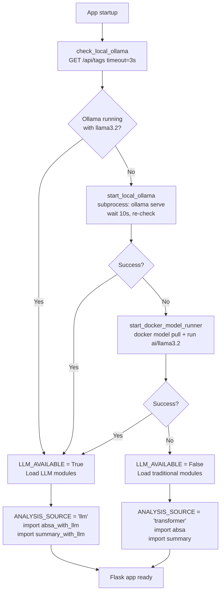
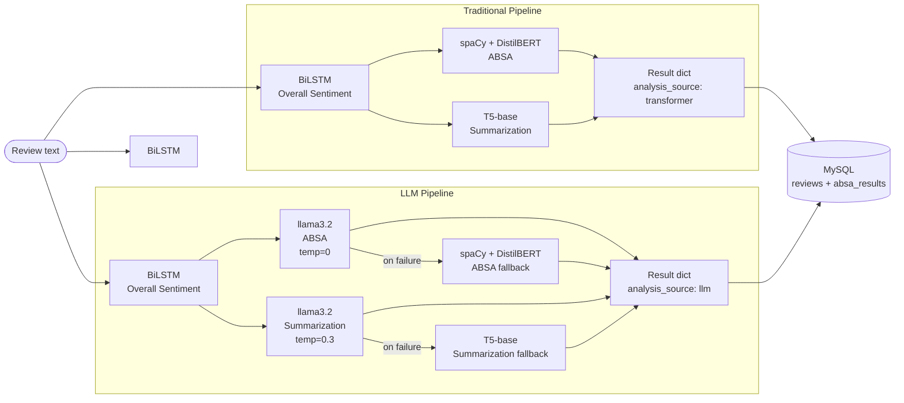
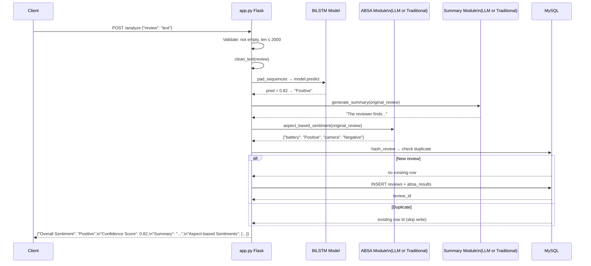

# Workflow: Traditional Pipeline vs LLM Pipeline

This document compares the three pipeline operating modes, covering latency, reliability, explainability, cost, hallucination risk, determinism, scalability, observability, and the architectural rationale for the hybrid fallback design.

---

## Table of Contents

1. [Three Pipeline Modes](#1-three-pipeline-modes)
2. [Component Latency Breakdown](#2-component-latency-breakdown)
3. [Reliability Comparison](#3-reliability-comparison)
4. [Explainability](#4-explainability)
5. [Cost Analysis](#5-cost-analysis)
6. [Hallucination Risk](#6-hallucination-risk)
7. [Inference Stability](#7-inference-stability)
8. [Scalability](#8-scalability)
9. [Observability](#9-observability)
10. [Why the Hybrid Fallback Architecture](#10-why-the-hybrid-fallback-architecture)
11. [Pipeline Mode Selection at Startup](#11-pipeline-mode-selection-at-startup)
12. [Diagrams](#12-diagrams)
13. [Full Comparison Table](#13-full-comparison-table)

---

## 1. Three Pipeline Modes

Every call to `complete_pipeline()` in `app.py` runs three components. The first component (BiLSTM sentiment) is identical in all modes. The ABSA and summarization components differ:

### Mode 1 — Traditional (transformer-only)

Active when `LLM_AVAILABLE = False`.

```
BiLSTM (overall sentiment)
    + spaCy + DistilBERT (ABSA)
    + T5-base (summarization)
```

All models are local. No external process calls. Fully deterministic. This mode runs even when Ollama is not installed.

### Mode 2 — LLM

Active when `LLM_AVAILABLE = True`.

```
BiLSTM (overall sentiment)
    + llama3.2 via Ollama (ABSA)
    + llama3.2 via Ollama (summarization)
```

Requires Ollama running with llama3.2 pulled. ABSA uses `temperature=0` (deterministic); summarization uses `temperature=0.3` (slight variation). Stored `analysis_source = "llm"`.

### Mode 3 — LLM with fallback (automatic)

Activated transparently within Modes 2 when Ollama calls fail.

```
BiLSTM (overall sentiment)
    + [llama3.2 attempt 1 → attempt 2 → spaCy + DistilBERT] (ABSA)
    + [llama3.2 attempt 1 → attempt 2 → T5-base] (summarization)
```

The caller in `app.py` is unaware whether the fallback was triggered — it always receives a properly populated result dict. The `analysis_source` column records `"llm"` regardless of whether the fallback was used, because the source selection was LLM mode; the fallback is a reliability mechanism, not a separate mode.

---

## 2. Component Latency Breakdown

All times are wall-clock estimates on CPU (no GPU). GPU would reduce DistilBERT and LLM inference significantly.

| Component | Mode | Estimated Time | Notes |
|---|---|---|---|
| `clean_text()` | All | < 1ms | Regex on string; negligible |
| `texts_to_sequences()` | All | < 5ms | In-memory dict lookup |
| `pad_sequences()` | All | < 1ms | NumPy array operation |
| BiLSTM `model.predict()` | All | 50–150ms | CPU inference on 150-token sequence; `verbose=0` suppresses output overhead |
| spaCy `nlp(text)` | Traditional | 50–200ms | Depends on review length; includes tokenization, POS, dep-parse |
| DistilBERT SST-2 per aspect | Traditional | 100–300ms | Runs once per extracted aspect — multiplicative with aspect count |
| Traditional ABSA total | Traditional | 300–1500ms | With 3-5 aspects: 3× DistilBERT = 300–900ms + spaCy = 400–1100ms total |
| T5-base `generate()` | Traditional | 500–2000ms | Beam search with `num_beams=4`; longer on longer inputs |
| **Traditional pipeline total** | Traditional | **1000–3700ms** | |
| Ollama llama3.2 ABSA | LLM | 1000–5000ms | Cold response slower; depends on model load state and system resources |
| Ollama llama3.2 summary | LLM | 1000–3000ms | Single inference call with cap at num_predict=150 |
| **LLM pipeline total** | LLM | **2100–8200ms** | BiLSTM + two Ollama calls |
| LLM with both fallbacks | Mode 3 | 3000–15000ms | Two retry attempts before T5/transformer fallback |

**Key observation:** The traditional pipeline's DistilBERT calls are multiplicative with aspect count. A review with 8 extracted aspects runs DistilBERT 8 times = up to 2400ms just for aspect scoring. The LLM pipeline runs a single Ollama call regardless of aspect count, which makes it more predictable for complex, multi-aspect reviews.

---

## 3. Reliability Comparison

| Property | Traditional | LLM |
|---|---|---|
| External process dependency | None | Ollama process must be running |
| Network calls | None | HTTP to `localhost:11434` (Ollama API) |
| Model availability guarantee | Yes — loaded at Flask startup, fails fast | No — Ollama may stop between requests |
| Failure modes | OOM (rare), tokenizer error (rare) | Ollama down, model not pulled, context overflow, empty response |
| Graceful degradation | Logs error, returns `"Summary not available."` | 2-attempt retry, then T5/transformer fallback |
| Request-level isolation | Full — no shared mutable state between requests | Full — Ollama handles each request independently |

The traditional pipeline's failure modes are startup-time failures (model not found, insufficient RAM). Once the Flask process is running, the traditional pipeline is essentially infallible for normal inputs.

The LLM pipeline has runtime failure modes because it depends on a separate process (Ollama). `initialize_llm()` checks availability at startup, but Ollama can stop, OOM, or fail to respond during the application's lifetime. The fallback chain handles these mid-session failures transparently.

---

## 4. Explainability

**Traditional ABSA — fully traceable:**

The aspect sentiment score is derived from `analyze_clause_sentiment()`, which exposes:
- `pos_count`: count of positive indicator words in the clause
- `neg_count`: count of negative indicator words in the clause
- Negation flags: which words triggered `check_negation_context()`
- Intensity factor: which modifier was applied (1.5 or 0.75)
- DistilBERT softmax score: float probability that can be compared against thresholds

A developer can add logging to trace exactly why `"battery"` received `"Negative"`:
- Clause extracted: `"the battery drains incredibly fast"`
- `neg_count = 1` (drains)
- Intensity modifier: `"incredibly"` → factor = 1.5
- Adjusted `neg_count = 1.5`, `pos_count = 0` → score ≈ 0.35 → Negative ✓

**LLM ABSA — black box:**

The llama3.2 model produces `"battery: Negative"` from internal attention patterns across billions of parameters. There is no mechanism to ask "which words caused this label?" without external interpretability tools (e.g., gradient attribution, attention visualization) that are not part of this system.

For production use cases where sentiment decisions must be auditable (e.g., customer service analytics, brand monitoring with SLA), the traditional pipeline provides the necessary traceability. The LLM pipeline is appropriate when output quality matters more than attribution.

---

## 5. Cost Analysis

| Component | Traditional | LLM |
|---|---|---|
| Per-request marginal cost | CPU compute only | CPU/GPU compute for llama3.2 inference |
| RAM allocation | ~2.5GB total (T5-base 1.1GB + DistilBERT 260MB + spaCy 50MB + BiLSTM 100MB) | ~4–5GB for llama3.2 3B (in addition to T5-base and DistilBERT still loaded as fallback) |
| Disk | ~2.5GB model weights | +4GB for llama3.2 weights on disk |
| Inference cost | ~0.5–1.0 CPU-seconds per request | ~2–4 CPU-seconds per request (llama3.2 is 3B params vs DistilBERT's 66M) |
| External API cost | $0 — fully local | $0 — Ollama runs locally |

**Important:** When `LLM_AVAILABLE = True`, the application loads T5-base and DistilBERT **in addition** to needing Ollama's llama3.2. This is because both are needed for the fallback path. Total RAM requirement in LLM mode: ~6-7GB. This is the primary reason why the traditional mode alone requires less memory — only T5-base and DistilBERT need to be in memory.

---

## 6. Hallucination Risk

**Traditional ABSA:**

Zero hallucination risk on aspect extraction. `extract_aspects_improved()` operates entirely on the spaCy parse tree and regex patterns applied to the input text. Every aspect in the output is a substring (or lemmatized form) of a substring of the input text. The model cannot invent aspects that do not appear in the review.

Example: for `"Great battery"`, the pipeline can only extract `"battery"`. It cannot invent `"charging speed"` or `"camera"`.

**LLM ABSA:**

Moderate hallucination risk. llama3.2 can generate aspect names that do not appear in the review text, because it is a generative language model producing tokens based on learned distributions.

Mitigation layers:
1. **System prompt exclusion rules:** Explicitly forbids `"product"`, `"item"`, `"device"`, `"thing"`, `"one"` and similar generic nouns.
2. **`_LINE_RE` regex:** Rejects lines that do not conform to the `aspect: Sentiment` format — hallucinated explanatory text is discarded.
3. **Few-shot examples:** Demonstrate what valid aspect names look like, implicitly discouraging hallucinated formats.

Residual risk: the model can still generate a valid-format line with a fabricated aspect. For example, for a review mentioning only battery life, it might hallucinate `"customer service: Neutral"` — this passes `_LINE_RE` but is not grounded in the review text. This risk is low in practice but not zero.

---

## 7. Inference Stability

| Dimension | Traditional | LLM (ABSA) | LLM (Summary) |
|---|---|---|---|
| Same input → same output? | Always | Yes (temperature=0) | Usually (temperature=0.3, slight variation) |
| Cross-run reproducibility | Perfect | Perfect (temp=0) | High (temp=0.3 gives ~85-95% token overlap across runs) |
| Cross-environment reproducibility | Perfect | Depends on llama3.2 version in Ollama | Depends on llama3.2 version |
| Numeric precision variation | None | None (greedy decode) | Minimal |

The ABSA temperature=0 decision is the key stability mechanism for the LLM path. It ensures that running the same review through the `/analyze` endpoint twice produces the same aspect labels — important for the `review_hash` deduplication logic in `save_review_with_absa()`, which skips re-analysis of duplicate reviews. If the LLM produced different aspect lists on re-runs, the deduplication would hide that variation.

---

## 8. Scalability

**Traditional pipeline — scales horizontally with gunicorn workers:**

Each gunicorn worker is an independent Python process with its own copy of the loaded models. 4 workers provide 4× throughput on a multi-core machine. No shared state between workers (db_connection.py uses thread-local storage, not process-level globals). The traditional pipeline scales predictably: throughput ∝ worker count × CPU cores available.

**LLM pipeline — bottleneck at Ollama:**

Ollama runs a single model server process. By default it processes one generation request at a time (sequential queue). Multiple gunicorn workers making concurrent Ollama requests are serialized at the Ollama layer. Under concurrent load:
- 4 gunicorn workers × 4 concurrent requests = 4 Ollama calls queued sequentially
- Effective throughput: limited by Ollama's single-threaded model runner
- Tail latency: a user at position 4 in the queue waits for all preceding requests to complete

Ollama supports parallel inference with `--parallel` flag (experimental in older versions). For production LLM deployments requiring >1 req/s throughput, a dedicated inference server (vLLM, TGI) replacing Ollama would be required.

**Recommendation:** For batch processing or high-concurrency scenarios, use the traditional pipeline (or submit to `/api/batch/analyze` which processes serially but within a single request).

---

## 9. Observability

Both pipelines log to stdout/stderr via Python `print()` statements with module-specific prefixes:

| Prefix | Module | Logged events |
|---|---|---|
| `[ABSA]` | absa.py | Transformer load failures, per-inference errors |
| `[ABSA LLM]` | absa_with_llm.py | Attempt failures, fallback activation |
| `[Summary]` | summary.py | T5 inference errors |
| `[Summary LLM]` | summary_with_llm.py | Attempt failures, fallback activation |
| `[INFO]` | llm_check.py | Ollama detection, startup sequence |
| `[ERROR]` | app.py | DB write failures |

**`analysis_source` column in the `reviews` table:**

```sql
INSERT INTO reviews (review_hash, review_text, ..., analysis_source)
VALUES (%s, %s, ..., %s)
```

Stored as either `"llm"` or `"transformer"`. This enables post-hoc comparison:

```sql
-- Compare average confidence scores by analysis mode
SELECT analysis_source, AVG(confidence_score), COUNT(*)
FROM reviews
GROUP BY analysis_source;

-- Find reviews where LLM mode was used
SELECT review_text, summarized_review
FROM reviews
WHERE analysis_source = 'llm'
ORDER BY created_at DESC
LIMIT 10;
```

The `analysis_source` column is the primary mechanism for A/B analysis of LLM vs traditional pipeline quality without re-running analyses.

---

## 10. Why the Hybrid Fallback Architecture

Four reasons justify the current design over a simpler "LLM only" or "traditional only" approach:

**Reason 1 — Graceful degradation without Ollama:**

Ollama is a separate process that may not be installed, may fail to start, or may crash mid-session. The traditional pipeline provides identical API behavior when Ollama is unavailable. Users do not see errors; they see sentiment analysis results. `initialize_llm()`'s 3-stage detection (`check_local_ollama` → `start_local_ollama` → `start_docker_model_runner`) provides best-effort LLM availability before falling back.

**Reason 2 — A/B comparison capability:**

The `analysis_source` column enables controlled comparison between pipeline outputs on the same review corpus. Without the hybrid architecture, there would be no way to evaluate whether the LLM pipeline produces measurably better aspect extraction or summaries on real user reviews.

**Reason 3 — Data quality guarantee:**

Both the ABSA and summarization modules implement the same fallback contract: callers always receive a populated dict and a non-empty string respectively. The original code raised exceptions that resulted in error strings stored in the database. The fallback chain eliminates this entirely — no review row in the database will have `"Summary not available."` due to an LLM failure (T5 would run instead), and no review will have an empty `absa_results` set due to an Ollama hiccup (transformer ABSA would run instead).

**Reason 4 — Incremental deployment:**

The architecture allows adding LLM capability to an existing traditional deployment without changing the API contract. Existing callers of `/analyze` and `/api/sentiment` receive the same response structure regardless of which backend ran. The `_source` key is popped before returning to clients; it only appears in the internal DB write call.

---

## 11. Pipeline Mode Selection at Startup

`initialize_llm()` in `llm_check.py` runs a 3-stage detection sequence:



Module selection happens at import time — Python's import system caches modules, so `aspect_based_sentiment` and `generate_summary` are bound once and reused for every request.

---

## 12. Diagrams

### Side-by-Side Pipeline Comparison



### Request Lifecycle Sequence Diagram



---

## 13. Full Comparison Table

| Dimension | Traditional Pipeline | LLM Pipeline |
|---|---|---|
| **ABSA module** | `absa.py` | `absa_with_llm.py` |
| **Summary module** | `summary.py` | `summary_with_llm.py` |
| **ABSA extraction method** | Rule-based: 5 strategies on spaCy parse tree + regex | Generative: llama3.2 produces aspect-sentiment pairs directly |
| **Summary generation** | T5-base beam search | llama3.2 with system-prompted constraints |
| **Overall sentiment** | BiLSTM sigmoid (identical in both modes) | BiLSTM sigmoid (identical in both modes) |
| **ABSA determinism** | Fully deterministic | Deterministic (temperature=0) |
| **Summary determinism** | Fully deterministic | High reproducibility (temperature=0.3) |
| **Latency (typical)** | 1000–3700ms | 2100–8200ms |
| **Latency predictability** | Variable with aspect count (DistilBERT × N) | Roughly constant regardless of aspect count |
| **Memory (all models loaded)** | ~2.5GB | ~6–7GB (includes fallback models) |
| **Hallucination risk (ABSA)** | Zero — only extracts from text | Low — mitigated by prompt exclusion rules + regex parser |
| **Hallucination risk (summary)** | Low — T5 stays close to source | Medium — temperature=0.3 allows slight drift |
| **Negation handling (ABSA)** | 5-word window, rule-based flip | Few-shot examples + language model understanding |
| **Implication handling (ABSA)** | Not supported — requires explicit sentiment words | Supported — demonstrated in few-shot examples |
| **Explainability** | Full — word counts, negation flags, softmax scores | Black box — no per-word attribution |
| **Availability guarantee** | Loaded at startup, always available | Requires Ollama running with llama3.2 |
| **Fallback behavior** | Terminal (no further fallback) | Falls back to traditional on LLM failure |
| **Scalability** | Horizontal (gunicorn workers) | Bottleneck at Ollama single-process model runner |
| **Observability** | `analysis_source = "transformer"` in DB | `analysis_source = "llm"` in DB |
| **A/B comparison** | Via `analysis_source` column post-hoc query | Via `analysis_source` column post-hoc query |
| **Suitable for** | CPU-only, no GPU, high throughput, audit requirements, Ollama not installed | Better contextual accuracy, GPU available, lower throughput requirement |
| **Aspect quality on simple reviews** | Comparable | Comparable |
| **Aspect quality on complex reviews** | Weaker (misses implication, comparative) | Stronger (handles implication, budget context, comparison) |
| **Summary quality** | Consistent but formulaic phrasing | More natural prose with greater length/tone control |
